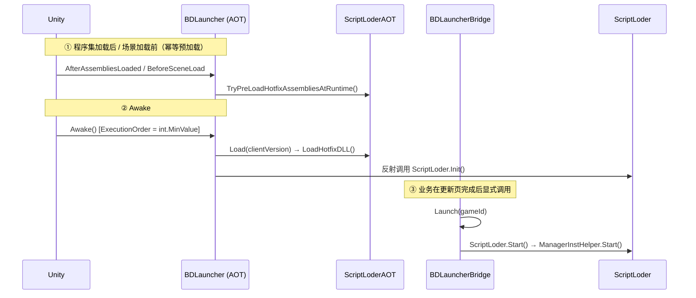

# BDFramework 启动链路与基础设置技能

## 1. 何时使用

命中以下任一情况时加载本技能：

- 排查"框架起不来"类问题（配置为 null、热更 DLL 不存在、管理器没启动）
- 理解启动时序
- 新增配置模块（`IConfigProcessor`）
- 日志系统（`BDebug`）的使用与排查
- 协程、路径（`BApplication`）、单例

不适用：**资源寻址细节**（用 `bdframework-resources`）、**管理器体系 API**（用 `bdframework-uimanager`）。

## 2. 铁律（先读这 8 条）

| # | 铁律 | 违反后果 |
|---|------|---------|
| 1 | **`BDebug` 全部方法带 `[Conditional("ENABLE_BDEBUG")]`** | 宏未定义时**连参数求值都被消除** |
| 2 | **`BDebug` 没有 `LogWarning` / `Assert` / `LogErrorAndThrow`** | 这三个 API **不存在**，需用 `UnityEngine.Debug.LogWarning` |
| 3 | **`IEnumeratorTool.StartCoroutine` 只是入队** | 场景无 `IEnumeratorTool` 组件时**永不推进，不报错** |
| 4 | **`GameConfigLoder` 在 `BDFramework.Configure`** | 不是 `BDFramework` |
| 5 | **配置处理器的嵌套类必须叫 `Config`** | 用 `cd.Type.GetNestedType("Config")` 匹配 |
| 6 | **`AssetLoadPathType` / `HotfixCodeRunMode` 定义在空壳 `Config : MonoBehaviour` 里** | 该类**没有任何字段**，别去找配置项 |
| 7 | **Editor 下 `streamingAssetsPath` 被重写为 `DevOps/PublishAssets`** | 与 Unity 原生语义不同 |
| 8 | **覆写管理器 `Start()` 必须调 `base.Start()`** | `IsStarted` 不置位 → 被重复调用 |

## 3. 三段启动



### ① AOT 阶段

```csharp
[RuntimeInitializeOnLoadMethod(RuntimeInitializeLoadType.AfterAssembliesLoaded)]
static void PreLoadHotfixAssembliesAfterAssembliesLoadedFromLauncher();

[RuntimeInitializeOnLoadMethod(RuntimeInitializeLoadType.BeforeSceneLoad)]
static void PreLoadHotfixAssembliesBeforeSceneLoadFromLauncher();     // 幂等
```

`Awake()`（`[DefaultExecutionOrder(int.MinValue)]`，全工程最先）：

```text
1. Inst = this；校验 ConfigText != null，否则 Debug.LogError("GameConfig配置为null,请检查!")
2. Application.isPlaying 时 DontDestroyOnLoad(this)
3. 若 !ScriptLoderAOT.HasLoadedHotfixAssembliesBeforeSceneLoad → ScriptLoderAOT.Load(ClientVersion)
4. InitHotfixScriptLoder()
     遍历 AppDomain.CurrentDomain.GetAssemblies() 找 "BDFramework.ScriptLoder"
     method.Invoke(null, null) 调用 ScriptLoder.Init()
5. 非 Editor 时反射设置 BDFramework.Core.Tools.BApplication.IsPlaying = true
```

!!! danger "为什么全是反射"
    `BDFramework.AOT` 不能引用 `BDFramework.Core`（循环依赖）。且 **`System.Type.GetType("..., BDFramework.Core")` 在 IL2CPP 下返回 `null`** —— 必须用 `AppDomain.CurrentDomain.GetAssemblies()` 枚举。

### ② 桥接阶段

```csharp
BDLauncherBridge.Launch(string gameId = "default")
```

**业务在热更/更新页完成后显式调用**：

```text
1. BApplication.IsPlaying = true
2. BDLauncher.Inst.gameObject.AddComponent<IEnumeratorTool>()      ← ★ 协程驱动必须先挂载
3. GameConfigLoder.LoadFrameworkConfig()
4. Config = GameConfigManager.Inst.GetConfig<GameBaseConfigProcessor.Config>()
5. (firstLoadDir, secondLoadDir) = ClientAssetsUtils.GetMultiAssetsLoadPath(RuntimePlatform, Config.ClientVersionNum)
     Application.isEditor 时 firstLoadDir = secondLoadDir
6. ClientAssetsUtils.CheckBaseClientAssets(firstLoadDir, secondLoadDir)
7. BResources.Init(Config.ArtRoot, firstLoadDir, secondLoadDir)
8. SqliteLoder.Init(Config.SQLRoot, firstLoadDir, secondLoadDir)
9. ScriptLoder.Start() → ManagerInstHelper.Start()
```

`BDLauncherHotfix.Launch(gameId)` 只是转发别名。`OnApplicationQuit()` 仅 Editor 下做 `SqliteLoder.Close()` + `ScriptLoder.Dispose()`。

### ③ `ScriptLoder` 内部

```csharp
ScriptLoder.Init()
  1. GetAppDomainHostingTypes()                    // 带缓存，Editor 下打印清单
  2. ManagerInstHelper.LoadManager(types)          // 只注册，不启动
  3. GameConfigLoder.LoadFrameworkConfig()         // 配置中心提前可用
  4. _ = BApplication.persistentDataPath;          // 主线程预热，防后台线程污染静态构造
  5. IsRunning = true

ScriptLoder.Start()
  → ManagerInstHelper.Start()
      ① 全部 Mgr.Init()
      ② 所有 !IsStarted 的 Mgr.Start()      // 按 [ManagerOrder] 升序
```

### 热更 DLL 装载

| 步骤 | 路径 |
|------|------|
| 1. 双寻址根 | `firstLoadDir = persistentDataPath/<clientVersion>/<platform>` |
| 2. **AOT 补充元数据** | **始终**从母包 `StreamingAssets/<platform>/script/aot_patch/*.zlua.bytes`（**不跟随版本目录**） |
| 3. 热更 DLL | 优先 `firstLoadDir/script/hotfix/*.zlua.bytes` |
| 4. 回退母包 | Android 走 `BetterStreamingAssets.ReadAllBytes`，其余 `File.ReadAllBytes`；都没有 → 抛 `【AOT.Load】HyCLR热更DLL不存在! 路径:...` |

`RuntimeApi.LoadMetadataForAOTAssembly(bytes, HomologousImageMode.SuperSet)`。

装载顺序（`GetHotfixDllLoadRank`）：`bdframework.core*`(0) → `assembly-csharp-firstpass*`(1) → `assembly-csharp*`(2) → 其他(10)。

## 4. 类型收集白名单

`ScriptLoder.GetAppDomainHostingTypes()` 按 `Assembly.FullName` 前缀匹配，仅取 `IsClass && !IsNested`：

```text
"BDFramework"
"Assembly-CSharp,"
"Assembly-CSharp-firstpass,"
"UnityEngine.UI"
"Game."
含 "@main"
```

结果**首次扫描后缓存**在 `hostingTypeList`；Editor 下按 `FullName` 排序并逐条打印 `框架托管DLL:...`。

!!! warning "主工程代码应放独立 asmdef"
    否则会被 `"Assembly-CSharp,"` 前缀误收集为热更类型。

## 5. 配置中心

### 命名空间

!!! danger "`BDFramework.Configure`"
    `GameConfigLoder`、`GameConfigManager`、`GameConfigAttribute`、`GameBaseConfigProcessor`、`GameCipherConfigProcessor` 全在这个命名空间。

### 类型

```csharp
public class GameConfigAttribute : ManagerAttribute
{
    public string Title = "";
    public GameConfigAttribute(int intTag, string tile) : base(intTag);
    public GameConfigAttribute(string tag) : base(tag);
}

abstract public class ConfigDataBase
{
    [HideInInspector] public string ClassType;      // = 嵌套 Config 类的 FullName
}

public interface IConfigProcessor
{
    void OnConfigLoad(ConfigDataBase config);
}

public class GameConfigManager : ManagerBase<GameConfigManager, GameConfigAttribute>
{
    public override void Start();
    public (List<ConfigDataBase>, List<IConfigProcessor>) LoadConfig(string configText);
    public T GetConfig<T>() where T : ConfigDataBase;
    public T GetConfigProcessor<T>() where T : IConfigProcessor;
    public List<ConfigDataBase> CreateNewConfig();
    public Dictionary<Type, ConfigDataBase> ReadConfig(string configText);

    private static readonly string DefaultEditorConfigPath = "Assets/Scenes/Config/editor.bytes";
}

public class GameConfigLoder
{
    public static void LoadFrameworkConfig();
}
```

### 处理器契约

```csharp
[GameConfig(100, "我的模块")]
public class MyConfigProcessor : IConfigProcessor
{
    [Serializable]
    public class Config : ConfigDataBase          // ★ 嵌套类必须叫 Config
    {
        public int    MaxLevel  = 100;
        public string ServerUrl = "http://127.0.0.1:8080";
    }

    public void OnConfigLoad(ConfigDataBase config)
    {
        var con = config as Config;
    }
}
```

`GameConfigManager.LoadConfig` 用 `cd.Type.GetNestedType("Config")` 取嵌套类型，再用它的 `FullName` 与 JSON 里的 `ClassType` 比对。

### 读取

```csharp
var cfg = GameConfigManager.Inst.GetConfig<GameBaseConfigProcessor.Config>();
```

`GetConfig<T>()` 在管理器尚未初始化时会**单独解析一次并写入 `configList`**，因此可以提前调用。

### 配置文本来源优先级

`GameConfigStartupPureLogic.ResolveFrameworkConfigTextSource`：

| # | 条件 | 来源 |
|---|------|------|
| 1 | `Application.isPlaying` 且运行时 launcher 有 `TextAsset` | 运行时 `BDLauncher` |
| 2 | 场景有 `BDLauncher` 且 `ConfigText` 已赋值 | 场景 `BDLauncher` |
| 3 | Editor 且 `Assets/Scenes/Config/editor.bytes` 存在 | 编辑器默认配置 |
| 4 | — | `None`（直接 return） |

`GameConfigStartupPureLogic.ShouldLoadFrameworkConfigManager(hasInstance)` 返回 `false` 时 `LoadFrameworkConfig()` **直接 return**，不查场景、不读文件 —— 这是 BatchMode / EditorTest 能复用生产分支的原因。

### 配置文件

| 项 | 值 |
|----|-----|
| 默认路径 | `Assets/Scenes/Config/editor.bytes` |
| 格式 | **LitJson 序列化的 JSON 数组** |
| 每条 | 一个 `ConfigDataBase` 派生对象的序列化结果（含 `ClassType`） |
| 真机来源 | `BDLauncher.ConfigText`（场景中的 `TextAsset`） |
| `ConfigEditorUtil` | `CONFIG_PATH = "Assets/Scenes/Config"`、`FILE_SUFFIX = ".bytes"` |

### 内置处理器

```csharp
[GameConfig(-9999, "框架基础")]
public class GameBaseConfigProcessor : IConfigProcessor
{
    public class Config : ConfigDataBase
    {
        public AssetLoadPathType CodeRoot    = AssetLoadPathType.Editor;
        public AssetLoadPathType SQLRoot     = AssetLoadPathType.Editor;
        public AssetLoadPathType ArtRoot     = AssetLoadPathType.Editor;
        public HotfixCodeRunMode CodeRunMode = HotfixCodeRunMode.HyCLR;
        public bool   IsDebugLog          = true;
        public string ClientVersionNum    = "0.0.0";
        public L2Type L2Type              = L2Type.zh_CN;

        public string GetClientVersionNumForIOS();
    }
}

[GameConfig(2, "加密")]
public class GameCipherConfigProcessor : IConfigProcessor
{
    public class Config : ConfigDataBase
    {
        public string SqlitePassword   = "password123!!!";
        public string ScriptPubKey     = "";       // ★ 未被消费
        public string ScriptPrivateKey = "";       // ★ 未被消费
    }
}
```

!!! note "`-9999` 保证最先执行"
    执行顺序 = `GetAllClassDatas()` 按 intTag 升序。`GameBaseConfigProcessor(-9999)` 早于 `GameCipherConfigProcessor(2)`，所以 `SqliteLoder.Password` 在 `SqliteLoder.Init` 之前一定已注入。

### 枚举宿主

```csharp
namespace BDFramework

public enum AssetLoadPathType { Editor = 0, Hotfix = 1 }
public enum HotfixCodeRunMode { HyCLR = 1, Mono64 }

public class Config : MonoBehaviour { }      // ★ 字段为空，只剩枚举宿主价值
```

## 6. 日志

```csharp
// 全局命名空间，: MonoBehaviour，[DefaultExecutionOrder(-10000)]
public class BDebug : MonoBehaviour
{
    public readonly static string ENABLE_BDEBUG = "ENABLE_BDEBUG";   // ★ 字符串常量，不是宏
    public bool IsLog = true;

    public static void Log(object log);
    public static void Log(string tagOrLog, string logOrColor);
    public static void Log(string log, Color color);
    public static void Log(string tagOrLog, string log, Color color);
    public static void Log(string tagOrLog, string log, string color);
    public static void LogFormat(string format, params object[] args);
    public static void LogFormat(string tag, string format, params object[] args);
    public static void LogError(object log);
    public static void LogError(string tag, object log);

    static public void DisableLog(string tag);
    static public void EnableLog(string tag);

    static public void LogWatchBegin(string watchTag);
    static public void LogWatchEnd(string watchTag, string color = "");
    static public void LogWatchEnd(string logTag, string watchTag, string color = "");

    public static void FlushPlayerLogs();
    public static string ExportPlayerLogToText(string binFilePath, string txtFilePath = null, string password = null);
}
```

!!! danger "`[Conditional]` 会消除参数求值"
    ```csharp
    // ✗ 宏关闭时 LoadConfig() 根本不会被调用
    BDebug.Log("配置已加载: " + LoadConfig());

    // ✓ 先求值
    var cfg = LoadConfig();
    BDebug.Log("配置已加载: " + cfg);
    ```

!!! danger "不存在的 API"
    `BDebug.LogWarning`、`BDebug.Assert`、`BDebug.LogErrorAndThrow` **在仓库中不存在**。需要 warning 用 `UnityEngine.Debug.LogWarning`。

| 行为 | 说明 |
|------|------|
| Tag 过滤 | `IsEnableTag(tag)`：实例不存在返回 `true`；否则查 `DisableLogTagList`（`lock` 保护） |
| `IsConsoleLogEnabled` | `inst == null \|\| inst.IsLog`（**实例缺失时默认放行**） |
| `DisableLog` / `EnableLog` | 用 `Inst`（非宽松的 `inst`），**会强制创建实例** |
| 耗时统计 | `watchMap` 是 `ConcurrentDictionary<string, Stopwatch>`；`LogWatchEnd` 用 `TryRemove`，未配对时静默无事；换算 `ElapsedTicks / 10000f` |
| 持久化 | `[RuntimeInitializeOnLoadMethod(BeforeSceneLoad)]` + `Awake()` + `OnApplicationQuit` → `Persistence`；**Editor 下 `PlayerLogRootPath` 返回 `string.Empty`** |

日志持久化子系统：`PersistenceSettings`（`DEFAULT_DIRECTORY_NAME = "playerlogs"`、`DEFAULT_FLUSH_INTERVAL_MS = 1000`）、`Persistence`（`FILE_MAGIC = 0x474C4442`）、`LogCrypto`（`DEFAULT_PASSWORD = "368219a2c858..."`）、`LogReader`、`SerializedLogEntry`、`Editor_UnityLogHook`。

宏由 `Editor/EditorAutoSetting/Editor/EditorSetting.cs` 自动写入。

## 7. 协程

```csharp
// 全局命名空间
public class IEnumeratorTool : MonoBehaviour
{
    public class ActionTask { public Action willDoAction; public Action callBackAction; }

    static public void ExecAction(Action action, Action callBack = null);
    static public void ExecActionImmediately(Action action, Action callBack = null);
    static public new int StartCoroutine(IEnumerator ie);
    static public void StopCoroutine(int id);
    static public void StopAllCroutine();
    static public void WaitingForExec(float f, Action action);
}
```

!!! danger "`StartCoroutine` 只是入队"
    真正的 `base.StartCoroutine` 发生在 `Update()`。**场景中没有 `IEnumeratorTool` 组件时，所有调用永不推进且不报错。**

    `BDLauncherBridge.Launch()` 会自动 `AddComponent<IEnumeratorTool>()`；纯逻辑 / BatchMode 场景需自己保证。

`Update()` 驱动顺序：停协程 → 起协程队列 → 立即队列 → 每帧 1 个普通队列。

## 8. 路径（`BApplication`）

```csharp
namespace BDFramework.Core.Tools

static public class BApplication
{
    static public bool   IsPlaying { get; set; }
    static public string persistentDataPath { get; private set; }
    static public string streamingAssetsPath { get; private set; }

    static public string ProjectRoot / BDWorkSpace / Library / Package / RuntimeResourceLoadPath { get; private set; }
    public static string EditorResourcePath / EditorResourceRuntimePath { get; private set; }
    public static string DevOpsPath / DevOpsCodePath / DevOpsPublishAssetsPath
                       / DevOpsPublishClientPackagePath / DevOpsConfigPath / DevOpsCIPath / BDEditorCachePath { get; private set; }

    static public RuntimePlatform   RuntimePlatform { get; }      // ★ 宏判定，绝不返回 Editor 枚举
    public static RuntimePlatform[] SupportPlatform { get; }

    static public string GetRuntimePlatformPath();
    public static string GetPlatformLoadPath(RuntimePlatform platform);   // "windows"/"android"/"osx"/"ios"
    public static BuildTarget GetBuildTarget(RuntimePlatform);
    public static RuntimePlatform GetRuntimePlatform(BuildTarget);
    public static List<string> GetAllRuntimeDirects();      // 仅 Editor：扫描 Assets/*/Runtime
}
```

| 属性 | Editor | 真机 |
|------|--------|------|
| `persistentDataPath` | `<ProjectRoot>/.AppData` | Windows/macOS: `<dataPath>/.AppData`；其他: Unity 原生 |
| `streamingAssetsPath` | `<ProjectRoot>/DevOps/PublishAssets` | Unity 原生 |
| `BDEditorCachePath` | `Library/BDFrameCache` | — |

!!! danger "静态构造可能在 loading thread 触发"
    `Application.dataPath` 在非主线程会抛 `UnityException`。框架用 `TryInitializePathState`（吞异常返回 `false`）+ `[RuntimeInitializeOnLoadMethod(BeforeSceneLoad)] InitializePathStateBeforeSceneLoad` 兜底。

    业务侧应尽量**在主线程首次访问**（`ScriptLoder.Init()` 里已显式预热一次 `persistentDataPath`）。

## 9. 单例

```csharp
namespace BDFramework.ResourceMgr        // ★ 不是 BDFramework.Utils

public class Singleton<T> : MonoBehaviour where T : Singleton<T>
{
    public static T Instance { get; set; }
}
```

| 场景 | 行为 |
|------|------|
| 找到 1 个 | 复用并把 GameObject 改名 `typeof(T).Name` |
| 找到多个 | `Debug.LogError("...exists multiple times in violation of singleton pattern. Destroying all copies")` 并**全部 Destroy** |
| 找到 0 个 | `new GameObject(typeof(T).Name, typeof(T))` + `DontDestroyOnLoad` |

## 10. 故障对照

| 现象 | 根因 | 处理 |
|------|------|------|
| `GameConfig配置为null,请检查!` | 场景 `BDLauncher.ConfigText` 未赋值 | 赋值 `TextAsset` |
| `【AOT.Load】HyCLR热更DLL不存在!` | `StreamingAssets/<platform>/script/hotfix/` 无 DLL | 检查构建产物 |
| `[GameconfigManger]启动失败，class data 数量为0.` | 处理器类未被收集 | 检查属性与程序集白名单 |
| 管理器 `Init()` 没被调用 | 类没挂 `ManagerAttribute` 派生属性 | 补属性 |
| 管理器 `Start()` 被调用两次 | 覆写时漏 `base.Start()` | 补上 |
| AB 异步加载无回调 | `IEnumeratorTool` 未挂载 | 确认 `Launch()` 已执行 |
| Editor 里一切正常，真机黑屏 | `AssetLoadPathType` 误配为 `Editor` | 检查 `Config.ArtRoot` |
| `GetConfig<T>()` 返回 `null` | 嵌套类名不是 `Config`；或配置文件无该 `ClassType` | 修正类名 / 保存配置面板 |
| 配置面板看不到新字段 | 配置文件未保存；或字段缺 Odin 特性 | 保存一次 |
| 日志全都不打印 | `ENABLE_BDEBUG` 宏未定义 | 检查 `EditorSetting` |
| 日志参数里的方法没执行 | `[Conditional]` 消除 | 先求值再传参 |
| 命名空间报错 | 忘 `using BDFramework.Configure;` | 补上 |
| 真机路径不对 | `BApplication` 路径在 Editor 被重写 | 用 `BApplication` 属性而非 Unity 原生 |

## 11. 详细参考

| 文件 | 内容 |
|------|------|
| [references/startup-sequence.md](./references/startup-sequence.md) | 逐方法启动时序、热更 DLL 装载细节、无 MonoBehaviour 路径 |

在线文档：

- [启动链路](https://yimengfan.github.io/BDFramework.Core/architecture/bootstrap.md)
- [配置中心 GameConfig](https://yimengfan.github.io/BDFramework.Core/api/game-config.md)
- [服务容器与日志](https://yimengfan.github.io/BDFramework.Core/api/utils.md)
- [安装与依赖](https://yimengfan.github.io/BDFramework.Core/guide/installation.md)

## 12. 改动前检查清单

- [ ] `using BDFramework.Configure;`（配置相关）
- [ ] 配置处理器嵌套类名为 `Config`
- [ ] `OnBegin...` / 管理器 `Start()` 覆写调了 `base.`
- [ ] 日志参数无副作用表达式
- [ ] 没有使用不存在的 `BDebug.LogWarning` / `Assert`
- [ ] 新路径逻辑用 `BApplication` 而非 Unity 原生 API
- [ ] 协程调用前确认 `IEnumeratorTool` 已挂载
