# Introduction 

AssetGraph is a tool that aims to reduce the workload needed to build workflows around asset importing, building Asset Bundles and building Player Apps. With this tool, you can build workflows to create, modify, and change asset settings graphically, and even automate them, thus freeing designers and artists from repetitive tasks during game development.

## Supported Unity Versions 

Unity 2018.4.2f1 or higher. For older Unity, use the older version of AssetGraph.

# Changelogs

You can find bug fixes and changes in [ChangeLog](https://github.com/Unity-Technologies/AssetGraph/blob/1.7/release/CHANGELOG.md). 

# Install 

You can install AssetGraph from Unity Package Manager. 

Open Package Manager from Window > Package Manager menu and find AssetGraph package, and press Install button.

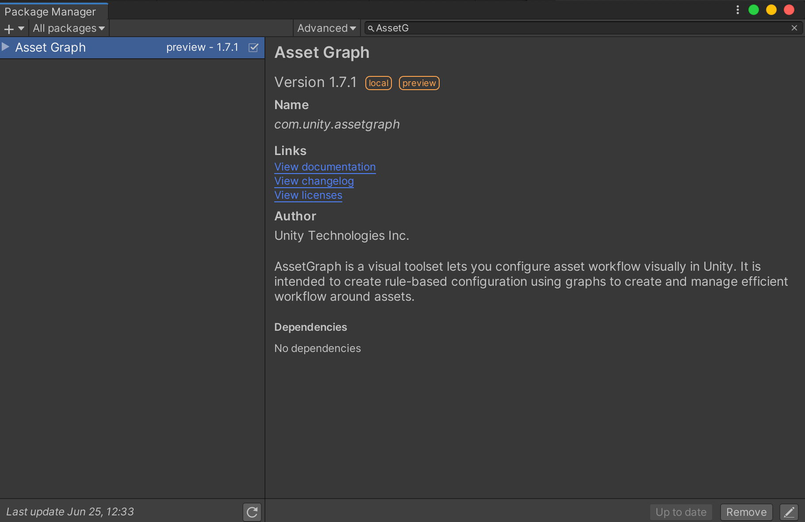

# Interface 

## The Graph Editor Window 

The Graph Editor Window is the workbench window. Here you can view, edit and build asset graphs.

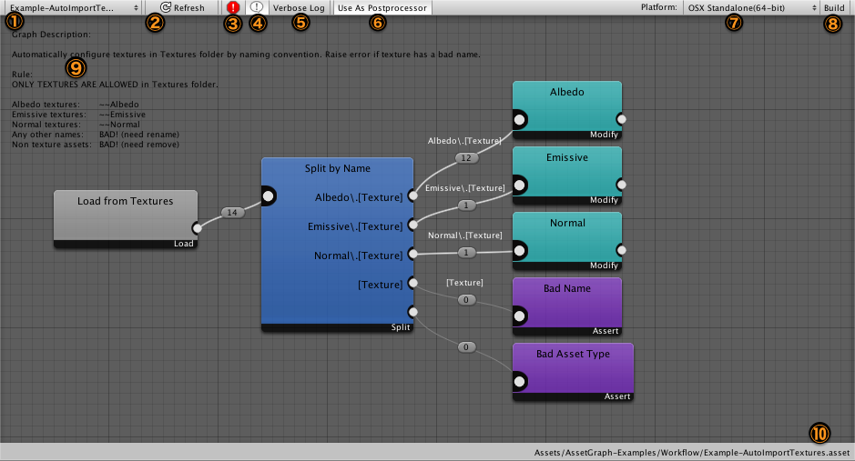

1. Graph that is currently open. Click to display the drop down menu.
2. Reload assets.
3. Display all errors in the graph.
4. Display graph description.
5. Export detailed messages about when the graph reloads and when it is building.
6. Turn this on to use the graph as an Asset Postprocessor. Graphs with this option enabled will run every time assets in this project are updated.
7. The current platform. You can change the platform from the drop down menu.
8. Run the graph.
9. Displays the path of the graph’s assets.

### The Graph Editor Menu 

1.      Select which graph to open in the graph editor.

2.      Create a new graph asset.

3.      You can export/import graphs in JSON format.

## The Asset Log Window 

The Asset Log Window displays a list of asset modifications done in the AssetGraph node. It also shows you any errors that occured in the graphs. 

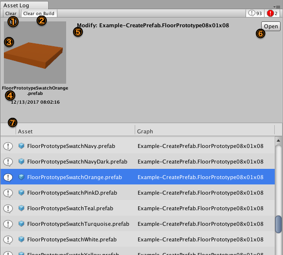

1. Clears the asset log.
2. Clears the asset log when you explicitly build a graph in the Graph Editor.
3. Asset preview
4. Asset name and timestamp of when this log was recorded.
5. Log event type, graph name and node name.
6. Opens the graph and selects the node which issued this log event.
7. List of asset log events.

### **The Error Display** 

When an error occurs in AssetGraph, a notification appears in the Asset Log. The error display in the Asset Log shows a description of the error, as well as how to fix it.

## The Batch Build Window 

The Batch Build Window allows you to run multiple graph lists on multiple platforms at once.

 

### **The Edit Tab** 

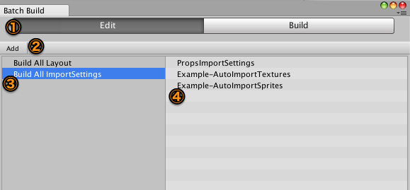

In the Edit Tab you can edit Graph Collections that run simultaneously. 

1. Switch between the Edit and Build Tabs.
2. Clicking the Add button creates a new, empty Collection. They can also be created by dragging and dropping Asset Graph assets. 
3. Graph Collections list. 
4. Displays the graphs included in the currently selected Graph Collection. Graphs in a Collection will run in order from the top down. The order can be changed by dragging graphs within the list. 

### **The Build Tab** 

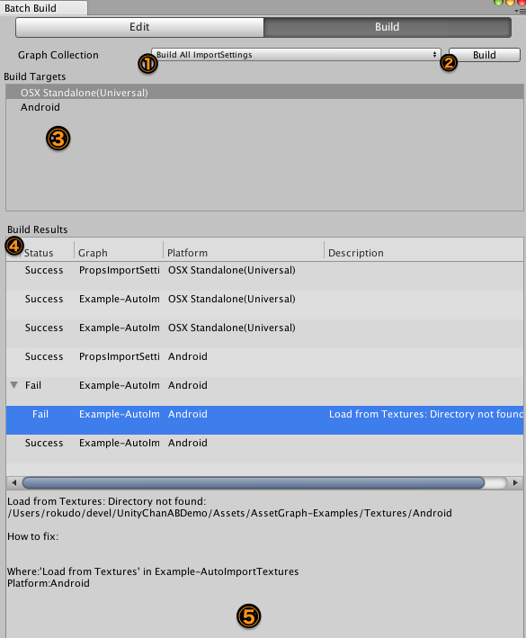

Run selected Graph Collections on the designated platforms from the Build Tab. 

1. Select a Graph Collection.
2. Build the selected Graph Collection.
3. Change the designated platform. Right-click to add or remove a platform. 
4. Displays the Graph Collection build results as ‘Success’ or ‘Fail’. 
5. Displays detailed build results, and a report in the event of a failure.

## The Project Window 

AssetGraph has shared settings at the project level. These settings are implemented in AssetGraph projects in the Project Window.

To change the project settings, select  Menuー>Window>Asset Graph>Open Project Window, and open the Project Settings window.

### **The Asset Bundles Tab** 

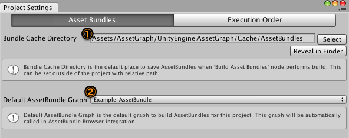

Change settings related to building AssetBundles in the Asset Bundles Tab.

1. Indicates the Asset Bundle Cache Directory to be used when Build in Cache Directory is selected at the Build Asset Bundles Node.
2. When integrated with AssetBundle Browser, this is the default Asset Bundle graph.

### **The Execution Order Tab \
**

 

In the Execution Order Tab, you can change the implementation order of AssetPostprocessor graphs. 

1. Graph Name
2. Graph execution order. Above, the graphs with smaller values are executed first. Graphs without any special settings will use this Default Execution Order. 
3. Add/remove graphs from the execution order list. 

# Basics 

AssetGraph does all of its work in graphs. After creating a graph, add nodes from the Graph Editing Window.  By connecting nodes, you can create pipelines for processing assets. Assets will be processed from left to right, modified and grouped at each stage, and finally built as an addition to an AssetBundle or copied to a specific directory. The basic way to use this tool is to build this pipeline by using the built-in nodes or custom nodes, then process many assets all at once.

## Creating a graph 

To create an AssetGraph graph, select the “Create” menu in the Project View, or right-click and select “AssetBundle Graph”. You can also select Menu > Window > Asset Graph > Open Graph Editor, and click on the “Create…” button in the AssetBundle window.

When you have created an AssetBundle Graph asset, double click to open the Graph Editing Window to start editing. You can select and add new nodes by right-clicking the window.

## Loading Assets 

You have to load assets to add processes to them. To load assets, right click the graph and select from the Load Assets menus to create nodes. Here, let’s select [Load From Directory](#load-from-directory) and load assets from a specific directory. The Load From Directory node can also be created by dragging it from the Project window to the directory’s graph editor.

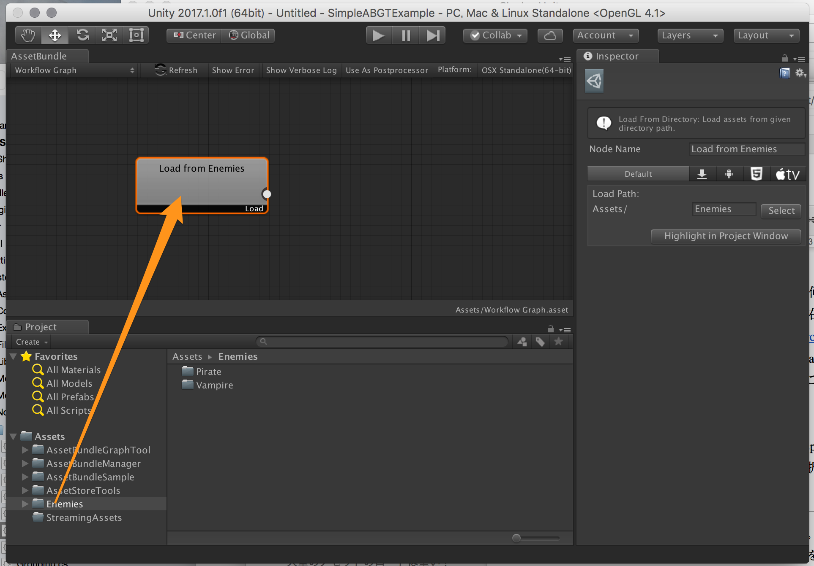

When you’ve created your node, select the node and open the inspector. You can select directories by clicking on the Select button under Load From Directory. Try selecting from the directories under Assets.

Now that you have loaded your asset, create another node and connect them. When you connect nodes, you can see that the asset will be passed to the connected node. By clicking on this connection, you can see a list of assets being passed in the Inspector.

For loading nodes, there is no limit to how many you can have in one graph. However, when they become Asset Bundles, if one asset is specified to be in multiple Asset Bundles, an error will occur at build time.

### Loading Multiple Assets is Too Heavy? Asset Loading in AssetGraph 

 

AssetGraph is made to be able to deal with thousands of assets. When loading assets in AssetGraph, it is actually just reading asset file paths and asset type information. The actual asset data will not be loaded until just before it is used, and it will be released as soon as it is no longer being used.

## Grouping Assets 

You can group assets with AssetGraph. We recommend using this function when you want to add multiple assets to your Asset Bundle or when you want to create a Prefab from a group of assets. When assets are first loaded, they are all in a group called “0” by default. You can group assets in any way you like. Try creating a node by right-clicking the graph and select Group By File Path under the Group Assets menu.

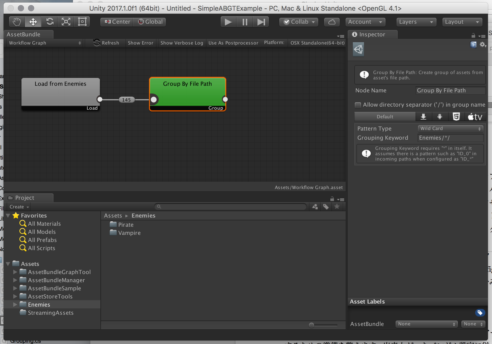

Group By File Path is a node that groups assets by file path names. For example, if you have enemy character assets with names like “Pirate” and  “Vampire” under the Assets/Enemies directory, they will be split into two groups called “Pirate” and “Vampire”.

 Characters’ assets are based on directories, so you want to group them based on that

 

Group By File Path pattern matches file paths and groups them. As seen above, it is convenient to use wildcard (*) pattern matching in this particular example. Choose “Wild Card” as a pattern type and “Enemies” as the grouping keyword

Inspector settings of Group By File Path

Create another node, try connecting it with the Group By File Path exportation, and select a connection. In the Inspector, you can see that assets under the Pirate directory and the Vampire directory are grouped into a “Pirate” group and a “Vampire” group respectively.

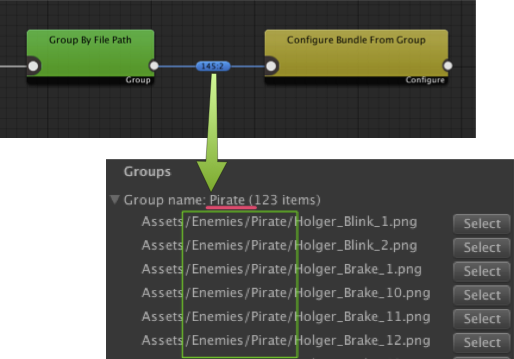

Grouping is done by matching the pattern “Enemies/*/” in an asset’s file path

 

To construct asset bundle settings, right-click on the graph and select Configure Bundle From Group under Configure Bundle. When you have created the Configure Bundle From Group node, connect this with the Group By File Path exporter.

## Constructing AssetBundle Settings 

When you have grouped your assets, try turning them into an Asset Bundle. You will have to create Asset Bundle settings to turn a group into an Asset Bundle. Creating Asset Bundle settings includes naming the Asset Bundle, specifying the variants, etc. Before building your Asset Bundle, you have to connect a node that creates your Asset Bundle settings to reflect the settings to the group.

To create an AssetBundle setting, right-click the graph and select [Configure Bundle From Group](#configure-bundle-from-group), from the menu below Configure Bundle.  When the Configure Bundle From Group node is created, connect the output of the Group By File Path to this node.

## 

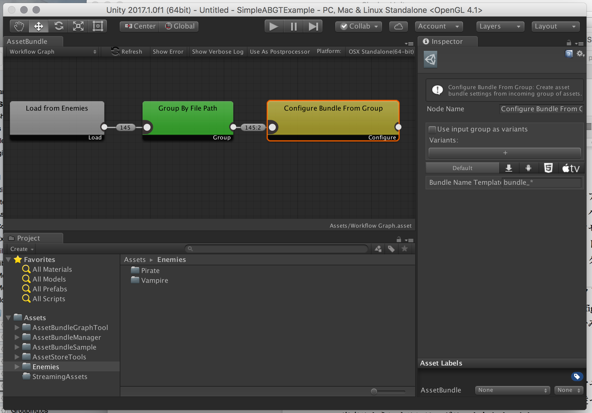

## Creating Asset Bundles 

You have successfully set the bundle settings! We are now going to start preparing for the Asset Bundle build. To build Asset Bundles according to the bundle settings, right-click the graph, choose Build/Build Asset Bundles and create a new node. Connect a Configure Bundle From Group node exportation to the Build Asset Bundles node. If you want to change the build settings of an Asset Bundle, such as compressing method, select the [Build Asset Bundles](#build-asset-bundles) node and tick the checkboxes in the Inspector. You are now ready to build your Asset Bundle!

## 

## Building A Graph 

You have already set the whole process from loading assets to building Asset Bundles, so let’s build the graph and see how it does. To build a graph, click “Build” on the right side of the Asset Bundle window toolbar. 

When the dialog for the progress bar disappears, the build has finished. Open the directory that you chose in Build Asset Bundles and check if the file has been exported. If you have set it to build in the Cache Directory, the Asset Bundle will be under the Cache Directory of the assets’ AssetGraph install directory.  

## Building Multiple Graphs at Once 

When multiple graphs are made as your project progresses, you might want to build multiple graphs at once. In such cases, go to Menu > Window > Asset Graph > Open Batch Build Window. The Batch Build Window allows you to build multiple graphs for multiple platforms at once. To learn more about the Batch Build Window, please refer to the [Interface section](#the-batch-build-window).

## Changing Project Settings 

There are shared settings in AssetGraph projects. At this point the save locations directory for Asset Bundle caches are included in the project settings. To change project settings, go to Menu > Window > Asset Graph > Open Project Window.

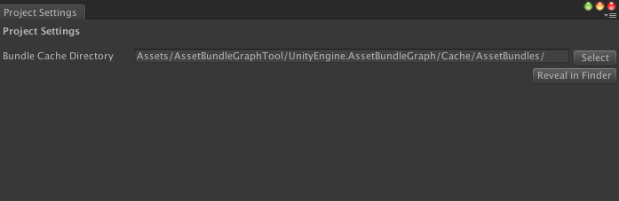

# Advanced Topics 

We covered the basics of how to load assets and how to create and copy Asset Bundles in the previous section. In this section, we are going to learn about the advanced uses of the graph tool.

## Categorizing Assets 

When loading assets with directories and labels, the type of assets given are not always the same. When you want to categorize assets by name or type when passing them to the next node, you can use Split Assets / Split By Filter. [Split By Filter](#split-by-filter) allows you to categorize assets based on name and type, and you can also add filters of your own. (Advanced topic: see [Adding Custom Filters](#adding-custom-filters)) When an asset matches multiple filters, the asset is exported to the first filter it goes through. This means that the sequence of the filters in Split By Filter matters, so please be careful. 

## Creating Assets 

You can also create new assets with AssetGraph. For example, you might want to create Prefabs to use in the game automatically from the textures and models artists have added. Right-click the graph and select Create Assets / Create Prefab From Group to create a node that creates prefabs from groups. To create Prefabs with Create Prefab From Group, you will have to add a PrefabBuilder script to your project. Please see Advanced Topics > [Creating Prefab From Group](#create-prefab-from-group) on how to make prefab builders. When you pass the group that needs to be used for creating prefabs to Create Prefabs From Group, it automatically generates prefabs and adds them for export.

## Editing Assets 

You might want to bulk edit assets when adding Asset Bundles, or as part of batch processing. By using AssetGraph, you can edit import settings all at once, and directly edit assets that do not go through the Importer (such as materials and render texture). If you want to change the import settings of textures and models, right-click the graph and select Modify Assets / Overwrite Import Settings. 

You can change the import settings of models, textures, audio and video with the [Overwrite Import Settings](#overwrite-import-setting) node. Please see Built-in nodes > Overwrite Import Settings for more on how to use it. When assets are passed on to the node, the assets’ settings will be changed when built. 

When you want to directly edit assets that do not have importers, use the Modify Assets Directly node. To learn how to use it, please refer to [Modify Assets Directly](#modify-asset-directly) in the built-in nodes section.

## Check Asset Bundle Settings  

When creating asset bundles, you may include unwanted assets by mistake. To make sure you don't have any unwanted data in your asset bundle, you can use the Assertion node. By using the built-in node [Assert Unwanted Assets In Bundle](#assert-unwanted-assets-in-bundle), you can specify that assets from certain directories can or cannot be included. When there is an unwanted asset detected, the node will report it as an error and you can check which specific unwanted file is included. For a detailed how-to, please see [Assert Unwanted Assets In Bundle](#assert-unwanted-assets-in-bundle) in the built-in nodes section. 

# Built-in Nodes 

Let’s take a look at the built-in nodes in AssetGraph.

## Load From Directory \

 

### Introduction  

This node loads assets from specified directories.

### Properties 

#### 

1. Decide whether the node will respond to changes in the loaded Asset, when used as an AssetPostprocessor. When this option is not checked, Assets loaded with this Loader will not trigger an AssetPostprocessor event. 
2. Directory path
3. Directory selector dialog 
4. Highlight directories in Project View

## Load By Search Filter 

#### 

### Introduction 

This node loads assets from specified search filters. The format of the search filters is the same as the search format in the project window. For more information, please refer to the [project window documentation](https://docs.unity3d.com/ja/current/Manual/ProjectView.html).

### Properties 

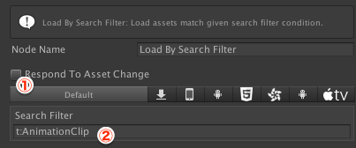

1. Decide whether the node will respond to changes in the loaded asset, when used as an AssetPostprocessor. When this option is not checked, assets loaded with this Loader will not trigger an AssetPostprocessor event. 
2. Search filter

## Last Imported Items 

## 

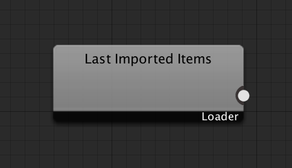

### Introduction 

The Last Imported Items node loads assets that have been imported recently. This node is made for using graphs as a postprocessor.

## Split By Filter  

## 

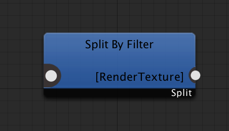

### Introduction  

The Split By Filter node categorizes assets based on filters. The default filters that you can use are file path and asset type. You can expand the categorizations of Split By Filter by adding custom filters.

Asset categorization in a Split By Filter node is done in a top-down manner. If an asset is filtered for the first condition, it will not be filtered for the conditions that come after. Additional filters can be moved up or down by dragging them up and down the filter list on the left side.

### Properties  

1. Filter conditions. You can use regular expressions to specify file paths.
2. Add new filter conditions. If you have custom filters installed, this + button will display a drop down menu for selecting filters.

## Group By File Path 

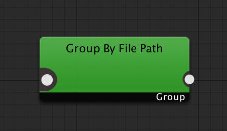

### Introduction  

This node creates groups by using file paths 

### Properties  

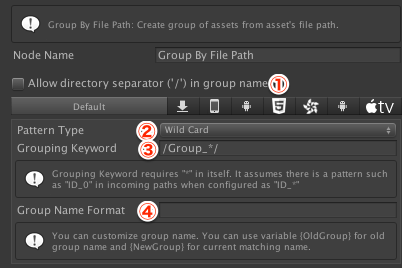

1. Set whether you want to include the directory separator in your group’s name 
2. Set the format for the Grouping Keyword (3). When set to Wild Card, if a portion of a file path matches the *, that portion becomes the group name. When set to Regular Expression, the Grouping Keyword uses the regular expression () and the grouped portion becomes the group name. 
3. Set the conditions for choosing a group name from the file path. The matching method is determined by the Pattern Type (2).
4. Set the group name format. The keyword that matches the Grouping Keyword on this node is designated as {NewGroup}, but the group name that was already in use when the file passed to this node can also be used by designating {OldGroup}. If nothing is input here, it will use the same value as {NewGroup}.

## Group By Size 

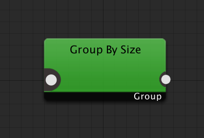

### Introduction 

The Group By Size node groups incoming assets by size. For example, if you set it to “File Size 1MB each”, it will check file sizes and add assets to groups. When a group reaches 1MB, the next asset will be added to a new group. When one asset is bigger than the specified size, this asset will become an individual group. The size of the group will not always be under the specified file size.

#### **Maintaining Groups** 

The Group By Size node creates groupings based on size, so oftentimes the group an asset will belong to will change. For example, it may be inefficient from a management perspective to use this node on an AssetBundle, because it may require lots of updates to the AssetBundle files. In order to resolve these kinds of issues, the Group By Size node has a function to remember and maintain group settings at build time. 

### Properties 

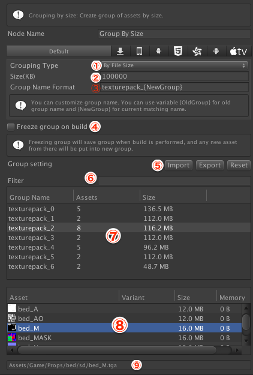

1. Specify grouping method. By File Size groups assets based on file size and By Runtime Memory Size groups assets based on the memory size after loading. Not all assets can use Runtime Memory Size so please be careful.
2. The size (in KB) you want to use for grouping.
3. Set the group name format. The keyword that matches the Grouping Keyword on this node is designated as {NewGroup}, but the group name that was already in use when the file passed to this node can also be used by designating {OldGroup}. If nothing is input here, it will use the same value as {NewGroup}.
4. Determine whether or not to save group settings when building. 
5. Import or export the current grouping in JSON format. Clicking Reset will reset the currently saved group settings. 
6. Filter the assets displayed in (7) down to specific assets. This does not affect groupings. 
7. Displays the Filename, number of assets, and approximate file size of the current group. 
8. Displays a summary of the assets included in the group selected in (7). 
9. Displays the project path of the asset selected in (8).

## Group By File 

### 

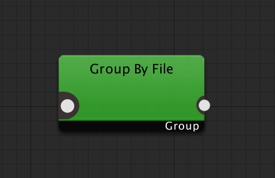
  \
Introduction  

The Group By File node splits each asset passed through it into a separate, individual group.  For example, if 3 assets pass through this node, 3 groups will be created based on the Group Name Format setting, and each asset will be recorded in its own group. 

#### **Properties** 

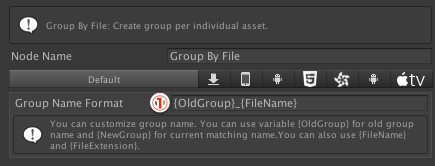

1. Set the group name format. The keyword that matches the Grouping Keyword on this node is designated as {NewGroup}, but the group name that was already in use when the file passed to this node can also be used by designating {OldGroup}. If nothing is input here, it will use the same value as {NewGroup}. In the Group By File node, the filename{FileName} and file extension {FileExtension} can also be used. 

## Create Prefab From Group 

### 

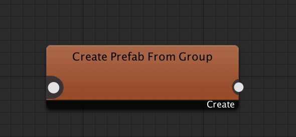
  \
Introduction  

The Create Prefab From Group node creates new prefabs from asset groups. Specify PrefabBuilder to create prefabs. To make prefabs that suit your project, add the necessary PrefabBuilders to your project. 

Please refer to Advanced Topics: [Creating Prefabs Automatically](#creating-prefabs-automatically) for more information on how to implement PrefabBuilders.

### Properties  

1. The PrefabBuilder used on this node.
2. The Prefab Replace Option. See the API documentation for details. 
3. The Prefab Output Option. Select whether to output to the Cache Directory or another Directory. 
4. The save destination Directory to be used when an Output Directory other than the Cache Directory is selected. 
5. Inspector for the selected PrefabBuilder. 
6. Open the PrefabBuilder script in the script editor. 

# Built-in Prefab Builder 

There are two built-in Prefab Builders in AssetGraph.

## Replace GameObject by Name (Experimental) 

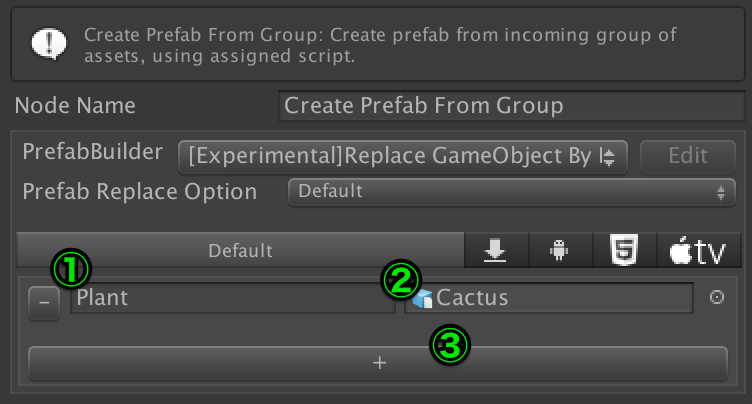
  \
“Replace GameObject by Name” creates new Prefabs by checking the passed-in GameObject’s Prefab for child GameObjects with the specified name, and replacing those child GameObjects with the specified Prefab.

1. Name of GameObject to be replaced
2. Name of Prefab to replace with
3. Add replacement name and game object

## Replace With Incoming GameObject by Name (Experimental)  

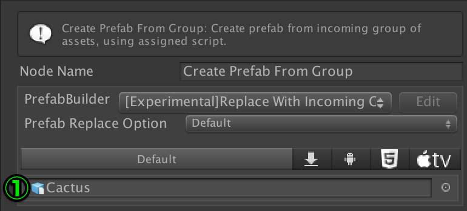

“Replace With Incoming GameObject by Name” creates new Prefabs by checking the passed-in GameObject’s Prefab for child GameObjects with names that match the given GameObject.

1. The base GameObject that will be replaced by the specified GameObject.

## Generate Asset 

### Introduction 

The GenerateAsset node spawns new assets from the given assets by using an AssetGenerator. Add AssetGenerators to your project to make the assets you need.

Please refer to Advanced Topics: [Creating Derived Assets Automatically](#creating-derived-assets-automatically) for information on how to implement AssetGenerators.

### Properties 

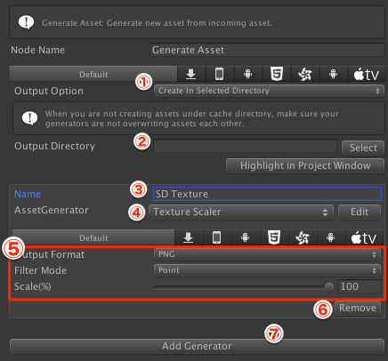

1. Output options for the created asset.  Choose whether to output to the Cache Directory, another designated Directory, or on a path related to the original asset. 
2. The output directory when creating assets (when Create In Selected Directory is selected)
3. The label for the created asset. 
4. The AssetGenerator used to creat the asset.
5. The inspector for the selected AssetGenerator. 
6. Remove the AssetGenerator.
7. Add a new AssetGenerator. 

## Built-in Asset Generator  

AssetGraph includes one built-in AssetGenerator

### Texture Scaler  

 \
 TextureScaler receives texture assets and generates resized assets. 

1. Select the output format of the generated texture. You can choose from JPG, PNG, or EXR (Unity 5.6 and later).
2. The scaling process method for resizing. You can choose from Point (nearest neighbour), or Bilinear.
3. Size relative to the original asset. Specify from 1~100%.
4. If you have chosen JPG, specify the JPG quality from 1~100.
5. If you have chose EXR, set the EXR save option. For more details, please refer to the [API documentation](https://docs.unity3d.com//ScriptReference/Texture2D.EXRFlags.html).

## Duplicate Asset 

Duplicate Asset generates copies of assets. There are no properties to set from the inspector.

## Overwrite Import Setting 

### 

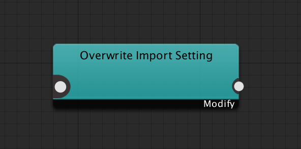
 \
Introduction  

The Overwrite Import Setting node overwrites the import settings of the given assets. You can only change the import settings of models, textures, audio and video clips (Unity 5.6 and later) that have importers. The Overwrite Import Settings node can explicitly specify the Importer type and can also automatically set the importer type based on the type of asset given.

##### Using custom setting asset  

The Overwrite Import Setting node creates a small asset internally to store all import configurations, but sometimes you may want to use your own. For example, it is easier if you can use one of your sprite texture assets as a base asset if you have multiple sprites in the same layout. For such cases, you can select custom setting asset from the inspector.

### Properties 

Properties before setting importer type

1. Select importer type

1. (Appears only when Texture Type is Sprite) Overwrite sprite mode if checked.
2. (Appears only when Texture Type is Sprite) Overwrite sprite packing tag if checked.
3. (Appears only when Texture Type is Sprite) Tag name for sprite packing. (*) will be replaced by the group name.
4. Use custom setting asset if checked.
5. The custom asset to use as the base setting.
6. Highlight custom assets in the Project Window.
7. Properties of the importer types.
8. Clear all settings and initialize this node.

## Modify Asset Directly 

 

### Introduction  

The Modify Asset Directly node directly edits the properties of assets passed to it. This node is used to edit assets without importers. As with the Overwrite Import Setting node, the asset type to be edited can be designated on the Modify Asset Directly node. 

You can implement your own modifier to edit the assets you need for your project. Please refer to Advanced Topics: [How To Edit Assets On Your Own](#editing-assets) for more information on how to implement modifiers. 

### Properties 

#### 

1. Select the Modifier to be use.
2. The Modifier’s assigned properties.
3. Open the selected Modifier in the script editor.
4. Clear the Modify Assets Directly settings, allowing you to re-select the Asset Type.

## Label Assets 

  \
Introduction

 The Label Assets node sets labels for the given assets.

### Properties 

#### 

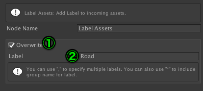

1. When Overwrite is enabled, the asset’s original label is deleted and replaced by the label set by this node
2. Label set for assets. Set multiple labels by separating labels with commas.

## Configure Bundle From Group 

### 

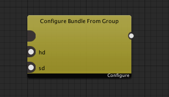
 \
Introduction 

The Configure Bundle From Group node creates asset bundle settings that will be used to build AssetBundles from the collection of assets it’s given.

### Properties

 

1. When enabled, the group name will be treated as a variant.
2. Set the variant name. You cannot use this with (1). 
3. Add variant settings.
4. Platform settings tab.
5. Set the template for the asset bundles’s name. (*) will be replaced by the group’s name. When (1) is enabled, the group name will be treated as a variant and therefore you will not be able to include asterisks.

## Extract Shared Assets 

### 

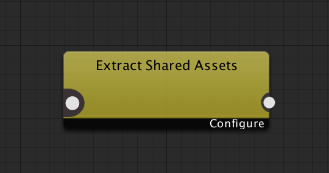
 \
Introduction 

Assets that have implicit dependencies are opened and explicit asset bundle settings are created. When multiple asset bundles are given, it will create new asset bundle settings for each set of shared assets.

### Properties 

1. Name used for shared assets in asset bundle settings. Numbers (0,1,2..) will replace the (*).
2. Platform settings tab.
3. When enabled, shared assets will be divided by size.
4. Set the grouping method, By File Size groups assets by file size, By Runtime Memory Size groups assets by memory size after loading, this is not available for all assets, so please be careful.
5. Standard size for grouping (in KB)

## Assert Unwanted Assets In Bundle 

### 

  \
Introduction 

The Assert Unwanted Assets In Bundle node checks to see if there are any unwanted assets in an AssetBundle.

### Properties 

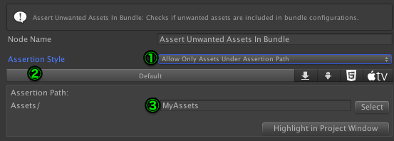

1. Select the assertion method. If you select “Allow Only Assets Under Assertion Path”, assets with asset bundle settings that are under (3)’s assertion path will result in an error. If you select “Prohibit Assets Under Assertion Path” , assets with asset bundle settings that are under assertion paths will result in an error. 
2. Platform settings tab.
3. Specify a directory path to use for assertion.

## **Error** 

## 

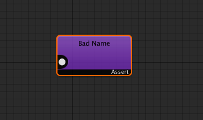

#### **Introduction** 

The Error node creates an error when an asset is passed to it. This node is useful for finding improper assets when paired with the Split by Filter node. 

#### **Properties** 

1. Summary of the error. 
2. Explanation of how to resolve the error. 

## Build Asset Bundles 

## 

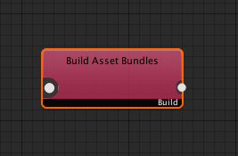

### Introduction 

This node builds asset bundles according to the asset bundle settings given.

### Properties 

#### 

1. When enabled, asset bundle names or variant settings designated by this graph will remain in the AssetImporter of assets in the asset bundle.
2. The output option. Designate whether to output to the Cache Directory or select another Output Directory.
3. Set the name of the Output Directory when an option other than Build In Cache Directory is selected in (2). 
4. Set the Global Manifest Name. If left empty, the Directory name will be used. 
5. Asset bundle build options. For more details, see the [API documentation](https://docs.unity3d.com//ScriptReference/BuildAssetBundleOptions.html).

## Build Player 

### 

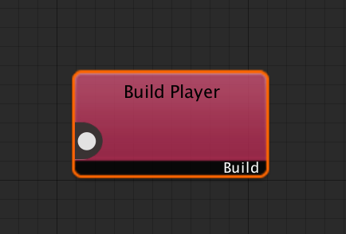
  \
Introduction  

This node builds the player for this project. By passing the output of Build Asset Bundles, you can build players that take into account the assets in the AssetBundles. If no AssetBundles are given to the Build Player node, there may be unexpected side effects such as scripts only used within the asset bundle being removed due to optimization.

### Properties 

#### 

1. Platform selection tab.
2. Set the directory to build the player in. 
3. Player name.
4. Player build options. Refer to the [API documentation](https://docs.unity3d.com//ScriptReference/BuildOptions.html) for details.
5. Scenes that will be included when building the player.

## Export To Directory 

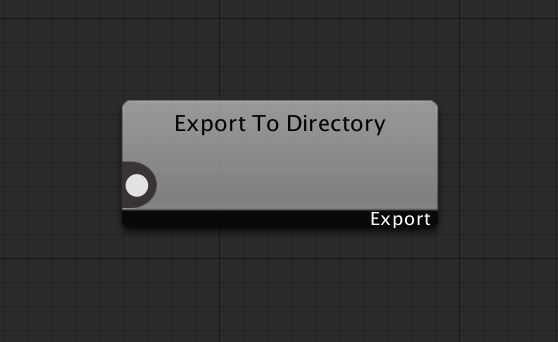

### Introduction  

The Export to Directory node copies given assets to specified directories.

### Properties 

1. Platform settings tab.
2. Export options. Select whether to report an error when there is no directory to export to, automatically create a directory, or delete the output destination and recreate it every time.
3. Destination directory.
4. When enabled, compresses the directory structure before copying.

## Mirror Directory 

### Introduction  

The Mirror Directory node mirrors directories based on specified properties. It does not use the assets given to it. Asset-giving only exists in order to mirror in the desired sequence when used with other nodes. This node is convenient for processing files that will be in special directories that are related to Unity’s build, such as StreamingAssets.

### Properties 

1. Platform settings tab.
2. Specify the mirroring settings. When set to “Keep Already Copied Files”, it will only copy files that do not already exist in the mirroring location or updated files. Files that do not exist in the mirroring location will be deleted but the directory will not be deleted. By selecting “Always Recreate Destination”, the mirroring destination will be deleted and recreated each time. 
3. Source mirror path.  When it is not a full path, it will be considered a project-relative path.
4. Destination mirror path. When it is not a full path, it will be considered a project-relative path.

## Copy or Move Files 

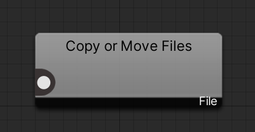

#### Intoroduction 

Copy or Move Files copies or moves given assets to destination on specified properties.

#### Properties

 

1. Copy or Move assets.
2. Number of directory paths to remove from source asset path. For example, if you are copying  **“Assets/Characters/Hero001/Textures/body.png”** to **“/Foo/Var”** and set Removing Directory Depth to 2, the asset is copied in **“/Foo/Var/Hero001/Textures/body.png”**.
3. The destination path to copy or move files.

## Import Unity Packages 

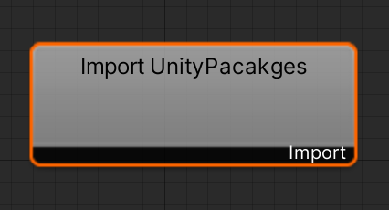

#### Introduction 

Import Unity Packages imports .unitypackages in the given directory. This node does not have input or output.

#### Properties 

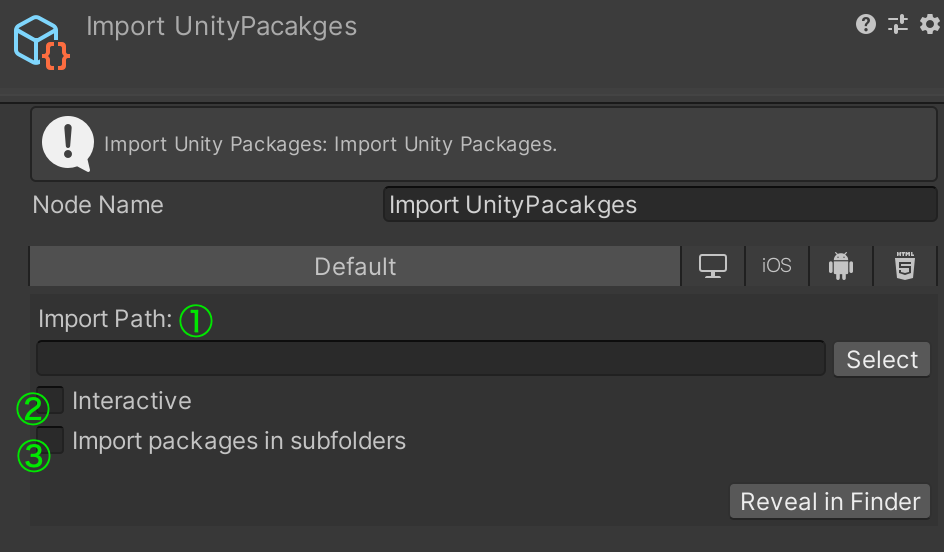

1. Directory path where importing .unitypackage files are located. 
2. Open a dialog on import.
3. Imports all .unitypackage files in subfolders.

## Export As UnityPackage 

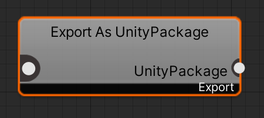

#### Introduction 

Export As UnityPackage exports given assets on specified properties. Most of the options in Export As UnityPackage are based on [ExportPackageOptions](https://docs.unity3d.com/ScriptReference/ExportPackageOptions.html).

#### Properties 

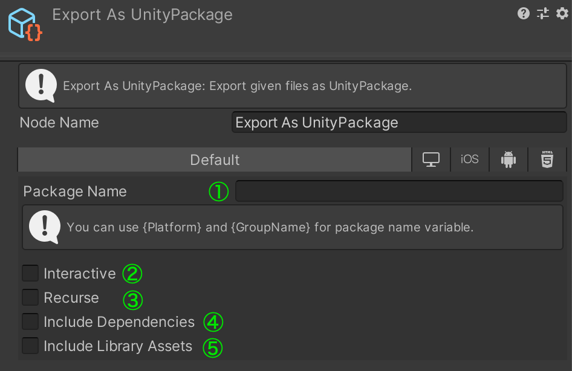

1. The package name to export.
2. The export operation will be run asynchronously and reveal the exported package file in a file browser window after the export is finished.
3. Will recurse through any subdirectories listed and include all assets inside them.
4. In addition to the assets paths listed, all dependent assets will be included as well.
5. The exported package will include all library assets, ie. the project settings located in the Library folder of the project.

# Addressables Nodes 

AssetGraph offers nodes for Addressables. They will be available if you install **Addressables 1.6 or later** in your project. Addresables can be installed from Unity Package Manager just like AssetGraph.

## Set Asset Address 

#### Introduction 

Set Asset Address sets address for incoming assets.

#### Properties 

1. Whether to set an address to this asset.
2. The regular-expression path to match asset’s path to configure address by pattern.
3. The relacing pattern use with ② to configure asset address. \
For example, if you have  **“.*/Prefabs/(.*)/\.prefab”** as matching pattern and **“blocks/$1”** as replacing pattern, then have **"Assets/Prefabs/Blocks/Orange2x2.prefab"** as incoming asset, the configured asset’s address will be **”blocks/Orange2x2”**. 
4. Whether to set assets in all lower cases.

## Set Asset Group 

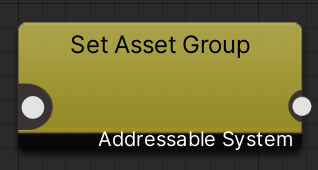

#### Introduction 

Set Asset Group configure the addressable group for incoming assets.

#### Properties 

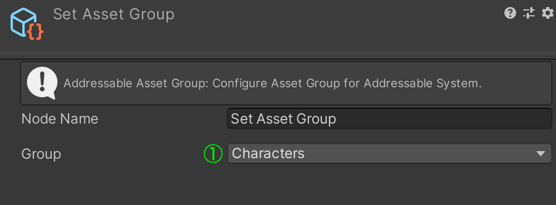

1. The Group to add incoming assets to.

## Set Asset Label 

#### Introduction 

Set Asset Label configures Addressable labels for incoming assets.

#### Properties 

1. Whether to overwrite labels. If set to false, the node will append labels.
2. Labels to set. * can be used to set group name as a label. “,” can be used to set multiple labels. 

## Build Addressable Assets 

#### Introduction 

Build Addressable Assets performs building of Addressable assets.

#### Properties 

1. Profile to use Addressable for this build.
2. The build script to use for this build.
3. Whether to perform an update of the last build.
4. Specify the Content State File to update.

# Advanced Topics 

## Configuring AssetBundles with AssetGraph 

There are standard features for AssetBundle settings included with Unity, but it is important to understand the relationship between those features and the features in AssetGraph. With Unity’s standard features the name of the AssetBundle for each asset to be included in can be set from the asset’s inspector, and the AssetBundle can be built depending on the BuildPipeline.BuildAssetBundles function called from the Editor script. On the other hand, with AssetGraph it’s important to remember not to use this method. Unlike the standard method there are more flexible options for building AssetBundles with AssetGraph, such as designating the assets that belong to each AssetBundle, pushing the Build button in AssetGraph, or calling the function from a script. 

## Adding Custom Nodes 

Built-in Nodes have many uses, but you might also want to create a node that performs a specific type of processing. In these cases, you can add custom nodes that run their own processes. Go to Menu > Window > Asset Graph > Create Node Script > Custom Node Script. Custom node scripts will be created under Generated Directory, but you can move or rename the scripts. By default, custom nodes are created under the Custom item.

To implement custom nodes, create a class that inherits from Node. Custom nodes also need to have the CustomNode attribute. The CustomNode attribute specifies the display position (menu hierarcy, sort order). For example, the settings of custom node scripts generated from the menu look like this:

 \
[CustomNode("Custom/MyNode", 1000)]

For more on the node class, please refer to the [API documentation](http://unity3d-jp.github.io/AssetGraph/index.html).

## Adding Custom Filters 

You can categorize assets based on type or file path with [Split By Filter](#split-by-filter), but you might want to have other filters too. For example, you might want to only get textures with an alpha channel.  In these cases, you can add custom filters. Go to Menu > Window > Asset Graph > Create Node Script > Filter Script. A custom filter script will be created under the UnityEngine.AssetBundleGraph / Generated directory. You can rename and move the spawned script. When a custom filter is added, a drop down menu to add filter options will be available by clicking on the + in Split By Filter. 

 \

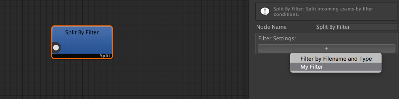

To add custom filters on your own, create a class that implements the [IFilter](http://unity3d-jp.github.io/AssetGraph/interface_unity_engine_1_1_asset_bundles_1_1_graph_tool_1_1_i_filter.html) interface. Custom filters also need the CustomFilter attribute. CustomFilter attribution can be set at the GUI display name in the Filter Settings drop down menu. In the example above, it will be displayed like this:

[CustomFilter("My Filter")]

 \
For more on the [IFilter](http://unity3d-jp.github.io/AssetGraph/interface_unity_engine_1_1_asset_bundles_1_1_graph_tool_1_1_i_filter.html) interface, please refer to the API documentation.

## Supporting Custom Assets 

When you need support for custom asset types, Unity’s [ScriptedImporter](https://docs.unity3d.com/ja/current/ScriptReference/Experimental.AssetImporters.ScriptedImporter.html) can be implemented in order to import them. Create a class equipped with the IImporterSettingsConfigurator interface in order to use importers supported by ScriptedImporter in AssetGraph. Classes equipped with IImporterSettingsConfigurator control how supported custom ScriptedImporter properties are managed.  Additionally, setting the class’ CustomAssetImporterConfigurator attribute is required. The CustomAssetImporterConfigurator attribute designates a template file name for supporting the custom data type, GUI display name, and saving the default settings. For example, the attribute for an XYZImporter would look like this:

 \
[CustomAssetImporterConfigurator(typeof(XYZImporter), "XYZ", "setting.xyz")]  \
public class XYZImportSettingsConfigurator : IAssetImporterConfigurator

The template file must be placed in the project’s SettingTemplate directory. There can be as many Setting Template directories in as many places in the project as you like. 

## Editing Assets 

Assets like Materials do not have importers, so it is difficult to edit them per platform, but there are times when you want to do that in the actual production. You can edit assets directly by using [Modify Assets Directly](#modify-asset-directly). If you want to edit assets your own way, you can add a custom modifier to do that. Go to Menu > Window > Asset Graph > Create Node Script > Modifier Script.  A custom modifier script will be created under UnityEngine.AssetBundleGraph / Generated. You can rename and move the new script as you like. When a custom modifier is added, you can select the custom modifiers from the Modifier’s drop down menu. 

A Custom Modifier is a class that implements a [IModifier ](http://unity3d-jp.github.io/AssetGraph/interface_unity_engine_1_1_asset_bundles_1_1_graph_tool_1_1_i_modifier.html)interface, and has the CustomModifier attribute. Specify the type the modifier will change and the modifier name that will be displayed in the GUI.

 \
[CustomModifier("MyModifier", typeof(RenderTexture))]

 \
For more details on the [IModifier ](http://unity3d-jp.github.io/AssetGraph/interface_unity_engine_1_1_asset_bundles_1_1_graph_tool_1_1_i_modifier.html)interface, please refer to the API documentation.

## Creating Prefabs Automatically 

Sometimes, you may have a lot of typical GameObjects prefabs with scripts and components added to your project. By using the [Create Prefab From Group](#create-prefab-from-group) node, you can create these typical prefabs from groups. If you want to create prefabs for your project, you can add custom PrefabBuilders to your project. 

Go to Menu > Window > Asset Graph > Create Node Script > PrefabBuilder Script to add a custom PrefabBuilder. A PrefabBuilder script will be created under the UnityEngine.AssetBundleGraph / Generated directory. You can rename and move the script freely. When the script is added you can select the PrefabBuilders you have added from the drop down menu.  \
 

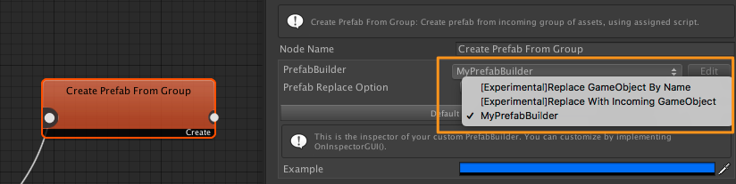
 \
Custom PrefabBuilders require the CustomPrefabBuilder attribute, like other custom scripts. Specify the GUI display name of PrefabBuilders from CustomPrefabBuilder. In the example above, these attributes are set. 

[CustomPrefabBuilder("MyPrefabBuilder")]

To create a PrefabBuilder, create a class that implements the [IPrefabBuilder](http://unity3d-jp.github.io/AssetGraph/interface_unity_engine_1_1_asset_bundles_1_1_graph_tool_1_1_i_prefab_builder.html) interface.  For details on [IPrefabBuilder](http://unity3d-jp.github.io/AssetGraph/interface_unity_engine_1_1_asset_bundles_1_1_graph_tool_1_1_i_prefab_builder.html), please refer to the API documentation.

### Rebuilding all prefabs when a PrefabBuilder script is changed 

Sometimes you may want to rebuild all prefabs after modifying your PrefabBuilder script. You can force rebuild prefabs by versioning your PrefabBuilder. Versioning can be done in the CustomPrefabBuilder attribute. 

[CustomPrefabBuilder("MyPrefabBuilder", “ver.1”)]

Modifying a version string will induce all prefabs using that PrefabBuilder script to rebuild.

## Creating Derived Assets Automatically 

For example, when preparing assets for smartphones of different capacities, you may want to prepare textures and materials more specifically than just per platform. In these cases, it is important to prepare textures and materials that are resized according to the specs of the devices. 

By using Generate Asset, you can spawn and use related assets made from an original asset. If you want to expand functions other than Texture Scaler or Duplicate Asset, you can do that by adding AssetGenerator to your project. 

Go to Menu > Window > Asset Graph > Create Node Script > AssetGenerator Script to add AssetGenerator. An AssetGenerator script will be created under the UnityEngine.AssetBundleGraph / Generated directory. You can rename or move the script freely. You can select added AssetGenerators from the AssetGenerator’s drop down menu when you add a script. 

AssetGenerator, like other custom scripts, need to have the CustomAssetGenerator attribute. Specify the AssetGenerator’s GUI display name and version from CustomAssetGenerator. In the example above, these attributes were given. 

 \
[CustomAssetGenerator("My Generator", "v1.0")]

 \
To create an AssetGenerator, create a class that implements the [IAssetGenerator](http://unity3d-jp.github.io/AssetGraph/interface_unity_engine_1_1_asset_bundles_1_1_graph_tool_1_1_i_asset_generator.html) interface.  For details on [IAssetGenerator](http://unity3d-jp.github.io/AssetGraph/interface_unity_engine_1_1_asset_bundles_1_1_graph_tool_1_1_i_asset_generator.html), please refer to the API documentation.

## Running Post-processes After Building 

You may want to have post-processes such as getting notifications when a graph execution is done. You can get results automatically after a graph is executed when you add a post-process script. Go to Menu > Window > Asset Graph > Create Node Script > Postprocess Script to add a post process script. The script will be created under the UnityEngine.AssetBundleGraph / Generated directory. You can rename and move the script freely. The post-process script has a method called DoPostprocess which enables you to get build reports and copy reports in the form of [AssetBundleBuildReport](http://unity3d-jp.github.io/AssetGraph/class_unity_engine_1_1_asset_bundles_1_1_graph_tool_1_1_asset_bundle_build_report.html) and [ExportReport](http://unity3d-jp.github.io/AssetGraph/class_unity_engine_1_1_asset_bundles_1_1_graph_tool_1_1_asset_bundle_build_report.html#). 

To implement post processes, create a class with a [IPostprocess](http://unity3d-jp.github.io/AssetGraph/interface_unity_engine_1_1_asset_bundles_1_1_graph_tool_1_1_i_postprocess.html) interface implemented. For more on [IPostprocess](http://unity3d-jp.github.io/AssetGraph/interface_unity_engine_1_1_asset_bundles_1_1_graph_tool_1_1_i_postprocess.html), please refer to the API documentation.

## Building A Graph From A Script 

When you are extending editors and custom menus on your own, you may want to run AssetGraph graphs from a script. In these cases, you can run graphs with [AssetBundleGraphUtility](http://unity3d-jp.github.io/AssetGraph/class_unity_engine_1_1_asset_bundles_1_1_graph_tool_1_1_asset_bundle_graph_utility.html). [AssetBundleGraphUtility](http://unity3d-jp.github.io/AssetGraph/class_unity_engine_1_1_asset_bundles_1_1_graph_tool_1_1_asset_bundle_graph_utility.html) can be run on just one graph or multiple graphs.  For more information on [AssetBundleGraphUtility](http://unity3d-jp.github.io/AssetGraph/class_unity_engine_1_1_asset_bundles_1_1_graph_tool_1_1_asset_bundle_graph_utility.html) , please refer to the API documentation. 

## Execution with Command Line Tools 

## Use with AssetBundle Browser 

## 

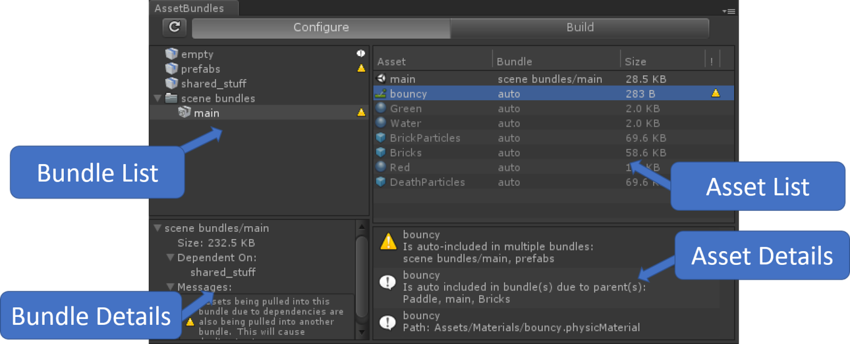

The [AssetBundle Browser](https://docs.unity3d.com/Manual/AssetBundles-Browser.html) is a tool that lets you set asset bundles, check the content of asset bundles, and build them. You can install the AssetBundle Browser from Unity Package Manager.

When you want to check files included in asset bundles that were set by AssetGraph, you can use AssetGraph with the AssetBundle Browser. After installing AssetBundle Browser and AssetGraph into your project, you can select the graph from the project settings in AssetBundle Browser’s drop down menu. After selecting, you can check the asset bundle settings set by AssetGraph. 

In addition, since asset bundle settings on the GraphTool side are set by graphs, they are viewable, but not editable, in the AssetBundle Browser.

## Work With Version Control Systems 

There are several files and directories created implicitly by AssetGraph. 

*   **Cache**: Stores files configurations for the files created by graphs. Deleting the cache folder will cause related files (such as prefabs built by graphs) to recreate when a graph runs, but clearing the cache folder should not do any harm to your project. (you can clear cache from the menu, too)
*   **SavedSettings**: Stores important configurations meant to be kept, such as import settings you configured. This should be kept and shared across the team to make the graph work properly. Unnecessary SavedSettings files not currently being used by the project can be removed by clicking Window > AssetGraph > Clean Up SavedSettings. 

If you are sharing your project using version control systems, here is a quick guide for your configuration.

**Ignore from committing**

*   Everything under Cache

**Do not ignore**

*   Everything under SavedSettings