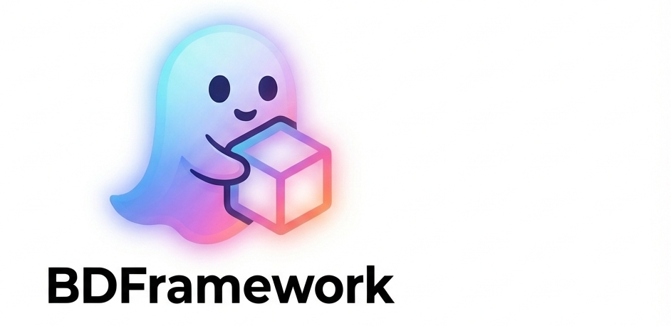

     
# 作者寄语(Introduction)

Simple! Easy! Professional! This‘s a powerful Unity3d game workflow! BDFramework的设计理念永远是：**致力于打造高效的游戏工业化流水线！！**  BDFramework大部分功能开发都是围绕一整条工作流，以**Pipeline**的形式放出. 如:**BuildPipeline、PublishPipeline、DevOps** 等... 对于第三方库使用也都是为了Pipeline深度定制，很多时候为了一些使用体验优化会编写大量的Editor编码. 这也是BDFramework的设计理念之一： **能编辑器解决的，就不要业务层解决！能自动化的，就不要手动!** BDFramework没有什么看上去很酷炫的功能，大都是一点一滴的积累，一点点的增加自动化，一点点的增加业务编码的体验.也正是因为有这样的坚持，才会有这套框架的出现. 更多的是做一些商业技术方案的分享和讨论. 因为一些特殊原因，只能放出一些游戏基建方案Pipeline的实现， 不会有对具体业务逻辑的解决方案，所以整套workflow更像是一套游戏开发脚手架. 望理解！ 最后, 虽然该框架能开箱即用，但我个人建议且鼓励 ：**进行自己的思考，并为自己项目进行改造！** 有任何疑问也欢迎讨论~

# 文档(Document)

[**中文 Wiki**](https://www.wolai.com/ky1FVhe7Mudg6ru277gfNr)

#### [English Wiki](http://www.nekosang.com/)

#### [视频教程（video）](https://www.bilibili.com/video/av78814115/)

#### [博客（Blog）](https://zhuanlan.zhihu.com/c_177032018)

# 社区(Community)

#### 在线提问、交流(Online Discussions): [点击](https://github.com/yimengfan/BDFramework.Core/discussions)  
#### 第十艺术交流: [点击加群](https://jq.qq.com/?_wv=1027&k=OSxzhgK4)  

If you find a bug or have some suggestions,please make issue! I'll get back to you

任何问题直接提issue,24小时内必解决 （有时候邮件抽风，没收到，需要在群里at下我~） 

# 安装使用(Start)  
#### OpenUPM(强烈推荐): [链接](https://www.wolai.com/4CdvGJ93AXPJ2kLMC49F2Z)   
# 发布（Publish）

#### 稳定版本托管在OpenUPM :  [链接](https://www.wolai.com/4CdvGJ93AXPJ2kLMC49F2Z)   

### 支持奇数版本:2019、2021 、 Unity6（2023）

#### Unity2018 - [ObsoleteBranch](https://github.com/yimengfan/BDFramework.Core/tree/2018.4.23LTS)  
#### Unity2019 - [链接](https://www.wolai.com/4CdvGJ93AXPJ2kLMC49F2Z)    （当前主干）  
#### Unity2021 - [待测试]
#### Unity6(2023) - [待测试]  

版本开发流程： =》修改、Fixed bug、新功能加入 基于**Master（目前为Unity2019）** =》Merge to Unity2021测试  

#### [开发计划](https://www.wolai.com/rYPc8FpYj1Lu9EjYoz1Ci9)  

  

## V2.1版本:

#### -增加BuildPipeline！
#### -增加PublishPipeline！
#### -增加HotfixPipeline！
#### -全面支持DevOps工作流.
## V2版本:
#### 1.全面升级为UPM管理

#### 2.全面适配URP管线工作流

#### 3.全面定制Unity Editor环境，升级编辑器操作。更便捷、人性化的开发体验

#### 4.全面优化框架启动速度,重构部分远古代码。

#### 5.UFlux UI工作流全面升级：更智能的值绑定、更简单的工作流、更方便的自定义扩展、DI等...

#### 6.更全面的文档

#### 7.商业级的Demo加入，后续会开放免费商业级项目开发教程

## V1版本：

### C#热更(C# hotfix):

- 自定义编译服务
- 可选工程剥离(热更可以不拆工程)
- 一键打包热更DLL
- 兼容DevOps、CI、CD.

### 表格管理(Table Manage):

- Excel一键生成Class
- Excel一键生成Sqlite、Json、Xml等
- 服务器、本地表格分开导出.
- 自定义配置保留字段、单条记录等.
- SQLite ORM工具(兼容热更)
- 自定义表格逻辑检测.
- 兼容DevOps、CI、CD.

### 资源管理（Assets Manage）:

- 重新定制目录管理规范、指导管理.
- 一套API自动切换AB和Editor模式，保留Resources.load习惯.
- 可视化打包逻辑配置、0冗余打包.
- 可扩展打包规则
- 分包机制.
- 打包逻辑纠错机制.
- 内置增量打包机制，防止不同机器、工程打包AB不同情况.
- 自动图集管理.
- 自动搜集Shader  Keyword.
- 可寻址加载系统.
- Assetbundle混淆机制，一定程度下防破解资源.
- Assetbundle 同、异步加载校验.
- Assetbundle 加载性能测试.
- Editor下完整支持
- 支持DevOps接入、CI/CD友好.

### 一键版本发布（Publish）:

- 代码、资源、表格一键打包,版本管理自动下载.
- 内置本机文件服务器
- 支持DevOps接入、CI/CD友好.

### UI工作流(UFlux):

- 提供一套Flux ui管理机制(类似MVI)
- 完善的UI管理,可配合任意NGUI、UGUI、FairyGUI等使用
- 完整的UI抽象：Windows、Component、State、Props...
- 支持UI管理、值绑定、数据监听、数据流、状态管理等
- 支持DI依赖注入.

### 业务管理（Logic Manage）:

- 管理器和被管理类自动注册
- 在此之上BD实现了ScreenviewManger,UIManager,EventManager...等一些管理器.使用者根据自己的需求可以实现其他的管理器.
- Editor下完整支持.

### 导航机制（Navication）:

- 模块、用户Timeline等导航机制.
- 方便做模块调度、划分等逻辑...

### 全面定制Editor:

- 提供完整的编辑器生命周期，方便可定制、拓展.
- **完整的测试用例，保证框架的稳定.**
- 所有功能全面兼容DevOps、CI、CD等工具.
- 其他大量的定制Editor，以保证使用体验...(太多了统计不过来)

**有很多细枝末节的系统就不列举了...**  
