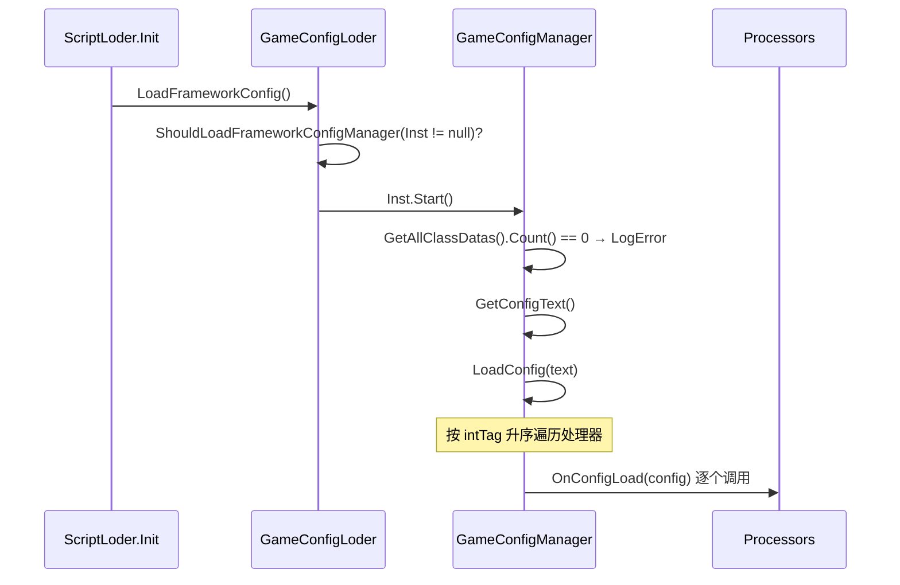

# 配置中心 GameConfig

配置中心基于 **`IConfigProcessor` 处理器 + `.bytes` JSON 文件**，替代 ScriptableObject 方案。

!!! warning "命名空间是 `BDFramework.Configure`"
    `GameConfigLoder`、`GameConfigManager`、`GameConfigAttribute`、`GameBaseConfigProcessor`、`GameCipherConfigProcessor` 全部在 **`BDFramework.Configure`**，不是 `BDFramework`。这是高频踩坑点。

## 类型体系

```csharp
namespace BDFramework.Configure

// ① 属性：标记一个配置处理器，intTag 决定执行顺序
public class GameConfigAttribute : ManagerAttribute
{
    public string Title = "";
    public GameConfigAttribute(int intTag, string tile) : base(intTag);
    public GameConfigAttribute(string tag) : base(tag);
}

// ② 配置数据基类
abstract public class ConfigDataBase
{
    [HideInInspector] public string ClassType;      // = 嵌套 Config 类的 FullName，用于匹配
}

// ③ 处理器接口
public interface IConfigProcessor
{
    void OnConfigLoad(ConfigDataBase config);
}

// ④ 配置中心
public class GameConfigManager : ManagerBase<GameConfigManager, GameConfigAttribute>
{
    public override void Start();
    public (List<ConfigDataBase>, List<IConfigProcessor>) LoadConfig(string configText);
    public T GetConfig<T>() where T : ConfigDataBase;
    public T GetConfigProcessor<T>() where T : IConfigProcessor;
    public List<ConfigDataBase> CreateNewConfig();
    public Dictionary<Type, ConfigDataBase> ReadConfig(string configText);

    private static readonly string DefaultEditorConfigPath = "Assets/Scenes/Config/editor.bytes";
}

// ⑤ 静态入口
public class GameConfigLoder
{
    public static void LoadFrameworkConfig();
}
```

## 处理器契约

每个处理器类需要：

1. 挂 `[GameConfig(intTag, "标题")]` 属性
2. 定义一个**嵌套的 `Config` 类**，派生自 `ConfigDataBase`
3. 实现 `IConfigProcessor.OnConfigLoad(ConfigDataBase config)`

```csharp
[GameConfig(100, "我的模块")]
public class MyConfigProcessor : IConfigProcessor
{
    // ★ 嵌套类名必须叫 Config
    [Serializable]
    public class Config : ConfigDataBase
    {
        public int    MaxLevel  = 100;
        public string ServerUrl = "http://127.0.0.1:8080";
    }

    public void OnConfigLoad(ConfigDataBase config)
    {
        var con = config as Config;
        // 消费配置
    }
}
```

!!! danger "嵌套类必须叫 `Config`"
    `GameConfigManager.LoadConfig` 用 `cd.Type.GetNestedType("Config")` 取嵌套类型，再用它的 `FullName` 与 JSON 里的 `ClassType` 字段比对。类名不叫 `Config` 就匹配不上。

## 读取配置

```csharp
var config = GameConfigManager.Inst.GetConfig<GameBaseConfigProcessor.Config>();
var version = config.ClientVersionNum;
```

`GetConfig<T>()` 在管理器尚未初始化时会**单独解析一次并写入 `configList`**，因此可以提前调用。

## 加载时序



### 配置文本来源优先级

`GameConfigStartupPureLogic.ResolveFrameworkConfigTextSource` 的解析顺序：

| # | 条件 | 来源 |
|---|------|------|
| 1 | `Application.isPlaying` 且运行时 launcher 有 `TextAsset` | 运行时 `BDLauncher` |
| 2 | 场景中有 `BDLauncher` 且 `ConfigText` 已赋值 | 场景 `BDLauncher` |
| 3 | Editor 且 `Assets/Scenes/Config/editor.bytes` 存在 | 编辑器默认配置 |
| 4 | — | `None`（直接 return，不加载） |

`GameConfigStartupPureLogic` 是 `internal static`，支持**无 MonoBehaviour** 的启动路径（BatchMode / EditorTest）。

## 内置处理器

### `GameBaseConfigProcessor`（`[GameConfig(-9999, "框架基础")]`）

```csharp
[Serializable]
public class Config : ConfigDataBase
{
    public AssetLoadPathType CodeRoot    = AssetLoadPathType.Editor;    // LabelTextAttribute("代码路径")
    public AssetLoadPathType SQLRoot     = AssetLoadPathType.Editor;    // LabelTextAttribute("SQLite路径")
    public AssetLoadPathType ArtRoot     = AssetLoadPathType.Editor;    // LabelTextAttribute("资源路径")
    public HotfixCodeRunMode CodeRunMode = HotfixCodeRunMode.HyCLR;     // LabelTextAttribute("热更代码执行模式")
    public bool   IsDebugLog          = true;                           // LabelTextAttribute("是否打印日志")
    public string ClientVersionNum    = "0.0.0";                        // LabelTextAttribute("客户端版本")
    public L2Type L2Type              = L2Type.zh_CN;                   // LabelTextAttribute("语言包")

    public string GetClientVersionNumForIOS();
#if UNITY_EDITOR
    public void UpdateClientToAllConfig();     // [ButtonAttribute]
#endif
}

public void OnConfigLoad(ConfigDataBase config);      // 把 IsDebugLog 同步到 BDebug.IsLog
public static BDebug EnsureDebugComponent(GameObject owner);
static public string GetLoadPath(AssetLoadPathType assetLoadPathType);
```

UI 分组（Odin 特性）：`a/a1` 代码路径、`a/a2` SQLite、`a/a3` 资源、`a/a4` 执行模式、`a/a6` 日志、`a/a12` 客户端版本、`a/a13` 语言包。

!!! note "`-9999` 保证最先执行"
    配置处理器的执行顺序由 `GetAllClassDatas()` 按 intTag 升序决定。`GameBaseConfigProcessor` 用 `-9999` 保证**早于 `GameCipherConfigProcessor`（2）**，这样 `SqliteLoder.Password` 在 `SqliteLoder.Init` 之前一定已注入。

### `GameCipherConfigProcessor`（`[GameConfig(2, "加密")]`）

```csharp
public class Config : ConfigDataBase
{
    public string SqlitePassword  = "password123!!!";   // LabelTextAttribute("Sqlite密码")
    public string ScriptPubKey    = "";                 // LabelTextAttribute("DLL公钥")
    public string ScriptPrivateKey = "";                // LabelTextAttribute("DLL私钥")
}

public void OnConfigLoad(ConfigDataBase config)
{
    var con = config as Config;
    SqliteLoder.PasswordFallback = () => con.SqlitePassword;   // 解耦 Config → Sql 依赖
    SqliteLoder.Password = con.SqlitePassword;
}
```

!!! warning "`ScriptPubKey` / `ScriptPrivateKey` 未被消费"
    这两个字段只做配置存储，**仓库内没有任何读取逻辑**。

## `AssetLoadPathType` 与 `HotfixCodeRunMode`

```csharp
namespace BDFramework

public enum AssetLoadPathType { Editor = 0, Hotfix = 1 }
public enum HotfixCodeRunMode { HyCLR = 1, Mono64 }

public class Config : MonoBehaviour { }     // ★ 字段为空，只剩枚举宿主价值
```

!!! note "`Config : MonoBehaviour` 是空壳"
    源码里 `Config` 类**没有任何字段**，所有配置项都在各处理器的嵌套 `Config` 类里。它现在的唯一价值是承载两个枚举的定义位置（见[重构清单](../architecture/refactor-backlog.md#ref-11-empty-types)）。

`AssetLoadPathType` 的解析见[资源加载寻址](../guide/asset-load-path.md)。

## 配置文件格式

| 项 | 值 |
|----|-----|
| 默认路径 | `Assets/Scenes/Config/editor.bytes` |
| 格式 | **LitJson 序列化的 JSON 数组** |
| 每条内容 | 一个 `ConfigDataBase` 派生对象的序列化结果，含 `ClassType` 字段 |
| 真机来源 | `BDLauncher.ConfigText`（场景中挂载的 `TextAsset`）内容为同一份 JSON |
| 扩展名 | `.bytes`（`ConfigEditorUtil.FILE_SUFFIX`） |

`ConfigEditorUtil`（`namespace BDFramework.Editor.Inspector.Config`，但**位于 Runtime 程序集**）：

```csharp
CONFIG_PATH   = "Assets/Scenes/Config"
FILE_SUFFIX   = ".bytes"
DefaultEditorConfig = "Assets/Scenes/Config/editor.bytes"

GenConfigPaths()   // Directory.GetFiles(CONFIG_PATH, "*.bytes", AllDirectories)，排除 .meta
```

!!! warning "`ConfigEditorUtil` 在 Runtime 程序集里但依赖 UnityEditor"
    它的内容被 `#if UNITY_EDITOR` 包裹。后果是 `GameConfigManager` 无法直接复用它，只好自己复制了一份 `DefaultEditorConfigPath` 常量。见[重构清单](../architecture/refactor-backlog.md#ref-8-configeditorutil)。

## 新增一个配置模块的完整步骤

```csharp
// ① 定义处理器
[GameConfig(100, "战斗配置")]
public class BattleConfigProcessor : IConfigProcessor
{
    [Serializable]
    public class Config : ConfigDataBase
    {
        public int    MaxCombo    = 10;
        public float  DamageScale = 1.0f;
        public string[] BannedSkills = new string[0];
    }

    public void OnConfigLoad(ConfigDataBase config)
    {
        var con = config as Config;
        BDebug.Log($"[BattleConfig] MaxCombo={con.MaxCombo}");
    }
}

// ② 读取
var cfg = GameConfigManager.Inst.GetConfig<BattleConfigProcessor.Config>();
```

配置面板会**自动**出现 `BattleConfigProcessor.Config` 的字段（靠 `GetAllClassDatas()` 扫描 + Odin 绘制），无需手工注册。

!!! note "配置文件需要在 Editor 面板里保存一次"
    新处理器加入后，`Assets/Scenes/Config/*.bytes` 里还没有对应的 `ClassType` 条目。在 `BDFrameWork工具箱 → 框架设置` 面板中保存一次即可写入。

## 常见故障

| 现象 | 根因 |
|------|------|
| `[GameconfigManger]启动失败，class data 数量为0.` | 处理器类未被收集（缺属性 / 不在收集白名单程序集） |
| `GetConfig<T>()` 返回 `null` | 嵌套类名不是 `Config`；或配置文件里没有该 `ClassType` |
| 配置面板看不到新字段 | 配置文件未保存；或字段缺 Odin 特性 |
| `GameConfig配置为null,请检查!` | 场景 `BDLauncher.ConfigText` 未赋值 |
| Editor 有配置、真机没有 | 母包 `StreamingAssets` 未包含配置，或 `ConfigText` 未打包 |
| 命名空间报错 | 忘了 `using BDFramework.Configure;` |

## 相关页面

- [资源加载寻址](../guide/asset-load-path.md) —— `AssetLoadPathType` 解析
- [启动链路](../architecture/bootstrap.md) —— 配置在启动中的位置
- [表格 SQLite](sqlite.md) —— 加密配置如何注入
- [Runtime 模块地图](../architecture/runtime-modules.md)
