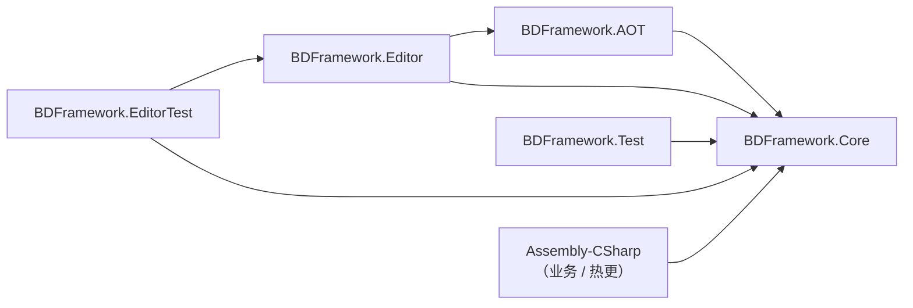

# 程序集与依赖

## 一方程序集清单

| 程序集 | asmdef 路径 | 平台 | 职责 |
|--------|------------|------|------|
| `BDFramework.Core` | `Packages/com.popo.bdframework/Runtime/BDFramework.Core.asmdef` | Any | 框架运行时 |
| `BDFramework.AOT` | `Packages/com.popo.bdframework/Runtime.AOT/BDFramework.AOT.asmdef` | Any | AOT 补充注册，供 IL2CPP 预剪裁保留 |
| `BDFramework.Editor` | `Packages/com.popo.bdframework/Editor/BDFramework.Editor.asmdef` | Editor | 构建管线、编辑器窗口、CI bridge |
| `BDFramework.Test` | `Packages/com.popo.bdframework/Runtime.Test/Runtime/` | Any | Runtime API 测试（仅 Debug 构建） |
| `BDFramework.EditorTest` | `Packages/com.popo.bdframework/Runtime.Test/Editor/` | Editor | Editor-only 测试、BatchMode bridge |

`Runtime/AssemblyInfo.cs` 暴露内部类型给测试程序集：

```csharp
[assembly: InternalsVisibleTo("BDFramework.EditorTest")]
[assembly: InternalsVisibleTo("BDFramework.Test")]
```

另有一方包 `com.talosai.e2e`（`Packages/com.talosai.e2e/`）承载 E2E 测试编排，不属于框架本体。

## 依赖方向



规则：

- **`Runtime` 不得反向引用 `Editor`。** 唯一的例外是 `Runtime/GameConfig/ConfigEditorUtil.cs`——它位于 Runtime 程序集，但内容被 `#if UNITY_EDITOR` 包裹。这是历史遗留（见[重构清单](refactor-backlog.md)）。
- **`BDFramework.AOT` 不得引用 `BDFramework.Core`。** 因此 `BDLauncher` 走了全反射路径访问 Core。
- **业务代码（`Assembly-CSharp`）可以引用 Core，Core 不知道业务。**

## 第三方与内置依赖

### 作为 Unity Package 引入

| 包 | 用途 |
|----|------|
| `com.code-philosophy.hybridclr` | 热更运行时 |
| `com.code-philosophy.obfuz` / `com.code-philosophy.obfuz4hybridclr` | 代码混淆 |
| `com.unity.assetgraph`（BDFramework 维护分支） | AssetBundle 打包图 |
| `Unity-Logs-Viewer` | 设备日志查看 |
| `com.popo.bdframework/3rdPlugins/AssetGraph-1.8-release-BD` | AssetGraph 源码镜像 |

### 内置在包内（`Packages/com.popo.bdframework/`）

| 目录 | 内容 |
|------|------|
| `3rdPlugins/BetterStreamingAssets` | Android APK 内资源读取 |
| `3rdPlugins/LitJson` | JSON 序列化（配置文件、`AssetsVersionInfo`） |
| `3rdPlugins/MessagePack` | 二进制序列化 |
| `3rdPlugins/Protobuf` | 网络协议 |
| `3rdPlugins/UniTask` | async/await 支持 |
| `3rdPlugins/ZString` | 零分配字符串格式化 |
| `3rdPlugins/NuGet` | NuGet 包宿主 |
| `Nuget/ServiceStack.Text.5.12.0` | CSV 序列化（`art_assets.info`、`assets.info` 都是 CSV） |
| `Plugins/Sqlite` | 原生 `sqlite3` / SQLCipher |
| `Plugins/Debug` | Odin 等编辑器依赖 |

!!! warning "不要修改第三方与 vendored 插件"
    `Packages/com.code-philosophy.*`、`3rdPlugins/**`、`Nuget/**` 属第三方代码。一方改动只允许落在 `Packages/com.popo.bdframework/**` 与 `Packages/com.talosai.e2e/**`。

    需要覆写第三方行为时，用**扩展点**（继承 + 注册）而不是 fork 源码。AssetGraph 的分支镜像 `AssetGraph-1.8-release-BD` 是唯一例外，它的存在本身就是为了定制。

## 业务程序集

`Assets/Code/**` 下**没有任何 `.asmdef`**，因此全部落在 Unity 默认程序集：

| 目录 | 程序集 | 参与热更 |
|------|--------|---------|
| `Assets/Code/**`（除 `Editor`） | `Assembly-CSharp` | ✓ |
| `Assets/Code/**/Editor/**` | `Assembly-CSharp-Editor` | ✗ |
| `Assets/Plugins/**` | `Assembly-CSharp-firstpass` | ✓ |
| `Assets/3rdPlugins/**` | 各自 asmdef | ✗ |

热更收集白名单（`ScriptLoder.GetAppDomainHostingTypes()`，按 `Assembly.FullName` 前缀匹配，仅取 `IsClass && !IsNested`）：

```text
"BDFramework"
"Assembly-CSharp,"
"Assembly-CSharp-firstpass,"
"UnityEngine.UI"
"Game."
含 "@main"
```

收集结果**首次扫描后缓存**在 `hostingTypeList`；Editor 下会按 `FullName` 排序并逐条打印 `框架托管DLL:...`。

### HybridCLR 热更程序集配置

`HyCLREditorTools.SetBDFramework2HCLRConfig()` 写入的约定：

| 配置项 | 值 |
|--------|-----|
| `preserveHotUpdateAssemblies`（追加） | `Assembly-CSharp`、`Assembly-CSharp-firstpass`、`BDFramework.Core` |
| `hotUpdateAssemblies`（移除） | 原列表 |
| `patchAOTAssemblies`（追加） | `mscorlib`、`System`、`System.Core` |

`preserveHotUpdateAssemblies` 表示"这些程序集在母包中**已经以 DLL 形式存在**，热更时替换而非新增"。`ScriptLoderAOT.ShouldSkipAlreadyLoadedHotfixAssembly` 会跳过已由 Player 预加载的同名程序集，避免 `AppDomain` 出现同名类型副本。

## 相关页面

- [启动链路](bootstrap.md)
- [Runtime 模块地图](runtime-modules.md)
- [热更代码 HybridCLR](../pipeline/build-hotfix-dll.md#hotfix-assembly-set)
