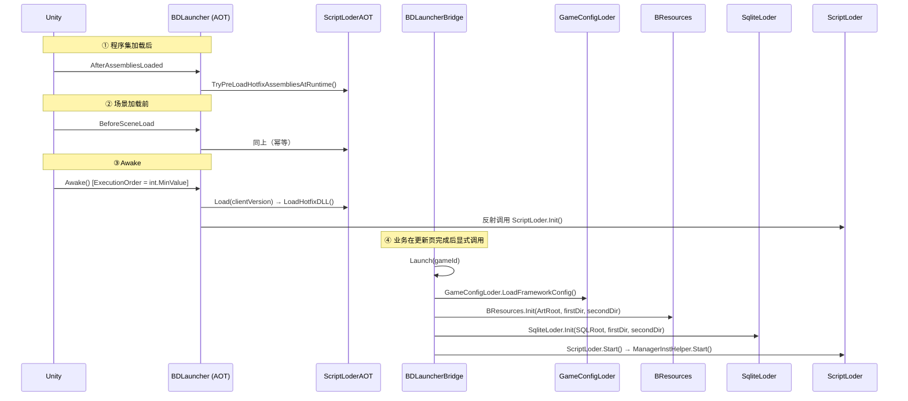

# 启动链路

框架启动分成**三段**，中间由业务代码决定何时进入第二段。



## ① AOT 阶段（`Runtime.AOT/BDLauncher.cs`）

```csharp
[RuntimeInitializeOnLoadMethod(RuntimeInitializeLoadType.AfterAssembliesLoaded)]
static void PreLoadHotfixAssembliesAfterAssembliesLoadedFromLauncher()
    => ScriptLoderAOT.TryPreLoadHotfixAssembliesAtRuntime("AfterAssembliesLoaded");

[RuntimeInitializeOnLoadMethod(RuntimeInitializeLoadType.BeforeSceneLoad)]
static void PreLoadHotfixAssembliesBeforeSceneLoadFromLauncher()
    => ScriptLoderAOT.TryPreLoadHotfixAssembliesAtRuntime("BeforeSceneLoad");   // 幂等
```

`Awake()`（`[DefaultExecutionOrder(int.MinValue)]`，全工程最先执行）依次做：

1. `Inst = this`；校验 `ConfigText != null`，否则 `Debug.LogError("GameConfig配置为null,请检查!")`。
2. `Application.isPlaying` 时 `DontDestroyOnLoad(this)`。
3. 若 `!ScriptLoderAOT.HasLoadedHotfixAssembliesBeforeSceneLoad` → `ScriptLoderAOT.Load(ClientVersion)`。
4. `InitHotfixScriptLoder()` —— 遍历 `AppDomain.CurrentDomain.GetAssemblies()` 找 `"BDFramework.ScriptLoder"`，`method.Invoke(null, null)` 调用 `ScriptLoder.Init()`。
5. 非 Editor 时反射设置 `BDFramework.Core.Tools.BApplication.IsPlaying = true`。

!!! danger "为什么这里全是反射"
    `BDFramework.AOT` 不能引用 `BDFramework.Core`（循环依赖）。且 **`System.Type.GetType("..., BDFramework.Core")` 在 IL2CPP 下返回 `null`** —— 必须用 `AppDomain.CurrentDomain.GetAssemblies()` 枚举。源码注释明确记录了这个坑。

### 热更 DLL 装载（`ScriptLoderAOT.LoadHotfixDLL`） { #hotfix-dll-loading }

| 步骤 | 路径 | 说明 |
|------|------|------|
| 1. 计算双寻址根 | `firstLoadDir` = `persistentDataPath/<clientVersion>/<platform>` | `clientVersion` 来自 `StreamingAssets/<platform>/package_build.info` |
| 2. **AOT 补充元数据** | **始终**从母包 `StreamingAssets/<platform>/script/aot_patch/*.zlua.bytes` | **不跟随版本目录**，因为 Patch AOT 必须与母包 IL2CPP 产物匹配 |
| 3. 热更 DLL | 优先 `firstLoadDir/script/hotfix/*.zlua.bytes` | 命中则 `File.ReadAllBytes` + `Assembly.Load` |
| 4. 回退母包 | Android 走 `BetterStreamingAssets.ReadAllBytes`，其余 `File.ReadAllBytes` | 都没有则抛 `【AOT.Load】HyCLR热更DLL不存在! 路径:...` |

AOT 元数据加载：`RuntimeApi.LoadMetadataForAOTAssembly(bytes, HomologousImageMode.SuperSet)`。

**程序集装载顺序被硬编码**（`GetHotfixDllLoadRank`）：

| 排名 | 匹配 | 说明 |
|------|------|------|
| 0 | `bdframework.core*` | 框架必须最先 |
| 1 | `assembly-csharp-firstpass*` | |
| 2 | `assembly-csharp*` | |
| 10 | 其他 | 同级按文件名 `OrdinalIgnoreCase` 排序 |

单个文件 `FileNotFoundException` / `DirectoryNotFoundException` 降级为 `Debug.LogWarning` 并继续。

## ② 桥接阶段（`Runtime/BDLauncherHotfix.cs`）

```csharp
BDLauncherBridge.Launch(string gameId = "default")
```

**业务代码在热更/更新页完成后显式调用**。步骤：

1. `BApplication.IsPlaying = true`
2. `BDLauncher.Inst.gameObject.AddComponent<IEnumeratorTool>()` ← **协程驱动必须先挂载**
3. `GameConfigLoder.LoadFrameworkConfig()`
4. `Config = GameConfigManager.Inst.GetConfig<GameBaseConfigProcessor.Config>()`
5. `(firstLoadDir, secondLoadDir) = ClientAssetsUtils.GetMultiAssetsLoadPath(BApplication.RuntimePlatform, Config.ClientVersionNum)`
    - `Application.isEditor` 时 `firstLoadDir = secondLoadDir`
6. `ClientAssetsUtils.CheckBaseClientAssets(firstLoadDir, secondLoadDir)`
7. `BResources.Init(Config.ArtRoot, firstLoadDir, secondLoadDir)`
8. `SqliteLoder.Init(Config.SQLRoot, firstLoadDir, secondLoadDir)`
9. `ScriptLoder.Start()` → `ManagerInstHelper.Start()`

`BDLauncherHotfix.Launch(gameId)` 只是转发别名。`OnApplicationQuit()` 仅 Editor 下做 `SqliteLoder.Close()` + `ScriptLoder.Dispose()`。

## ③ `ScriptLoder` 内部顺序

```csharp
ScriptLoder.Init()
  1. GetAppDomainHostingTypes()                    // 带缓存，Editor 下打印清单
  2. ManagerInstHelper.LoadManager(types)          // 只注册，不启动
  3. GameConfigLoder.LoadFrameworkConfig()         // 配置中心提前可用
  4. _ = BApplication.persistentDataPath;          // 主线程预热路径，防后台线程污染静态构造
  5. IsRunning = true

ScriptLoder.Start()
  → ManagerInstHelper.Start()
      ① 全部 Mgr.Init()
      ② 所有 !IsStarted 的 Mgr.Start()      // 按 [ManagerOrder] 升序
```

## 管理器启动顺序

`ManagerInstHelper.LoadManager` 的排序依据是 `[ManagerOrder(Order = n)]`（缺省 `0`，越小越先）。

| 管理器 | Order | 说明 |
|--------|-------|------|
| `GameConfigManager` | 0 | 配置中心 |
| `UIManager` | 0 | UI |
| `ComponentBindAdaptorManager` | 0 | 绑定适配器 |
| `ScreenViewManager` | **99999** | 全仓库唯一的 `ManagerOrder`，保证导航最后启动（它 `Start()` 时立刻 `BeginNavTo` 默认页） |

业务管理器（如 `DemoEventManager`）无需注册——`"Game."` / `"Assembly-CSharp,"` 前缀会把它收集进来。

!!! warning "`base.Start()` 不能省"
    `ManagerBase.Start()` 会置 `IsStarted = true`。覆写时忘调 `base.Start()` → `ManagerInstHelper.Start()` 会**重复调用**你的 `Start()`。

## 无 MonoBehaviour 的纯逻辑启动

`GameConfigStartupPureLogic` 让框架可以在 BatchMode / EditorTest 下复用生产分支。

```csharp
GameConfigLoder.LoadFrameworkConfig()
  → if (!GameConfigStartupPureLogic.ShouldLoadFrameworkConfigManager(GameConfigManager.Inst != null))
        return;      // 直接返回，不做场景查找、不读文件
  → GameConfigManager.Inst.Start()
```

配置文本解析优先级（`ResolveFrameworkConfigTextSource`）：

1. `Application.isPlaying` 且有运行时 launcher 的 `TextAsset` → 用运行时 launcher
2. 场景中有 `BDLauncher` 且 `ConfigText` 已赋值 → 用场景 launcher
3. Editor 且 `Assets/Scenes/Config/editor.bytes` 存在 → 用编辑器默认配置
4. 否则 `None`

这套设计让 E2E / BatchMode 可以在**没有 `BDLauncher` 组件**的情况下直接构造框架 runtime（见 `TalosE2EBatchBridge.PrepareEditorOnlyRuntime`）。

## 启动失败的排查顺序

| 症状 | 检查点 |
|------|--------|
| `GameConfig配置为null,请检查!` | 场景 `BDLauncher.ConfigText` |
| `【AOT.Load】HyCLR热更DLL不存在!` | `StreamingAssets/<platform>/script/hotfix/` |
| `[GameconfigManger]启动失败，class data 数量为0.` | 业务程序集是否被收集（前缀白名单） |
| 管理器 `Init()` 没被调用 | 属性是否派生自 `ManagerAttribute` |
| AB 异步加载无回调 | `IEnumeratorTool` 是否已挂载 |
| Editor 里一切正常，真机黑屏 | `AssetLoadPathType` 是否误配为 `Editor` |

## 相关页面

- [资源加载寻址](../guide/asset-load-path.md)
- [管理器体系 ManagerBase](../api/manager-base.md)
- [热更代码 HybridCLR](../pipeline/build-hotfix-dll.md)
- [E2E（Talos）](../testing/e2e.md)
