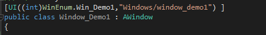

# &#x20;业务管理：ManagerBase

## 目录

- [其他文档](#其他文档)
- [管理器基类: ](#管理器基类)
- [示范:](#示范)
  - [UI管理器](#UI管理器)
- [注意事项：](#注意事项)
- [Demo：](#Demo)

### 其他文档

***

&#x20;[https://zhuanlan.zhihu.com/p/40751037](https://zhuanlan.zhihu.com/p/40751037 "https://zhuanlan.zhihu.com/p/40751037")
&#x20; &#x20;

### \*\*管理器基类: \*\*​

***

\*\* \*\*​**`ManagerBase<T,V>`**

\*\*  ****`T`****:管理器本身的单例\*\*

\*\*  ****`V`****:管理器需要 管理对象的标签 ，所有的标签需要继承`ManagerAtrribute`\*\*

 

### **示范:**

***

#### **UI管理器**

管理器:

```c# 
    /// <summary>
    /// UI管理类
    /// </summary>
    public partial class UIManager : ManagerBase<UIManager, UIAttribute>
```


标签：

```c# 
    /// <summary>
    /// UI
    /// </summary>
    public class UIAttribute : ManagerAttribute
    {
        public string ResourcePath { get; private set; }
    
        public UIAttribute(int intTag, string resPath):base(intTag)
        {
            this.ResourcePath = resPath;
        }
    }
```


被管理Class使用:

&#x20;



以上是UI管理的3个组成：

当BD框架启动时，会自动将拥有`UIAttribute`标签的，注册到`UIManager`中,并且可以通过自定义的Tag，获取到。

具体的管理器，会根据自己的业务，实现功能，如：**打开窗口**，**关闭窗口**，**创建窗口**等

但是本质上，管理器也就是管理一系列类和实例的。

所以BD将其简化，让使用者在 创建管理类，以及对应具体业务的时候，无需频繁的注册，只需要定义好标签就行。

### 注意事项：

***

ManagerBase只会收集以下DLL中的ClassType

```c# 
 Assembly[] assemblyList = System.AppDomain.CurrentDomain.GetAssemblies();
foreach (var assembly in assemblyList)
{
        
    if (
        //框架相关的类
         assembly.FullName.StartsWith("BDFramework")
        //unity 未定义Assembly 的class 
        || assembly.FullName.StartsWith("Assembly-CSharp,") 
        //unity未定义 Standard Assets 的class 
        || assembly.FullName.StartsWith("Assembly-CSharp-firstpass,") 
        / / UnityUI类 
        || assembly.FullName.StartsWith("UnityEngine.UIModule") 
        //所有以 Game.开头 定义的Assembly,可以定义 AssemblyDefine 以该字符开头
        || assembly.FullName.StartsWith("Game.") 
        //所有包含 @main 的Assembly,可以定义 AssemblyDefine 以该字符开头
        ||  assembly.FullName.Contains("@main") 
       )
    {
      var ts = assembly.GetTypes().Where((t) => t != null && t.IsClass && !t.IsNested);
      typeList.AddRange(ts);
    }
}
```


### Demo：

***

其他Demo:[链接](https://github.com/yimengfan/BDFramework.Core/tree/master/Assets/Code/Game%40hotfix/demo_Manager_AutoRegister_And_Event "链接")   这是一个基于管理器的事件事件系统 
