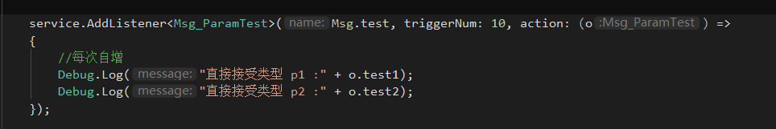
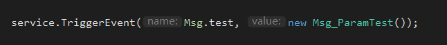
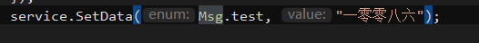
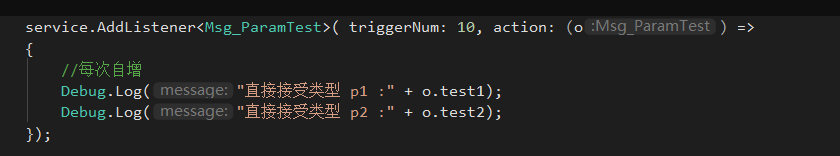
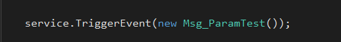

# 事件、数据监听

## 目录

- [API：](#API)
  - [1.创建](#1创建)
  - [2.数据监听](#2数据监听)
  - [3.事件（状态）监听](#3事件状态监听)
- [其他使用演示](#其他使用演示)
  - [1.枚举 数据监听](#1枚举-数据监听)
  - [2.事件（状态）监听](#2事件状态监听)

以下创建出来的是：**AStatusListener**对象,静态方法只是提供了快速的构建api.

实际上可以都自行管理.

> 📌**设计上** ,每个模块都应该持有一个**AStatusListener对象**，作为状态中心！

**如：** 战斗Battle对象、地图Map对象，都有成员对象 AStatusListener Status。
**则：** 我们可以使用battle.Status 、map.Status 对其访问.

而尽量**减少 GlobalEventCenter.Inst.AddListener**的全局事件中心方式.

**使用上 \*\* ，在**AStatusListener**基础上使用了This进行扩展，并抽象了**`值监听`**、**`状态监听`\*\*

**值监听**：**`ValueListenerEx.cs `**
设计为key-value形式，所以API接口中 需要用string或者Enum作为key
同个Status对象中， key不能重复，Value值类型并不做限制

**状态、事件监听：`EventListenerEx.cs `**
设计为监听T对象，同个Status对象中，T不能重复，
当然大部分情况下，事件监听 也可以作为值监听使用.

# API：

***

### 1.创建

```c# 
  public enum Msg
  {
     test,
  }
//通过Server创建
var service      = StatusListenerServer.Create(nameof(Msg.test));
//获取
var service      = StatusListenerServer.GetService(nameof(Msg.test));

//数值类型监听(避免拆装箱),当T指定以后，监听的回调只能是这个类型
var service      = StatusListenerServer.Create<int>(nameof(Msg.test));
var service2      = StatusListenerServer.Create<string>(nameof(Msg.test));
var service3      = StatusListenerServer.Create<float>(nameof(Msg.test));
var service4      = StatusListenerServer.Create<bool>(nameof(Msg.test));

//自行new
var status =  new StatusListenerService()


```


### 2.数据监听

```c# 
/// <summary>
/// 添加监听
/// </summary>
/// <param name="dl"></param>
/// <param name="name">监听名</param>
/// <param name="action">回调</param>
/// <param name="order">触发顺序</param>
/// <param name="triggerNum">触发次数</param>
/// <param name="isTriggerCacheData">是否触发回调</param>
static public void AddListener(this AStatusListener dl, Enum name, Action<object> action = null,int order = -1,int triggerNum = -1, bool isTriggerCacheData = false)
----------------------------------------------------------------------------------------
使用：
//添加监听
this.State.AddListener(Test.TestIntName, (ret_int) => { });
//设置数据、触发监听
this.State.SetData(Test.TestIntName,10010);
//获取数据
var i = this.State.GetData<int>(Test.TestIntName);
//移除监听
this.State.RemoveListener(Test.TestIntName,any_func);
//清理所有监听
this.State.ClearListener(Test.TestIntName);

//当然这里的 int类型可以是任何类型


```


### 3.事件（状态）监听

```c# 
/// <summary>
/// 状态(事件)监听 T
/// </summary>
/// <param name="dl"></param>
/// <param name="name">监听数据名</param>
/// <param name="action">回调</param>
/// <param name="order">顺序</param>
/// <param name="triggerNum">触发次数，-1代表一直触发</param>
/// <param name="isTriggerCacheData">是否触发回调</param>
/// <typeparam name="T"></typeparam>
static public void AddListener<T>(this AStatusListener dl, Action<T> action = null, int order = -1, int triggerNum = -1, bool isTriggerCacheData = false) where T : class
//添加一次监听
static public void AddListenerOnce<T>(this AStatusListener dl, Action<T> callback = null, int order = -1, bool isTriggerCacheData = false) where T : class
    
----------------------------------------------------------------------------------
public class TestClass
{
        
}
//添加监听
this.State.AddListener<TestClass>((test) => { });
//触发事件
this.State.TriggerEvent<TestClass>();
//触发事件，带数据
this.State.TriggerEvent<TestClass>(new TestClass());
//移除监听
this.State.RemoveListener<TestClass>(any_func);
//清理所有监听
this.State.ClearListener<TestClass>();

```


# 其他使用演示

#### 1.枚举 数据监听



**派发**



注：枚举和string其实没区别，枚举也可以用作值变化监听：



#### 2.事件（状态）监听



**派发**


