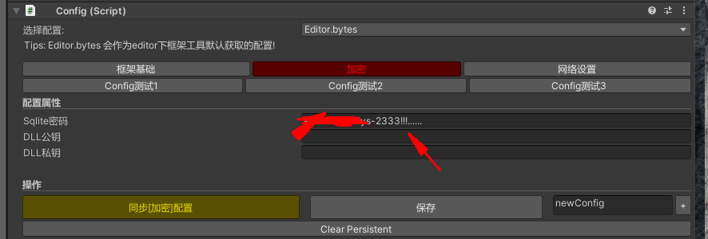

# 表格操作：Sqlite&#x20;

## 目录

- [Editor相关 ：](#Editor相关-)
- [数据库密码配置：](#数据库密码配置)
- [连接数据库：](#连接数据库)
  - [Editor: ](#Editor-)
  - [Runtime：](#Runtime)
  - [自定义DB加载|创建：](#自定义DB加载创建)
  - [关闭数据库：](#关闭数据库)
- [Sqlite查询（热更内）](#Sqlite查询热更内)
- [](#)

**`Framework Version：2.2`**

#### Editor相关 ：

[3.表格打包](<../../工作流管线（Pipeline）/构建工作流（Build Pipeline）/3.表格打包/3.表格打包.md> "3.表格打包")

### **数据库密码配置：**

***

[GameConfig 配置中心](https://www.wolai.com/vCfvkwh9KtLv48BCwswkYp "GameConfig 配置中心")



加密数据库访问工具：

[DB Browser for SQLite.zip](<file/DB Browser for SQLite_XRV0x6Jqbp.zip> " DB Browser for SQLite.zip")

### 连接数据库：

***

#### \*\*Editor: \*\*

可读写|创建db 权限

```c# 
 SqliteLoder.LoadLocalDBOnEditor(loadPath,platform); //加载local.db
 SqliteLoder.LoadServerDBOnEditor(root,platform)//加载server.db
```


#### **Runtime：**

只读权限

```c# 
SqliteLoder.Init(GameConfig . SQLRoot);  // 这里会根据配置中进行加载local.db

```


以上接口加载，通过 \*\*`SqliteHelper.DB`\*\*获取

#### **自定义DB加载|创建：**

```c# 
SqliteLoder.LoadDBReadOnly(path); //只读权限
SqliteLoder.LoadDBReadWriteCreate(path); //可读可写|创建

```


以上接口加载，通过 \*\*`SqliteHelper.GetDB(fileName) `\*\*获取

#### **关闭数据库：**

```c# 
   SqliteLoder .Close();
```


# Sqlite查询（热更内）

***

**因ILR热更内部情况复杂，以实现查询为主，无法实现比较优雅的ORM.**

**Where查询：**

```c# 
SqliteHelper.DB.GetTableRuntime().Where("id = 1").FromAll<APITestHero>();
```


**Limit：**

```c# 
SqliteHelper.DB.GetTableRuntime().Where("id != 1").Limit(1).From<APITestHero>();
```


**And查询:**

```c# 
SqliteHelper.DB.GetTableRuntime().Where("id > 1").And.Where("id < 3").FromAll<APITestHero>();
```


**Or查询：**

```c# 
SqliteHelper.DB.GetTableRuntime().Where("id = 1").Or.Where("id = 3").FromAll<APITestHero>();
```


**WhereAnd批量查询：**

```c# 
 SqliteHelper.DB.GetTableRuntime().WhereAnd("id", "=", 1, 2).FromAll<APITestHero>();
```


**WhereOr批量查询：**

```c# 
 SqliteHelper.DB.GetTableRuntime().WhereOr("id", "=", 1, 2).FromAll<APITestHero>();
```


**WhereIn批量查询：**

```c# 
SqliteHelper.DB.GetTableRuntime().WhereOr("id", "=", 1, 2).FromAll<APITestHero>();
```


**OrderBy 排序:**

```c# 
SqliteHelper.DB.GetTableRuntime().Where("Id >=1").OrderByDesc("Id").FromAll<APITestHero>();
```


#
