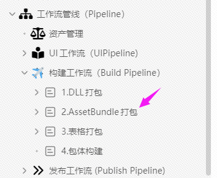

# 资源加载：BResource&#x20;

## 目录

- [机制:](#机制)
- [可寻址化的加载系统：](#可寻址化的加载系统)
- [API详解：](#API详解)

### 机制:

***

BD使用了内置了2套加载机制:

> &#x20;1\. Editor加载用\*\*`AssetDataBase.Load`**模拟**`Resources.Load`\*\*
> 2\.  移动端封装\*\*​`AssetBundle.Load`\*\*进行加载。

使用者只需使用\*\*`BResource.Load`\*\*进行加载，BD会根据环境进行切换

### 可寻址化的加载系统：

只要使用BDFramwork内置的打包工具，无论你将资源放在任何地方都可以使用BResource进行加载.

参考如下：

[2.AssetBundle打包](https://www.wolai.com/5ikwZDM7Gko9S2uvXtA6RA "2.AssetBundle打包")

### API详解：

***
