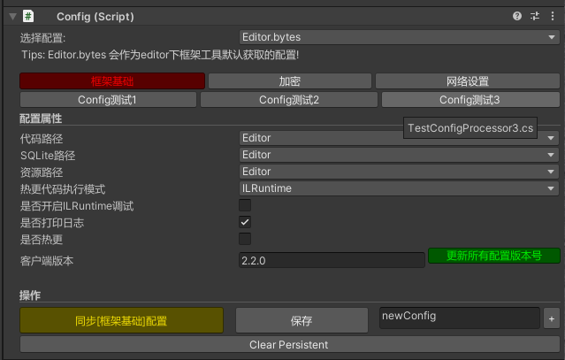
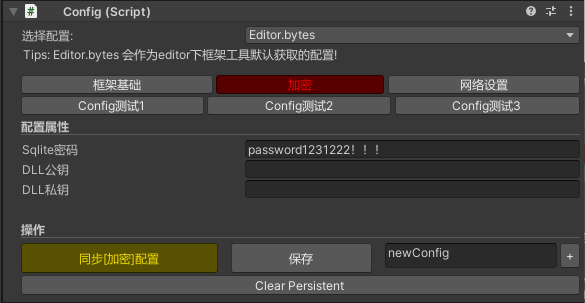
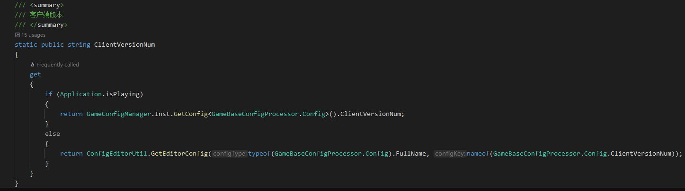
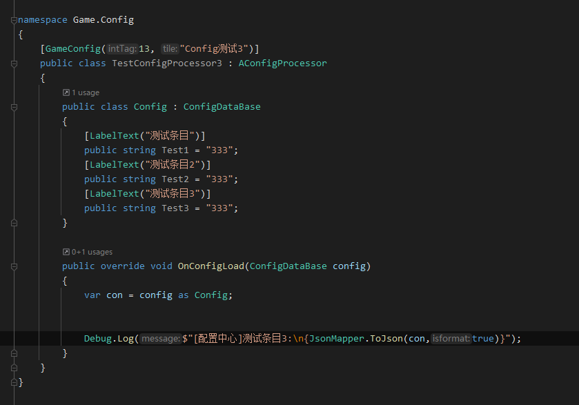

# 配置中心：GameConfig&#x20;

## 目录

- [面板预览](#面板预览)
- [获取配置](#获取配置)
- [自定义配置](#自定义配置)

## 面板预览

***





这里是基于ManagerBase开发的一整套获取GameConfig中心，也支持自定义扩展

框架默认实现了: **框架基础**、**加密** 两个配置！

## 获取配置

***

**Runtime下获取：**

```c# 
//1.获取基本配置
GameConfigManager.Inst.GetConfig<GameBaseConfigProcessor.Config>()

//2.获取基本配置
GameConfigManager.Inst.GetConfig<GameCipherConfigProcessor.Config>()
```


**GameConfigManager未启动时获取**：

```c# 
var typeName = typeof(GameCipherConfigProcessor.Config).FullName;
//获取密码
var sqlitePsw   = ConfigEditorUtil.GetEditorConfig(typeName, "SqlitePassword"))
```




## 自定义配置

```c# 
    /// <summary>
    /// 游戏加密处理器
    /// </summary>
    [GameConfig(2,"加密")]
    public class GameCipherConfigProcessor : AConfigProcessor
    {
        /// <summary>
        /// 游戏加密设置
        /// </summary>
        public class Config : ConfigDataBase
        {
            /// <summary>
            /// 数据库密码
            /// </summary>
            [LabelText("Sqlite密码")]
            public string SqlitePassword = "password123!!!";
            /// <summary>
            /// 公钥
            /// </summary>
            [LabelText("DLL公钥")]
            public string ScriptPubKey = "";
            /// <summary>
            /// 私钥
            /// </summary>
            [LabelText("DLL私钥")]
            public string ScriptPrivateKey = "";
        }


        /// <summary>
        /// 当加载成功
        /// </summary>
        /// <param name="config"></param>
        public override void OnConfigLoad(ConfigDataBase config)
        {
            var con = config as Config;
            //Sqlite秘钥
            SqliteLoder.Password = con.SqlitePassword;
            //DLL秘钥
            ScriptLoder.PrivateKey = con.ScriptPrivateKey;
            ScriptLoder.PublicKey = con.ScriptPubKey;
        }
    }
```


以上为例子：

&#x20;**`[GameConfig(2,"加密")]`** ：Attribute，影响排序和Editor上的显示

**`GameCipherConfigProcessor`** ：具体加载器类

**`Config `**：配置参数，Odin自动渲染

**`OnConfigLoad `**：当框架**加载配置完成**会调用，并传入配置参数，使用者只需要按配置情况实现自己的需求即可。


