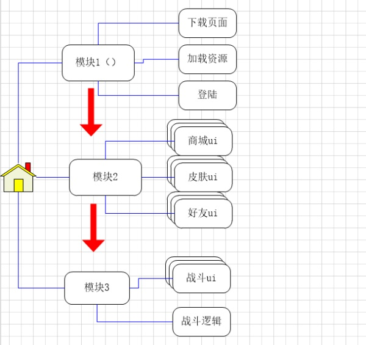
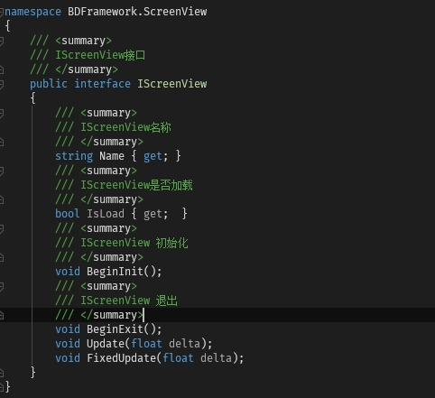
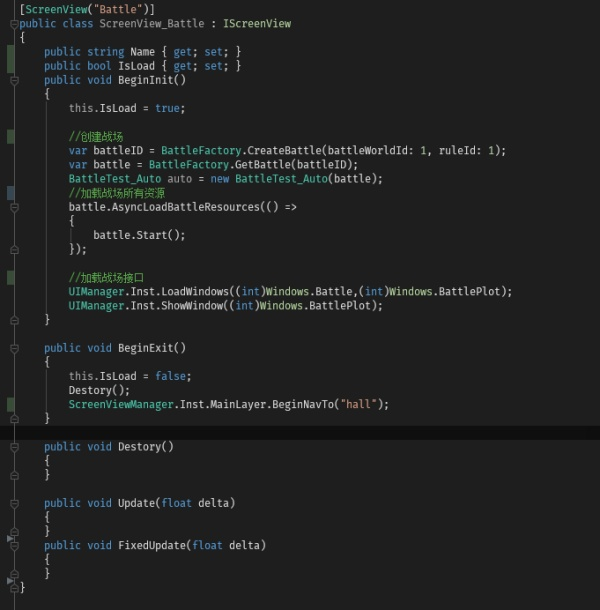

# &#x20;页面导航：ScreenView

## 目录

- [0x001.前言：](#0x001前言)
- [0x010.简介：](#0x010简介)
- [0x011.代码示例：](#0x011代码示例)
  - [ i.ScreenView抽象：](#-iScreenView抽象)
  - [ ii.ScreenView实现](#-iiScreenView实现)
  - [iii.导航](#iii导航)
- [0x100.最后：](#0x100最后)

## 0x001.前言：

***

游戏开发过程一般都是模块化开发。这里的模块指的是广义上相对隔离程序逻辑的模块，如：登陆，PVP战斗，PVE战斗等...

于此同时就会涉及到模块管理和模块划分。这个就是比较麻烦的问题，

**比如：** 游戏主界面上，n多按钮，每个按钮又是一个弹框功能。很多同学，为了效果流畅，在进游戏前，就把ui加载好了。这个时候要进游PVE模块，需要把部分ui进行删除卸载，给PVE预留内存空间。

想想，如果没有合理的划分模块和管理模块，那么就是一堆if else，针对每个情况进行处理。

一但游戏复杂，那么将会是噩梦。

## 0x010.简介：

***

BDFramework 针对这些逻辑，采用时间片的管理策略。这里的时间片，指的是按**照用户使用流程进行划分模块，这里其实采用的是app开发中导航的概念。**

1.进游戏、下载资源，资源加解压，登陆， 这个可以看成一个时间片，就是一个模块。

2.游戏大厅，和大厅上所有的按钮，以及按钮对应的窗口，这个也作为一个模块。

**而我们平时说的，商城模块，换装系统，在时间片的划分里，其实就只是一个ui窗口而已。**

这样回头想想，这样的一个个模块，**用户同时只会处于一个状态**，在这个状态里，可以把其他模块给卸载干净，update也停掉.

这样的一个流程，就是TimeLine了，其实就是按照用户的使用流程，进行合理的划分模块。 具体的划分还是要交给具体的开发者。

## 0x011.代码示例：

***

### &#x20;i.ScreenView抽象：

这里就是一个模块的生命周期。

BD里的模块，其实就是一个ScreenView，这个可不是一个窗口的意思。 这个就代表了一个时间块，BD永远只会执行一个时间块，会停掉其他的时间块的Update。

### &#x20;ii.ScreenView实现

&#x20;\* 拥有ScreenView标签的会被自动注册 \* ScreenView标签有第二参数，如果为True，则是默认进入该模块

这里是笔者项目中**战斗模块，**其实很简单，只有加载**战斗逻辑、战斗UI。**

### iii.导航

退出的时候，调用接口\*\*`ScreenViewManager.Inst.MainLayer.BeginNavTo("hall");`\*\*

切换模块。

## 0x100.最后：

***

**`ScreenView`**其实是基于**用户角度**进行模块封装，用以拆分逻辑，减少管理成本。

并不只局限于UI打包封装，而将**可能出现在一起的数个功能模块打包成一个`ScreenView`.**

**如：**

资源校验、登陆 数个模块为一个\*\*`ScreenView`\*\*、

主界面上诸多入口为一个\*\*`ScreenView`\*\*、

一些复杂的模块，如基建+基建UI为一个\*\*`ScreenView`\*\*、

战斗作为一个\*\*`ScreenView`\*\*.

最终还是要使用者自己把握\*\*`ScreenView`\*\*的颗粒度设计。
