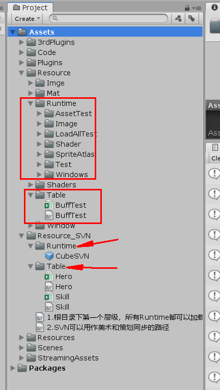

# 1.资源目录结构

【新增特性】（2020.06）：

Runtime、Table...

等目录约定，可以放到**Assets第一级任意子目录**下：

如Resource/Runtime,  aaa/Runtime, bbb/Rutime都可以被**加载，打包**。

\------------------------------------------------------------------------------------------------------------

**@hotfix**、**Runtime**、\*\*Table \*\*都是特殊约定目录

Asset

\------3rdPlugins                            第三方的一些插件

\------Code                                    所有Code存放目录

        ---------->Game                   具体游戏的非热更代码: 如编辑器（**谨记不要访问热更代码**）

&#x20;       \---------->Game\@hotfix       游戏的热更代码，代码路径中带@hotfix都会被打进热更DLL

\------Plugins                                 需要打包至移动端的插件代码

\------Resource             \*\*\*             所有项目资源                 &#x20;

&#x20; \*\*      ---------->Runtime \*\*           **这个目录用BResource.Load接口加载.**(需要手动Load的才放这)

&#x20;  \*\*     ---------->Table\*\*                 表格目录

Package

框架代码

剩余目录随意。
