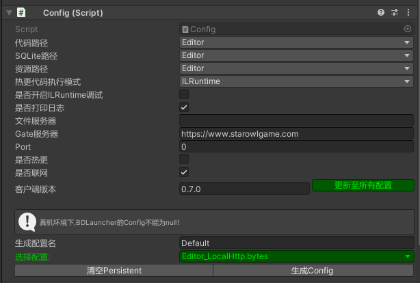

# 2.框架配置

## 目录

- [配置](#配置)
- [自定义配置：](#自定义配置)

## 配置

***

Config的相关配置仅在Editor下生效，Runtime需要生成配置，并赋值到`BDLauncher`上。

## 自定义配置：

***

[GameConfigMgr配置中心](https://www.wolai.com/vCfvkwh9KtLv48BCwswkYp "GameConfigMgr配置中心")
