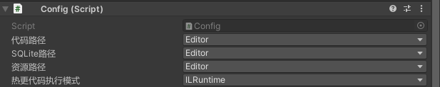
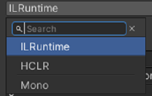

# 3.资源加载规则

## 目录

- [资源加载路径:](#资源加载路径)
  - [1.资源加载路径](#1资源加载路径)
  - [2.注意事项](#2注意事项)
  - [3.代码执行模式CodeRunMode：](#3代码执行模式CodeRunMode)

### **资源加载路径:**

***

BD内置了一个Config类，用于项目快速切换各种加载方式，ip地址，等。

#### 1.资源加载路径

**`代码`**、**`表格`** 、\*\*`美术资源`\*\*的加载路径:

     

**加载选项：**

|        | **Editor**             | **Persistent**       | **DevOps（Editor only）** |
| ------ | ---------------------- | -------------------- | ----------------------- |
| **代码** | 执行unity内部代码            | Persistent下的dll&#xA; | Devops目录下的DLL&#xA;      |
| **资源** | AssetDataBase加载&#xA;   | Persistent的ab包&#xA;  | Devops目录下的AB包&#xA;      |
| **表格** | StreamingAsset的DB&#xA; | Persistent的DB&#xA;   | DevOps下的db&#xA;         |

#### 2.注意事项

**真机环境下**：

&#x20;1.母包构建会携带所有 初始\*\*`热更资源（ab、脚本、db`**），资源会在**Persistent**和**Streaming\*\*中寻找资源加载

1. \*\*`热更资源`\*\*下载会存储Persistent下，且加载时优先寻找Persistent
2. 当**代码路径**选择为Edtor时，代码不更新。

**Editor下：**

1.和真机的区别则是，Editor在Persistent和DevOps目录进行\*\*`热更资源`\*\*寻的址加载。

2.当选项为**Editor**时：

&#x20;使用编辑器内代码、使用Devops内的db，使用AssetDabase.Load加载

#### 3.代码执行模式**CodeRunMode**：

