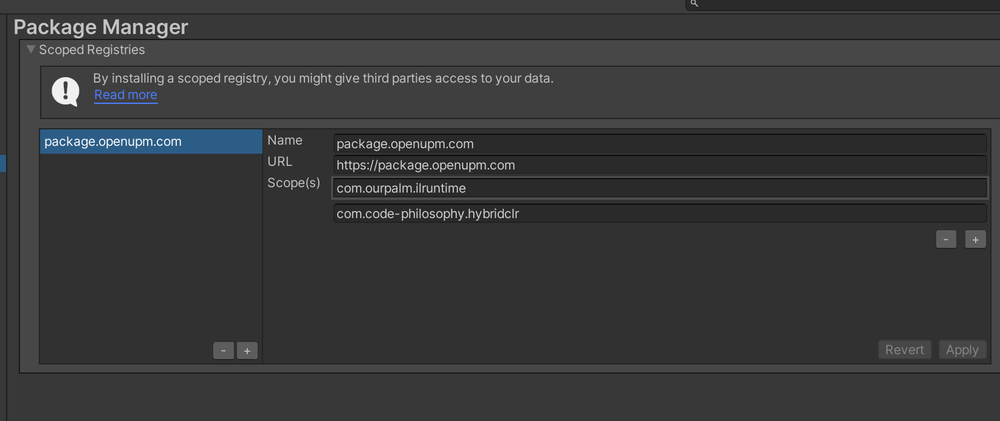
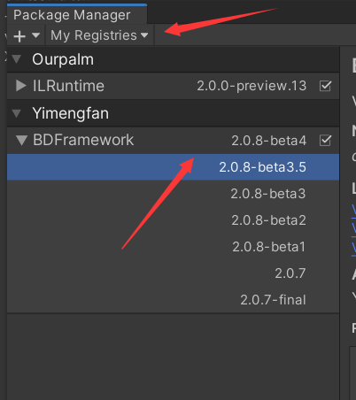
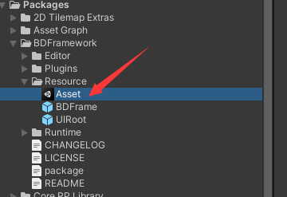
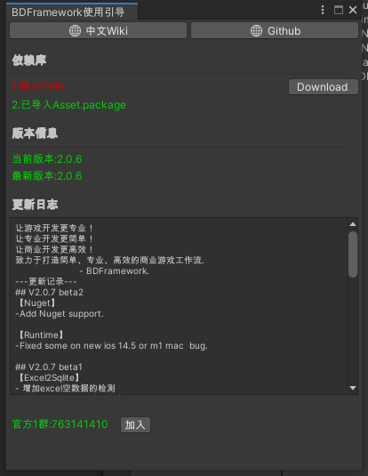
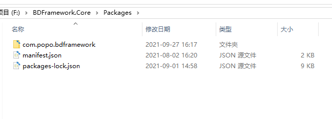

# UPM版本安装引导

## 目录

- [Release版：](#Release版)
- [导入后设置：](#导入后设置)
- [预览版&紧急修复bug版:](#预览版紧急修复bug版)

**Version: Unity3d 2019.4 LTS**

#### Release版：

***

**使用Open UPM更新框架：**

[https://openupm.com/packages/com.popo.bdframework/](https://openupm.com/packages/com.popo.bdframework/ "https://openupm.com/packages/com.popo.bdframework/")

**修改Manifest.json，增加：**

```json title="Manifest.json"
{
    "scopedRegistries": [
        {
            "name": "package.openupm.com",
            "url": "https://package.openupm.com",
            "scopes": [
                "com.code-philosophy.hybridclr",
                "com.ourpalm.ilruntime",
                "com.popo.bdframework"
            ]
        }
    ],
    "dependencies": {
        "com.popo.bdframework": "2.4.2"
    }
}
```


**或者：**

open the "**Package Manger"** editor windows.&#x20;

Switch menuitem to "**My Registries** ".



You can see the BDFramework ,you can select the new version.



**建议选择比较新的版本**

### 导入后设置：

***

1.导入Asset资源到工程中



2..导入Odin插件，此插件为付费插件，请自行获取\~



### 预览版&紧急修复bug版:

***

手动将框架放置在Package目录下，只移动**com.popo.bdframework文件夹**到项目即可


