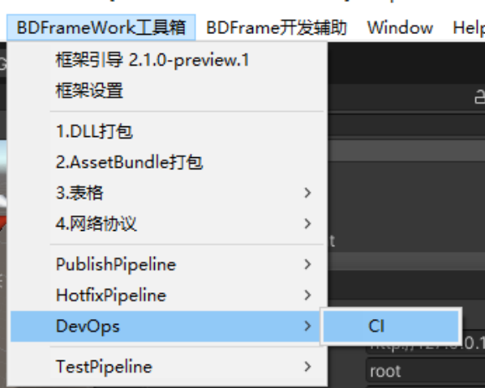
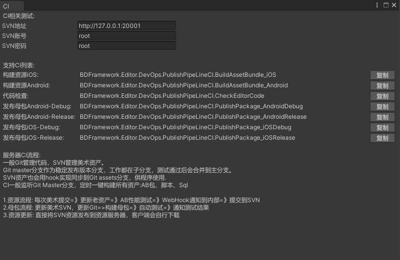
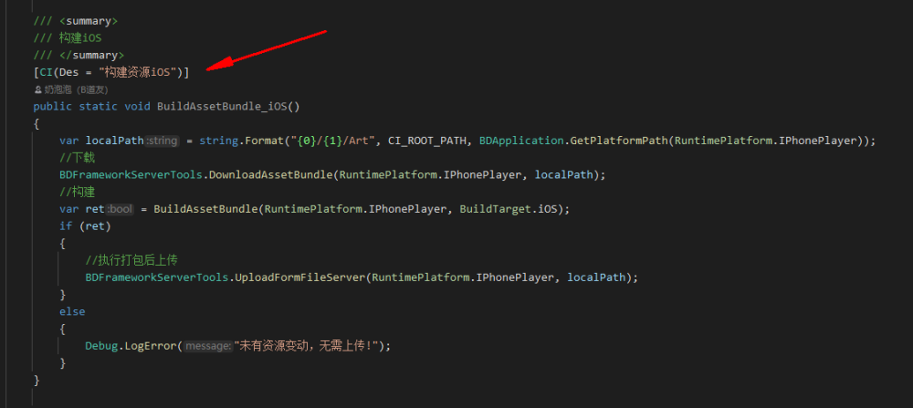
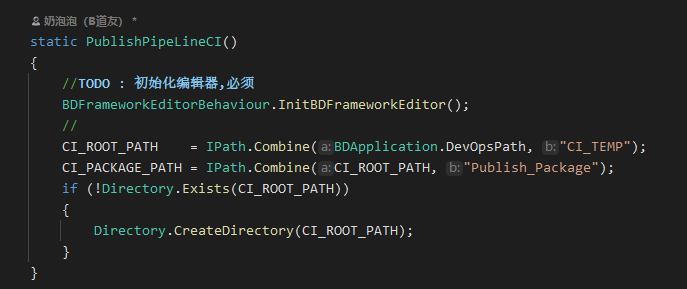

# CI相关操作（Jekins，TeamCity）

## 目录

- [CI相关操作（Jekins，TeamCity）](#CI相关操作JekinsTeamCity)
  - [1.预览框架(项目)中所有CI](#1预览框架项目中所有CI)
  - [2.如何显示在该列表中](#2如何显示在该列表中)
  - [3.注意事项](#3注意事项)

# CI相关操作（Jekins，TeamCity）

#### 1.预览框架(项目)中所有CI

#### 2.如何显示在该列表中

使用CI Method Attribute 对方法修饰即可

#### 3.注意事项

CI的class建议为 Static class，

> 📌**并且静态构造函数中需要初始化框架：`BDFrameworkEditorBehaviour.InitBDFrameworkEditor();`**
