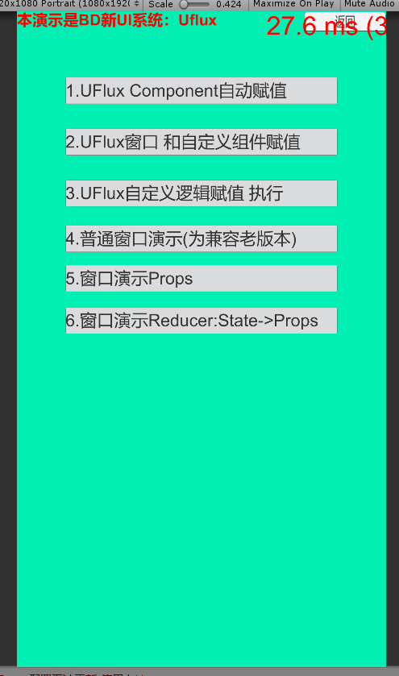

# Demo合集

## 目录

- [0.基本的窗口，可脱离Uflux使用](#0基本的窗口可脱离Uflux使用)
- [1. Props - Component的使用](#1-Props---Component的使用)
- [4.窗口Props刷新](#4窗口Props刷新)
- [5.服务器状态State 触发窗口刷新 Props](#5服务器状态State触发窗口刷新-Props)

#### 0.基本的窗口，可脱离Uflux使用

\*\* 拥有：  父子窗口管理，消息分发，自动节点赋值等特性\*\*​

**一般配合Component使用。**

[https://github.com/yimengfan/BDFramework.Core/tree/master/Assets/Code/Game%40hotfix/demo6\_UFlux/04.SimpleWindow](https://github.com/yimengfan/BDFramework.Core/tree/master/Assets/Code/Game%40hotfix/demo6_UFlux/04.SimpleWindow "https://github.com/yimengfan/BDFramework.Core/tree/master/Assets/Code/Game%40hotfix/demo6_UFlux/04.SimpleWindow")

#### 1. Props - Component的使用

- 简单组件，手动mark值变更
- 简单组件，自动分析值变更
- 嵌套组件

[https://github.com/yimengfan/BDFramework.Core/tree/master/Assets/Code/Game%40hotfix/demo6\_UFlux/01.Component](https://github.com/yimengfan/BDFramework.Core/tree/master/Assets/Code/Game%40hotfix/demo6_UFlux/01.Component "https://github.com/yimengfan/BDFramework.Core/tree/master/Assets/Code/Game%40hotfix/demo6_UFlux/01.Component")

**2.自定义绑定逻辑扩展**

[https://github.com/yimengfan/BDFramework.Core/tree/master/Assets/Code/Game%40hotfix/demo6\_UFlux/02.CustomComponentBindAdator](https://github.com/yimengfan/BDFramework.Core/tree/master/Assets/Code/Game%40hotfix/demo6_UFlux/02.CustomComponentBindAdator "https://github.com/yimengfan/BDFramework.Core/tree/master/Assets/Code/Game%40hotfix/demo6_UFlux/02.CustomComponentBindAdator")

#### 4.窗口Props刷新

[https://github.com/yimengfan/BDFramework.Core/tree/master/Assets/Code/Game%40hotfix/demo6\_UFlux/05.Window\_Props](https://github.com/yimengfan/BDFramework.Core/tree/master/Assets/Code/Game%40hotfix/demo6_UFlux/05.Window_Props "https://github.com/yimengfan/BDFramework.Core/tree/master/Assets/Code/Game%40hotfix/demo6_UFlux/05.Window_Props")

#### 5.服务器状态State 触发窗口刷新 Props

[https://github.com/yimengfan/BDFramework.Core/tree/master/Assets/Code/Game%40hotfix/demo6\_UFlux/06.Window\_Reducer](https://github.com/yimengfan/BDFramework.Core/tree/master/Assets/Code/Game%40hotfix/demo6_UFlux/06.Window_Reducer "https://github.com/yimengfan/BDFramework.Core/tree/master/Assets/Code/Game%40hotfix/demo6_UFlux/06.Window_Reducer")
