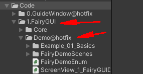
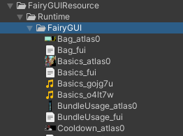
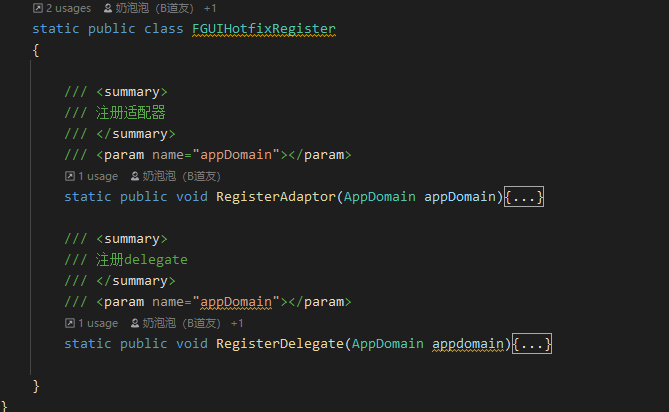
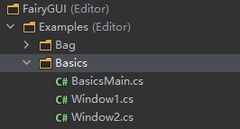
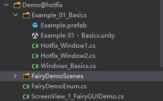

# FairyGUI支持

## 目录

- [目录结构：](#目录结构)
- [使用流程：](#使用流程)
- [API预览：](#API预览)
- [Demo讲解:](#Demo讲解)

BDFramework 扩展库地址 ：[https://github.com/yimengfan/BDFramework.Extension](https://github.com/yimengfan/BDFramework.Extension "https://github.com/yimengfan/BDFramework.Extension")

#### 目录结构：

在Code/1.FairyGUI中有核心库 和当前工程的demo.

#### 使用流程：

1.将FGUI资源放置再 xxx/Runtime 下

2.拷贝Fairy核心库 和BDFramework的扩展库 到自己项目

3.注册delegate 和 CrossAdaptor到ILRuntime 热更层。

可以查看在demo中的调用

#### API预览：

| AFGUIWindowContainer&#xA; | FGUI的容器类，可以是一个window，也可以是一段逻辑. 也可以存放多个FairyGUI 的windows做逻辑，具体看使用者的具体操作。他与windows不是一 一对应的关系。&#xA;                                                           |
| ------------------------- | ---------------------------------------------------------------------------------------------------------------------------------------------------------- |
| FGUI 标签&#xA;              | 用于描述当容器的资源路径 和tag，方便用FairyGUIManager进行导航.&#xA;                                                                                                             |
| FairyGUIManager&#xA;      | 页面导航，主要逻辑打开windows的容器类&#xA;例如：&#xA;FairyGUIManager.Inst.LoadWindow((int) FairyDemoEnum.Basics);FairyGUIManager.Inst.Open((int) FairyDemoEnum.Basics);&#xA; |

#### Demo讲解:

FairyGUI的demo

BDFramework拓展库的demo.

这里是完整的还原了FairyGui的 Basics demo.

具体细节不赘述 大部分逻辑一致，只是封装形式不一样，可以自行对比.

**最后，笔者项目中并未使用FairyGUI，这里只是简单跑通FairyGUI逻辑，有需要的同学还需根据自己需求进一步完善，如：消息机制 等...**
