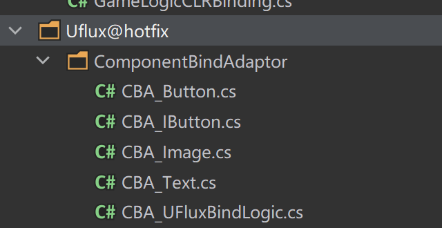

# Props值绑定

## 目录

- [Props值绑定](#Props值绑定)
  - [基本使用](#基本使用)
    - [1.定义](#1定义)
    - [2.修改](#2修改)
    - [3.提交](#3提交)
  - [值绑定核心代码:](#值绑定核心代码)
  - [自定义拓展：](#自定义拓展)
  - [注意事项：](#注意事项)
- [建议：](#建议)

> 📌值绑定**是可选功能,**通过ComponentValueBind进行绑定，绑定逻辑可以自定义
> **主要流程是**：
> 将一个**"value"**通过自定义的逻辑（**ComponentBindAdaptor**），设置为页面的值。
> 如：一个string的**value**，可以代表img的加载地址，也可以代表Text的文本
> 具体看绑定的type和自定义的逻辑实现\~

# Props值绑定

```c# 
//商品item 的props
public class Props_ItemTest002 : APropsBase
 {
         //商品icon地址
        [ComponentValueBind("img", typeof(Image), nameof(Image.overrideSprite))] //数据赋值对象
        public string ItemImg = "";

        //商品名
        [ComponentValueBind("img/text", typeof(Text), nameof(Text.text))] //数据赋值对象
        public string Content = "";

        //商品按钮点击事件
        [ComponentValueBind("btn_Buy", typeof(Button), nameof(Button.onClick))] //数据赋值对象
        public Action Action;

        //商品id
        [ComponentValueBind("Id", typeof(Text), nameof(Text.text))] //数据赋值对象
        public string ID = "";
    }

```


**需要注意的是**：值绑定**是可选功能，需要时加上这一类绑定标签.**

对用Props赋值，与之前对AWindow成员变量赋值不同，本质逻辑是：

**用一个****成员变量值****作为****参数****，调用一些方法，对Transform进行一些处理！**

如：根据string加载图片，根据String 修改Text文字，都是属于触发了不同函数

所以对于Attribute，统一用ComponentValueBind作为绑定逻辑.

\[ComponentValueBind("Id", typeof(Text), nameof(Text.text))]&#x20;

**第一个传参**: 节点路径，需要处理的节点

**第二个传参**: 绑定的方法Class， 如有对Text做了适配的则会直接调用，后面会讲如何

**第三个传参**: 具体执行的方法，这里规范上 用需要绑定的对象进行传递，这样调意图可读性更强

如上面Text实际由：

**CBA\_Text**控制逻辑

负责判断调用到他的则是通过该标签

\[**ComponentBindAdaptor**(typeof(**Text**))]

```c# 
using BDFramework.UFlux;
using UnityEngine;
using UnityEngine.EventSystems;
using UnityEngine.UI;
//这里的命名空间必须为：BDFramework.Uflux
namespace  BDFramework.UFlux
{
    /// <summary>
    /// 这里是UnityEngine的UI Text适配器
    /// </summary>
    [ComponentBindAdaptor(typeof(Text))]
    public class CBA_Text : AComponentBindAdaptor
    {
        
        public override void Init()
        {
            base.Init();
            setPropComponentBindMap[nameof(Text.text)] = SetProp_Text;
            setPropComponentBindMap[nameof(Text.color)] = SetProp_Color;
        }
        /// <summary>
        /// 设置文字
        /// </summary>
        /// <param name="value"></param>
        private void SetProp_Text(UIBehaviour uiBehaviour,object value)
        {
            var text = uiBehaviour as Text;
            text.text = value.ToString();
        }
        
        
        /// <summary>
        /// 设置文字
        /// </summary>
        /// <param name="value"></param>
        private void SetProp_Color(UIBehaviour uiBehaviour,object value)
        {
            var text = uiBehaviour as Text;
            text.color = (Color) value;
        }
    }
}

```


## 基本使用

这里是demo中的商城页面，每个item都是一个compnent。

这里当然触发了更复杂的**UFluxBindLogic.BindChildren**方法

#### 1.定义

```c# 
    public class Props_Window : APropsBase
    {
        /// <summary>
        ///嵌套： 绑定单个节点
        /// </summary>
        [ComponentValueBind("Item",typeof(UFluxBindLogic), nameof(UFluxBindLogic.BindChild))]
        public Props_Item Item= new Props_Item();
        
        /// <summary>
        ///嵌套： 绑定到每个子节点的
        /// </summary>
        [ComponentValueBind("Items",typeof(没有标记修改字段), nameof(UFluxBindLogic.BindChildren))]
        public PropsList<Props_Item> ItemList = new PropsList<Props_Item>();

    }


窗口集成

    //窗口继承Awindow<T> 并约束Props为 Props_Window
    [UI((int) WinEnum.Win_UFlux_01Component_03, "Windows/UFlux/01Component/Window_Test003")]
    public class Window_Test003 : AWindow<Props_Window>
    {
        public Window_Test003(string path) : base(path)
        {
        }
        
        [ButtonOnclick("btn_BindSingle")]
        private void btn_BindSingle()
        {
            int i = Random.Range(1, 6);
            this.Props.Item.IconPath = "Image/" + i;
            this.Props.Item.IconName = "小新被刷新:" + i;
            //嵌套的父级Class最好，手动标记修改
            this.Props.SetPropertyChange(nameof(this.Props.Item));
            this.CommitProps();
            
            Debug.Log("嵌套绑定单节点,点击跟踪代码");
        }
      }

```


#### 2.修改

对Prop进行赋值

```c# 
  for (int i = 0;  i < 6; i++)
  {
      var item = new Props_Item();
      item.IconPath = "Image/1";
      item.IconName = "小新" + i + "号";
      this.Props.ItemList.Add(item);
  }

```


#### 3.提交

```c# 
  //嵌套的父级Class最好，手动标记修改
  this.Props.SetPropertyChange(nameof(this.Props.ItemList));
  this.CommitProps();

```


这里是手动标记修改参数，

当没有标记修改字段，直接提交时，，则会**触发自动差异数据对比，消耗会略高.**

## 值绑定核心代码:

**UFluxUtils.SetComponentProps(Transform trans, APropsBase props)**

```c# 
    /// <summary>
    /// 设置Component Props
    /// </summary>
    /// <param name="trans"></param>
    /// <param name="aState"></param>
    static public void SetComponentProps(Transform trans, APropsBase props)
    {
        ComponentBindAdaptorManager.Inst.SetTransformProps(trans, props);
    }

```


事实上，在一些业务中，你可以手动调用该方法，某个Transform进行自动赋值.

当完成第一次自动后，Transform和Props结构就是一个绑定关系，无法再次修改Props的类型。

后面的每次值提交，都会进行差异对比（若无手动mark），判断需要更新的内容.

## 自定义拓展：



参考自带的几个demo，你能实现任何效果。

## 注意事项：

- **Props**支持嵌套的结构，但是结构也能为继承Props的类
- **Props**需要需要用数组容器存**储嵌套结构**，但是需要继承需要用**PropsList.**（如demo中用来存储商城列表）
- **Props**可以不手动标记本次修改的字段直接CommitProps();

在一次刷新量不大的时候，如：内容（成员变量）较少的组件，Props内容不大，

或者差异对比并不复杂的时候,如：没有嵌套使用Props，PropsList等，

可以不进行手动的SetPropertyChange().

这点不是核心性能消耗，可以忽略。

# 建议：

- **关于ComponentValueBind**, 本质上其实就使用当前的**成员变量**作为**传参，调用**了一些**约定方法**，从而实现自动赋值.

最后，当你的逻辑比较复杂的时候，我还是建议你手动赋值，毕竟 **自动赋值只是个可选项**，不必强求\~
