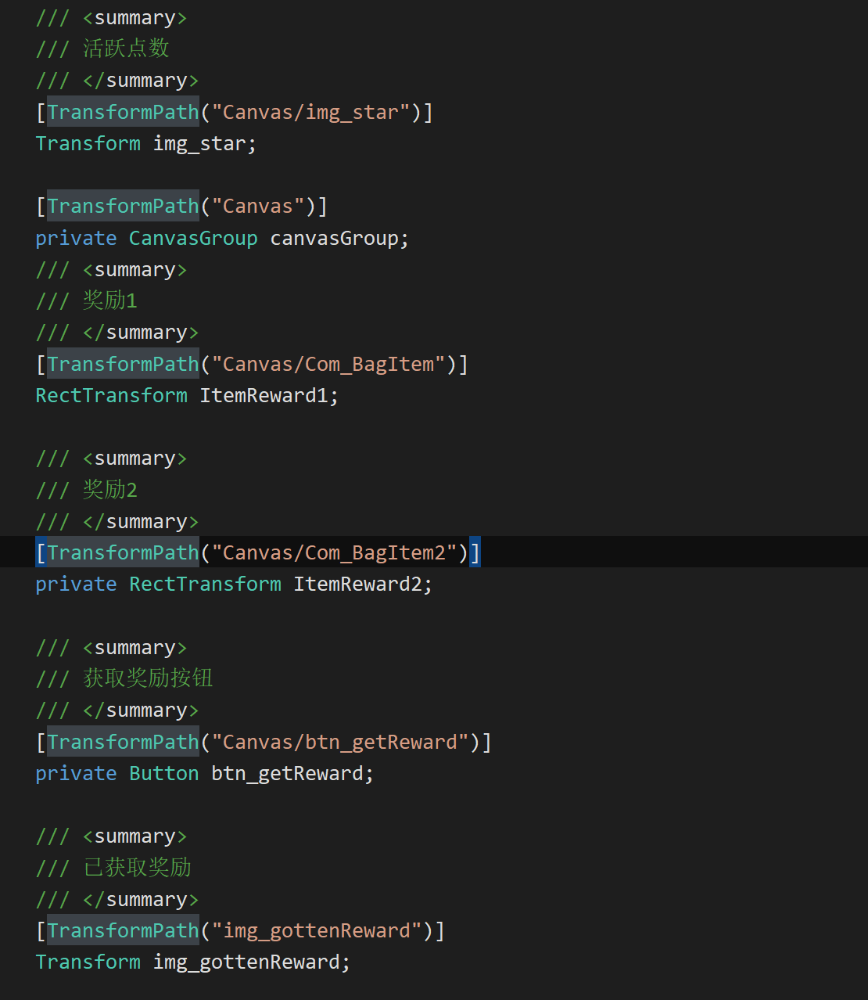

# TransformPathAttribute-节点注册

## 目录

- [TransformPath实现流程](#TransformPath实现流程)

功能：

**自动初始化ui组件**（只要是UI组件都能被初始化）

演示：



## TransformPath实现流程

被框架调度过程中，会把Component传过来，

然后根据**构造函数**传来需要的参数，进行赋值逻辑.

**ps: 自定义实现的自动赋值需要的参数，都可用构造函数传参过来\~**

```c# 
using System;
using System.Reflection;
using UnityEngine;
using UnityEngine.EventSystems;

namespace BDFramework.UFlux
{
    /// <summary>
    /// 自动初始化，节点自动赋值
    /// </summary>
    public class TransformPathAttribute : AutoInitComponentAttribute
    {
        public string Path;

        public TransformPathAttribute(string path)
        {
            this.Path = path;
        }
        /// <summary>
        /// 设置字段
        /// </summary>
        /// <param name="com"></param>
        /// <param name="fieldInfo"></param>
        public override void AutoSetField(IComponent com, FieldInfo fieldInfo)
        {
            if (!fieldInfo.FieldType.IsSubclassOf(typeof(UnityEngine.Object)))
            {
                return;
            }
            
            Type uiType = fieldInfo.FieldType;
            var node = com.Transform.Find(this.Path);

            if (!node)
            {
                BDebug.LogError($"窗口:{com} 不存在节点:{ this.Path}");
                return;
            }

            if (uiType == typeof(Transform))
            {
                fieldInfo.SetValue(com, node);
            }
            else
            {
                var ui = node.GetComponent(uiType);
                if (ui)
                {
                    fieldInfo.SetValue(com,ui);
                }
                else
                {
                    BDebug.LogError($"窗口:{com} 节点:{ this.Path} 不存在:{uiType.FullName}");
                }
            }
        }


        /// <summary>
        /// 设置property
        /// </summary>
        /// <param name="com"></param>
        /// <param name="propertyInfo"></param>
        public override void AutoSetProperty(IComponent com, PropertyInfo propertyInfo)
        {
            if (!propertyInfo.PropertyType.IsSubclassOf(typeof(UnityEngine.Object)))
            {
                return;
            }
            
            Type uiType = propertyInfo.PropertyType;
            var node = com.Transform.Find(this.Path);
            if (!node)
            {
                BDebug.LogError("节点存在:" + this.Path);
            }

            if (uiType == typeof(Transform))
            {
                propertyInfo.SetValue(com, node);
            }
            else
            {
                var ui = node.GetComponent(uiType);
                if (ui)
                {
                    propertyInfo.SetValue(com,ui);
                }
                else
                {
                    BDebug.LogError("窗口:" + com + "组件不存在:" + uiType.FullName + " - " + this.Path);
                }
            }
        }
    }
}

```
