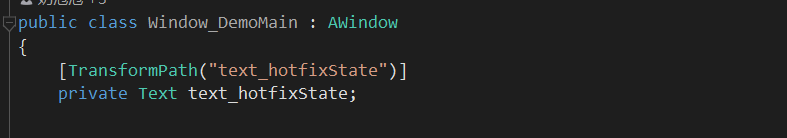
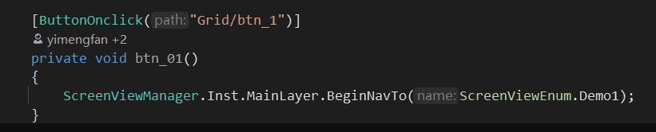

# View元素自动赋值

## 目录

- [Attribute扩展](#Attribute扩展)
- [常用Attribute：](#常用Attribute)

> 📌**UFlux中使用标签进**页面元素的自动赋值，避免手动赋值.





## Attribute扩展

只需要继承**AutoInitComponentAttribute，实现对应逻辑即可，** 后续会被框架自动调用且赋值.

```c# 
  /// <summary>
  /// 自动初始化Component属性基类
  /// </summary>
  public class AutoInitComponentAttribute : Attribute
  {
      //自动设置字段值
      virtual public void AutoSetField(IComponent com, FieldInfo fieldInfo)
      {
          
      }
      //自动设置属性值
      virtual public void AutoSetProperty(IComponent com, PropertyInfo propertyInfo)
      {
          
      }
      //自动设置方法
      virtual public void AutoSetMethod(IComponent com, MethodInfo methodInfo)
      {
          
      }
  }

```


## 常用Attribute：

[TransformPathAttribute-节点注册](TransformPathAttribute-节点注册/TransformPathAttribute-节点注册.md "TransformPathAttribute-节点注册")

[ButtonOnclickAttribute-按钮点击](ButtonOnclickAttribute-按钮点击/ButtonOnclickAttribute-按钮点击.md "ButtonOnclickAttribute-按钮点击")

[SubWindowAttribute-子窗口](SubWindowAttribute-子窗口/SubWindowAttribute-子窗口.md "SubWindowAttribute-子窗口")

[ComponentPathAttribute组件自动注册](ComponentPathAttribute组件自动注册/ComponentPathAttribute组件自动注册.md "ComponentPathAttribute组件自动注册")
