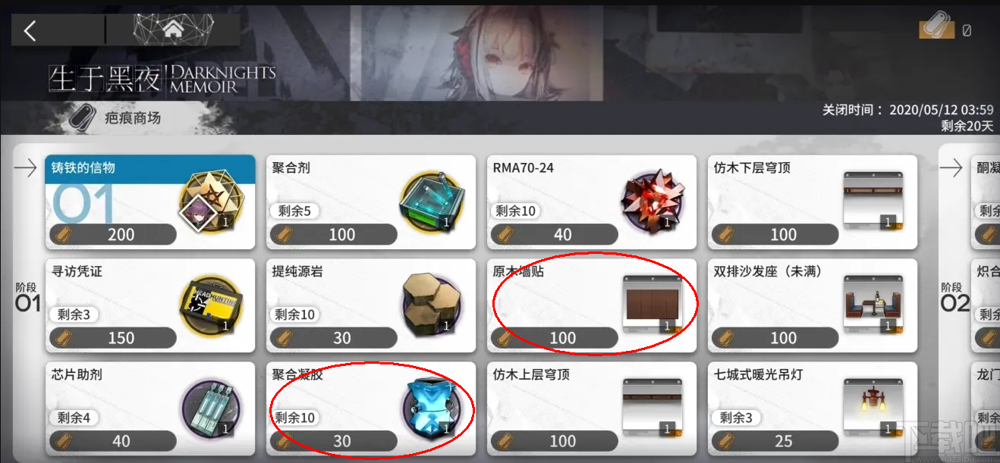

# 基本组件：Component

## 目录

- [前言：](#前言)
- [组件演示](#组件演示)
- [组件创建、加载](#组件创建加载)
- [组件刷新渲染](#组件刷新渲染)

demo: [https://github.com/yimengfan/BDFramework.Core/tree/master/Assets/Code/Game%40hotfix/demo6\_UFlux/01.Component](https://github.com/yimengfan/BDFramework.Core/tree/master/Assets/Code/Game%40hotfix/demo6_UFlux/01.Component "https://github.com/yimengfan/BDFramework.Core/tree/master/Assets/Code/Game%40hotfix/demo6_UFlux/01.Component")

# 前言：

**Component**作为UI元素最小的颗粒，通常用以大能独立的组件与窗口逻辑拆分，方便管理、减少窗口代码.

一般用来实现，如背包道具，商城界面界面 商品，角色血条逻辑 等...

# 组件演示

组件由：
**`Component属性`**： path路径，是否异步加载
**`ATComponen<T>`**:组件基类， T当前组件的渲染数据

**`Props绑定（可选）`**： 后面会详细介绍 [https://www.yuque.com/naipaopao/eg6gik/rewt51](https://www.yuque.com/naipaopao/eg6gik/rewt51 "https://www.yuque.com/naipaopao/eg6gik/rewt51")

**`【TransformPath】`属性和具体的节点路径对应
​`【ComponentValueBind】`绑定具体的组件**和**方法**（这里为什么是\*\*`方法`**，其实对应组件（这里为什么是“方法”，其实对应组件**`绑定逻辑（ComponentBindAdaptor）`\*\* 的一个方法，后面会介绍） 的一个方法，后面会介绍）

# 组件创建、加载

**1.同步加载在构造过程中会自动加载2.异步加载需要手动加载**

# 组件刷新渲染

> **`1.对具体的Prop值进行修改`**（这里的headImage是string类型，后面后ComponentBindAdaptor实现了根据string加载Image的功能）
> **`2.设置修改属性过属性。`**（注：这一步可以不需要，就会自动进行计算，哪些属性修改过，但是有消耗）
> **`3.提交Props修改，即可刷新`**
