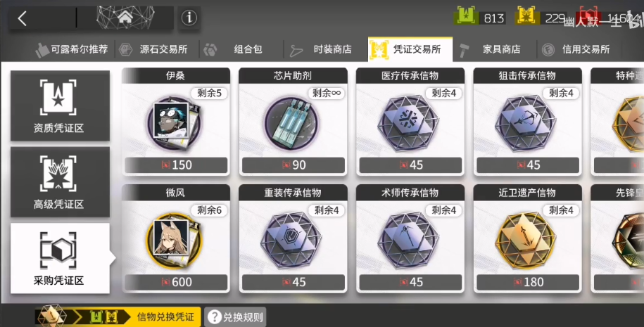
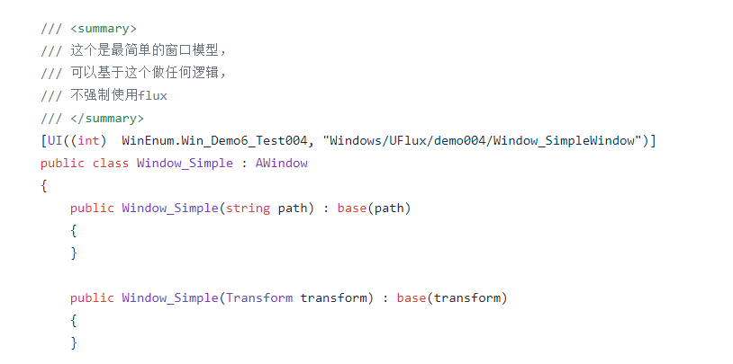
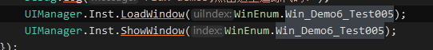

# 窗口AWindows

## 目录

- [简单窗口示例](#简单窗口示例)
- [加载、显示：](#加载显示)

前言：

窗口类作为UI中的基本\*\*`逻辑容器`\*\*，

这里先要明确一个概念：

> 📌**代码中的`Windows`****，实际上是****`逻辑层的抽象`****. ****并不需要与****渲染窗口齐保持一致！
> 该Window主要用来****拆分窗口逻辑，便于管理.**

如下图，&#x20;

你可以将所有逻辑写在**一个Window**.cs控制几个分页来回切换，**只要你觉得自己还能管理这块逻辑.**

也可以将分页拆分成几个\*\*`SubWindow`**分别管理**，弹窗拆成`Component`.\*\*​

只要你想，甚至你可以把每个按钮抽用一个\*\*`AWindow`\*\*容器进行封装.（当然这太不可能\~）

# 简单窗口示例

> 📌如果你相信自己的需求不会膨胀，也不会面临大规模重构、重写，
> 你也可以 **“一把梭”** 只在Window中 编写所有该模块逻辑、不做逻辑拆分、这是最简单的用法，当这样已经满足你的需求，也不需要去追求“MVC、MVP...”
>
> **合理的拆分窗口、子窗口、组件，比一切MV\*模式更能降低管理成本！！！！**

你要知道,对于ui来说：

> 📌**糟糕的窗口结构拆分，即使你用MVC 、MVVM、MVP，也只会增加代码的复杂度和编写成本！
> 甚至没享受到解耦的好处，就已经被 复杂的调用栈、高bug率、难调试 击败了！**

当然，对此UFlux除了提供大量的View层的工具：赋值、绑定等...

主要就是用辅助**逻辑分层**和**状态管理**，后面会介绍\~

不要过渡追求 **`“看起来高级的架构、迷信解耦”`**，**满足自己需求、合理拆分业务才是最重要的!**

# 加载、显示：

只要打上UI标签，会自动被UIManager收集到，无须自行注册..

