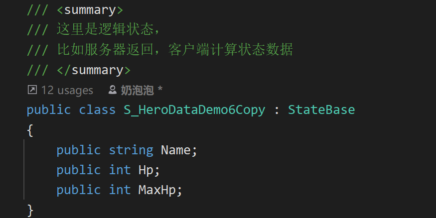
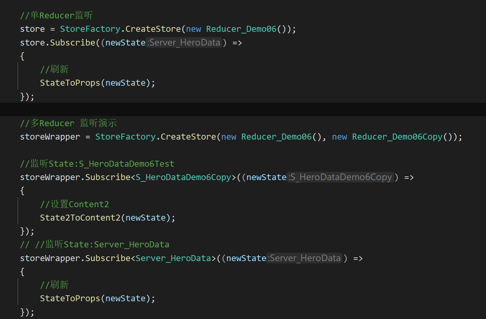
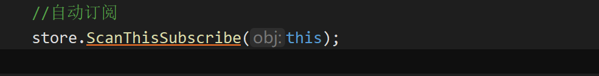
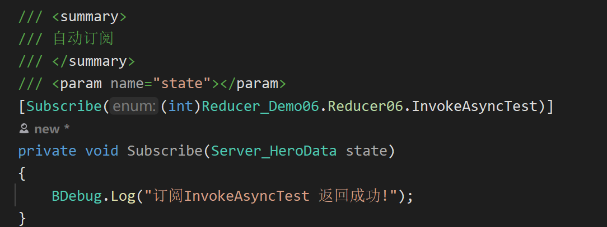

# Reducer、State、Store

## 目录

- [State:](#State)
- [Reducer:](#Reducer)
- [Store:](#Store)
- [流程：](#流程)
- [使用：](#使用)
  - [1.创建Reducer：](#1创建Reducer)
  - [2.Window创建Store 并订阅](#2Window创建Store-并订阅)
    - [创建store订阅单个Reducer](#创建store订阅单个Reducer)
    - [Store可以订阅多个Reducer](#Store可以订阅多个Reducer)
  - [3. State 到 Props（windows）转换](#3-State-到-Propswindows转换)
  - [4.发送Action](#4发送Action)

# State:

***

> 📌State是App**业务状态**，如：角色属性、服务器下发数据等...



# Reducer:

***

> 📌**Reducer 的职责**：
> **Reducer \*\* 其实就是一堆**业务逻辑（非页面逻辑）\*\*方法的集合.
> 且每个Reducer只能处理一种State

**Reducer方法约束**：只允许传入old State和传参，生成new State 返回给View层.

一定程度上 Reducer更像是一种无状态的设计：**无情的数据处理机器**\~


这么做的好处是：

> 📌我们将所有的 业务逻辑无状态化处理，减少状态干扰出bug的几率.排查bug也更简单.
> 也方便进行状态回溯，**相同的State**和传参必然得到**相同的结果**.

# Store:

***

> 📌**Store**：存储Reducer对象和管理State,
> 任何地方（View）都可以向其订阅,以得到State变化的数据.

存储管理State、派发Action（UI发出的动作）、执行Reducer、将结果返回给View层

事实上Store还具有**状态管理**的功能：

缓存下 Action和每次的State解决，就能记录下APP的所有数据流，这样依次推送给View,就可以将View还原到某个状态\~



store自动订阅:





# 流程：

***

demo：[https://github.com/yimengfan/BDFramework.Core/tree/master/Assets/Code/Game%40hotfix/demo6\_UFlux/06.Window\_Reducer](https://github.com/yimengfan/BDFramework.Core/tree/master/Assets/Code/Game%40hotfix/demo6_UFlux/06.Window_Reducer "https://github.com/yimengfan/BDFramework.Core/tree/master/Assets/Code/Game%40hotfix/demo6_UFlux/06.Window_Reducer")

流程：

1. UI订阅Store
2. UI 点击 按钮

   &#x20;\=》生成Action，通知store触发事件

   &#x20;\=》Store根据Action，执行对应的Reducer&#x20;

   &#x20;\=》Reducer 生成新的State

   &#x20;\=》触发Store的监听，广播新的State

   &#x20;\=》 触发UI的订阅监听

   &#x20;\=》UI根据新的State生成Props刷新窗口.

# 使用：

***

以下为Reducer\_Demo06的代码内容\~

### 1.创建Reducer：

Reduer支持3种执行方法:**同步，异步，回调!**

**一种Reducer只能处理一种State，如下面的ServerHeroData:**

```c# 
using System;
using System.Net;
using System.Threading.Tasks;
using BDFramework.UFlux.Contains;
using BDFramework.UFlux.Reducer;
using LitJson;

namespace BDFramework.UFlux.Test
{
    /// <summary>
    /// Reducer 函数处理的集合
    /// </summary>
    public class Reducer_Demo06 : AReducers<Server_HeroData>
    {
        public enum Reducer06
        {
            //同步请求
            InvokeSynchronizationTest,
            //异步请求
            InvokeAsyncTest,
            //回调请求
            InvokeCallbackTest,
        }
        

        
        /// <summary>
        /// url
        /// </summary>
        readonly public string url = "https://1843236967254885.cn-shanghai.fc.aliyuncs.com/2016-08-15/proxy/BDFramework/DemoForUFlux/";

        /// <summary>
        /// 同步网络请求
        /// </summary>
        /// <param name="old"></param>
        /// <param name="param"></param>
        /// <returns></returns>
        [Reducer((int)Reducer06.InvokeSynchronizationTest)]
        private Server_HeroData RequestServer(Server_HeroData old, object @param)
        {
            var api = url + "api/bdframework/getherodata";
            WebClient  wc=new WebClient();
            string ret =  wc.DownloadString(api);
            var hero = JsonMapper.ToObject<Server_HeroData>(ret);
            return hero;
        }
        
        /// <summary>
        /// 异步网络请求
        /// </summary>
        /// <param name="old"></param>
        /// <param name="param"></param>
        /// <returns></returns>
        [Reducer((int)Reducer06.InvokeAsyncTest)]
        async private Task<Server_HeroData>RequestServerByAsync(Server_HeroData old, object @param)
        {
            var api = url + "api/bdframework/getherodata";
            WebClient  wc=new WebClient();
            string ret = await  wc.DownloadStringTaskAsync(api);
            var hero = JsonMapper.ToObject<Server_HeroData>(ret);
            return hero;
        }
        

        
        /// <summary>
        /// 网络请求回调
        /// </summary>
        /// <param name="old"></param>
        /// <param name="param"></param>
        /// <returns></returns>
        [Reducer((int)Reducer06.InvokeCallbackTest)]
        private void RequestServerByCallback (Store<Server_HeroData>.GetState getStateFunc, object @params = null, Action<Server_HeroData> callback = null)
        {
            var api = url + "api/bdframework/getherodata";
            WebClient  wc=new WebClient();
            //提前注册回调
            wc.DownloadStringCompleted += (sender,download) =>
            {
                
                var hero = JsonMapper.ToObject<Server_HeroData>(download.Result);
                callback?.Invoke(hero);
            };
            //开始异步下载
            wc.DownloadStringAsync(new Uri(api));
        }
        
    }
}

```


### 2.Window创建Store 并订阅

#### 创建store订阅单个Reducer

```c# 
//监听单个Reducer          
var  store = StoreFactory.CreateStore(new Reducer_Demo06());
store.Subscribe((newState) =>
{
    //刷新
    StateToProps(newState);
 });

```


#### Store可以订阅多个Reducer

\*\* - 但是订阅时候需要指定State类型!\*\* ​

```c# 

  //2.多Reducer 监听演示
 var storeWrapper = StoreFactory.CreateStore(new Reducer_Demo06(),new Reducer_Demo06Test());
 //监听State:S_HeroDataDemo6Test
 storeWrapper.Subscribe<S_HeroDataDemo6Test>((newState) =>
 {
     Debug.Log(JsonMapper.ToJson(newState));
 });
 //监听State:Server_HeroData
 storeWrapper.Subscribe<Server_HeroData>((newState) =>
 {
     Debug.Log(JsonMapper.ToJson(newState));
 });


```


### 3. State 到 Props（windows）转换

当然你也可以不需要props，自己根据State内容进行渲染\~

```c# 
/// <summary>
/// 这个是根据逻辑State
/// 转化为渲染Props的部分
/// 自行处理
/// 需要注意的是，不要刷新整个页面，只要刷新部分更新的数值即可
/// </summary>
/// <param name="server"></param>
public void StateToProps(Server_HeroData server)
{

   // this.Props.Name  = server.Name;
    this.Props.Hp    = server.Hp;
    this.Props.MaxHp = server.MaxHp;
    //这里表现出State不一定跟Props完全一样，
    //有些ui的渲染状态，需要根据State算出来
    if (server.Hp < 50)
    {
        this.Props.HpColor = Color.red;
    }
    else
    {
        this.Props.HpColor = Color.blue;
    }
    //提交修改，这里会自动进行差异值对比刷新
    this.CommitProps();
}


```


### 4.发送Action

这里发送到Reducer后,会执行对应的Reducer方法。

当然这里也可以带参数，这里省略\~

```c# 
  [ButtonOnclick("btn_RequestNet")]
  private void btn_RequestNet()
  {
      //触发Reducer
      this.store.Dispatch(Reducer_Demo06.Reducer06.RequestHeroDataAsync);
  }

```
