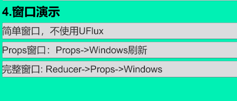
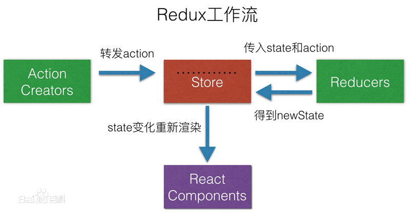

# UFlux整体流程

## 目录

- [UFlux主要分为两部分：](#UFlux主要分为两部分)
- [名词概念解释-Redux：](#名词概念解释-Redux)
- [Redux（Reducer+Store）小结：](#ReduxReducerStore小结)
- [名词概念解释-View:](#名词概念解释-View)
- [注意事项：](#注意事项)

Demo: [https://github.com/yimengfan/BDFramework.Core/tree/master/Assets/Code/Game%40hotfix/demo6\_UFlux/06.Window\_Reducer](https://github.com/yimengfan/BDFramework.Core/tree/master/Assets/Code/Game%40hotfix/demo6_UFlux/06.Window_Reducer "https://github.com/yimengfan/BDFramework.Core/tree/master/Assets/Code/Game%40hotfix/demo6_UFlux/06.Window_Reducer")

UFlux来源于React的Flux框架，具体实现参考Redux，且根据C# 和游戏实际开发情况进行调整

Redux相关资料：[访问](https://github.com/kenberkeley/redux-simple-tutorial "访问")

#### UFlux主要分为两部分：

1. **Redux（Reducer+Store）**：逻辑分层，管理APP的状态（数据）
2. **View**：自动刷新、数据到渲染层映射。

所以在Redux \*\*（Reducer+Store）**计算完状态以后，多了一个**\[ State =>Props(View的渲染数据) ] \*\*的设计。

注：这东西，简单点当成类mvc理解就行，如果不需要直接继承AWindow自行实现【逻辑分层=》Window渲染】 即可

#### 名词概念解释-Redux：

**注：**这里的**ReactComponent**，其实就是我们的View.

**State**：逻辑状态

**Store**：存储和管理状态的集合.

- `getState()` # 获取state
- `dispatch(action)` # 派发Action，这里的Action只是触发Reducer的一个标志，目前定义为枚举
- `subscribe(listener)` # 监听改变

**Reducer**：业务逻辑的集合，当派发`store.dispath(action）`的时候会执行Reducer的业务.

- &#x20;State只允许在Reducer中修改。
- &#x20;每个Reducer必须是接受一个State，返回一个新的State。
-

#### Redux（Reducer+Store）小结：

store 由 Redux 的 createStore(reducer) 生成

action 本质上是一个触发某个函数的标记，目前定义为**枚举**

改变 state 必须 dispatch 一个 action

reducer 本质上是根据 action 来更新 state 并返回 nextState 的**函数**

实际上，**state 就是所有 reducer 返回值的汇总**

View => action => store.dispatch(action) => reducer(state, action) => ~~原 state~~ state = nextState

注：Action，其实就是触发函数的标识 + 参数。

#### 名词概念解释-View:

> **Props**：渲染窗口的状态，且具有绑定-自动刷新组件的功能
> **Component**:所有组件的基类
> **Windows**：继承于Component的第一个容器抽象。
> **SubWindow**:子窗口

#### 注意事项：

> 📌Uflux只是实现了一套\*\* 数据源->渲染数据->自动刷新\*\* 这一套流程，并且给出了\*\* 逻辑**和**渲染分离\*\*的设计。**Redux（Reducer+Store）部分**，负责逻辑分层。
> **View部分**，负责自动渲染。

以上属于理想情况，能应付90%UI需求，

随着策划越来越高的需求，会有很多复杂情况

View层的自动刷新可能无法实现，此时**直接继承AWindows** 手动刷新渲染比较适合。

但是Redux系列，可以保留。

demo：[https://github.com/yimengfan/BDFramework.Core/tree/master/Assets/Code/Game%40hotfix/demo6\_UFlux/06.Window\_Reducer](https://github.com/yimengfan/BDFramework.Core/tree/master/Assets/Code/Game%40hotfix/demo6_UFlux/06.Window_Reducer "https://github.com/yimengfan/BDFramework.Core/tree/master/Assets/Code/Game%40hotfix/demo6_UFlux/06.Window_Reducer")

Reducer：所有处理逻辑的集合

流程：

1. UI订阅Store
2. UI 点击=》生成Action，通知store触发事件=》Store根据Action，执行对应的Reducer =》生成新的State=》

触发Store的监听，广播新的State=》 触发UI的订阅监听=》UI根据新的State生成Props刷新窗口。
