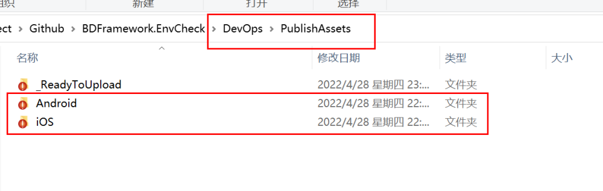
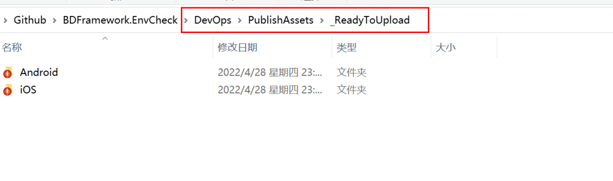
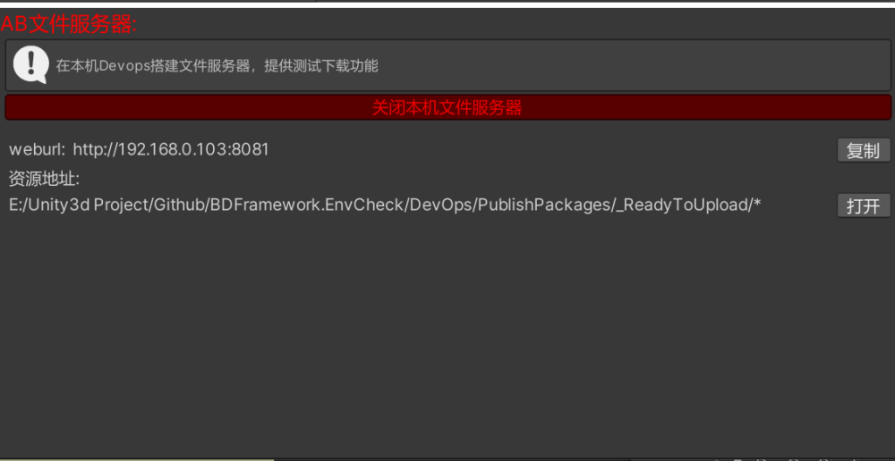
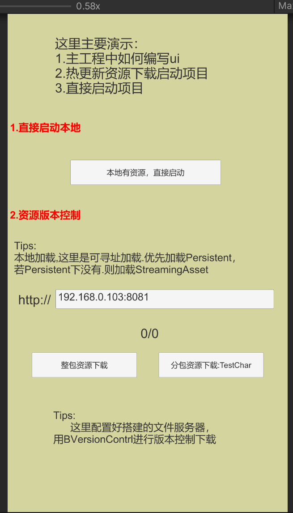

# 1.资源发布

## 目录

- [1.资源发布](#1资源发布)
  - [发布面板:](#发布面板)
  - [1.一键导出资源](#1一键导出资源)
  - [2.资源转Hash](#2资源转Hash)
  - [本机资源服务器：](#本机资源服务器)
  - [自动化:](#自动化)

# 1.资源发布

&#x20;视频地址： [https://www.bilibili.com/video/BV1ZJ411y7T4?p=7](https://www.bilibili.com/video/BV1ZJ411y7T4?p=7 "https://www.bilibili.com/video/BV1ZJ411y7T4?p=7")

#### 发布面板:

#### 1.**一键导出资源**

- 默认到DevOps文件夹，该目录位于Assets同级，用于CI自动化操作。不需要手动管理。

#### 2.**资源转Hash**

- **会将所有资源准备为 提交到服务器上的资源**

**3.最后，你可以将整个目录****（Android、iOS...）** ​**上传到资源服务器上。**

#### 本机资源服务器：

当一键导出后，并且进行热更资源转hash操作，就可以启动本机文件服务器。

即将本机作为资源服务器进行真机测试下载资源等操作。

如上图所示，

真机只要将demo中资源文件地址填为:\*\* [http://192.168.0.103:8081\*\*即可下载。](:8081**即可下载。)

**Ps:这里获取的本机ip可能不对，存在多网卡等问题，不影响文件服务器的执行...**

#### 自动化:

可以监听所有发布环节的生命周期，**实现修改版本号**，**自动提交**等功能

[https://www.yuque.com/naipaopao/eg6gik/foq3gg](https://www.yuque.com/naipaopao/eg6gik/foq3gg "https://www.yuque.com/naipaopao/eg6gik/foq3gg")

如果需要测试，可以学学PHPStudy，这个可以简单 搭建出一个资源服务器 。

然后再Config上将你的服务器url填对即可。
