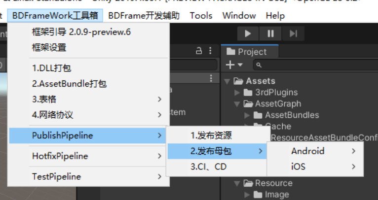

# 2.母包发布

## 目录

- [事件监听：](#事件监听)
- [CI：](#CI)

这里是发布**母包**的操作，也是每次更新大版本.

#### 事件监听：

**实现该接口 可以做打包时的监听。**

[https://www.yuque.com/naipaopao/eg6gik/foq3gg](https://www.yuque.com/naipaopao/eg6gik/foq3gg "https://www.yuque.com/naipaopao/eg6gik/foq3gg")

#### CI：

该操作一般建议使用CI进行操作
