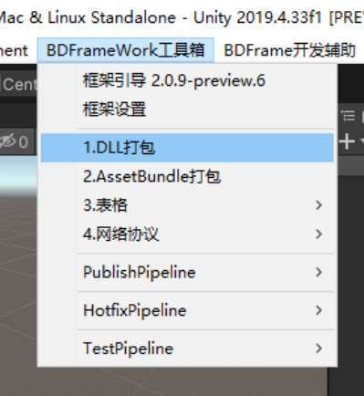

# 1.脚本打包

## 目录

- [一、定义和注意事项](#一定义和注意事项)
- [二、热更代码发布](#二热更代码发布)
- [三、DLL打包流程及报错相关:（ILRuntime）](#三DLL打包流程及报错相关ILRuntime)
- [四、事件监听：](#四事件监听)

BD中使用的是C#热更方案,目前兼容ILRuntime 和 HCLR

BD对其进行了一系列整合和优化，打造了一套比较舒爽的工作流模式。

Android下使用反射，则效率更高。

IOS下因为JIT权限问题，所以只能使用解释执行。

这里是我早期写的另外一篇博文:  [链接](https://zhuanlan.zhihu.com/p/41070384 "链接")

#### 一、定义和注意事项

定义：

文件路径中有以下字符串会被收集进行热更打包为hotfix.dll:

\*\*@hotfix \*\*： 全热更、只会在热更dll内存在，打包后主工程不存在

~~**@half\_hotfix**\~\~\~\~: 半热更，代码会在主工程和 热更工程中各留一份，因为热更dll访问有就近原则，所以会访问热更dll内部的代码.~~

尽管按照BD的工作流进行工作，也要谨记以下几点:

1.主工程，**不要访问**热更代码！！

2.尽量**减少跨域继承（****热更继承主工程****）**，包括UnityEngine.dll 和 syscorelib的类。

所有的业务以 热更层去**引用、操作**主工程类，接口为主。

3.尽量减少热更代码中的数值计算，以及一些拆装箱操作。

4.**热更工程内，不要使用宏！不要使用宏!**

#### 二、热更代码发布

**注:如果发现编译语法，请按照原理去进行分析.不要理所当然的认为一定会编译通过!**

#### 三、DLL打包流程及报错相关:（ILRuntime）

BD中生成DLL:

1.打包搜集生成base.dll,

2.根据Base.dll 和项目引用其他dll + 搜集到的hotfix代码，生成\*\* hotfix.dll\*\*

**3.CLRBinding阶段：**

1.原理 ：[点击](https://ourpalm.github.io/ILRuntime/public/v1/guide/bind.html "点击")

2.分析Hotfix中引用到的**主工程接口、类进行绑定，**

\*\* 预绑定UI所有的Unity主工程接口。\*\* ​

\*\* 根据黑名单剔除、部分不绑定。\*\* ​

3.CLRBinding过程中，会使用ilr解释器加载DLL。

所以可能会有报错部分，可能性如下：

**1.Adaptor报错：**[原理](https://ourpalm.github.io/ILRuntime/public/v1/guide/cross-domain.html "原理")

根据提示判断，是否做了Adaptor（如果继承了主工程），\*\*但是我们不建议继承主工程! \*\*

**部分语法糖如 Await，yield，会有生成一个继承主工程类的匿名类，框架已经做好绑定。**

\*\*2.ilr本身的语法、机制不支持报错 : \*\*

需要自行在解释器中进行try ，判断是执行到哪条语句报错

**注：框架会有已经做好的部分绑定，如反射相关接口、Debug接口。不会重复生成**

#### 四、事件监听：

**实现该接口 可以做打包时的监听。**

[https://www.yuque.com/naipaopao/eg6gik/foq3gg](https://www.yuque.com/naipaopao/eg6gik/foq3gg "https://www.yuque.com/naipaopao/eg6gik/foq3gg")
