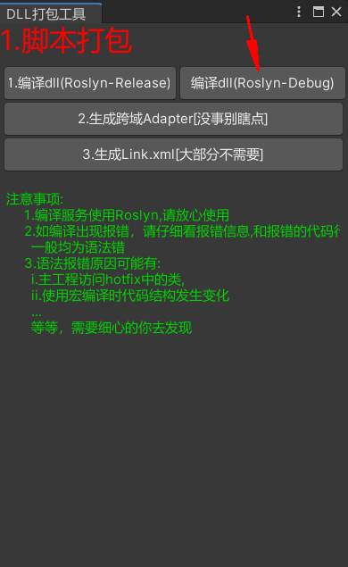
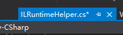
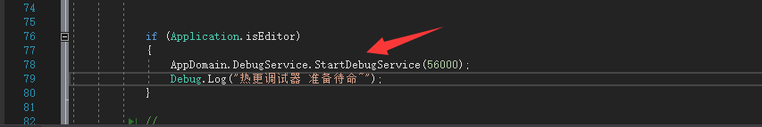
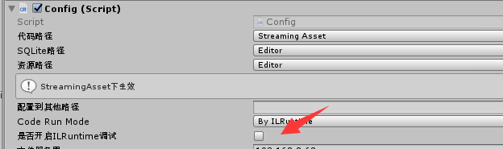
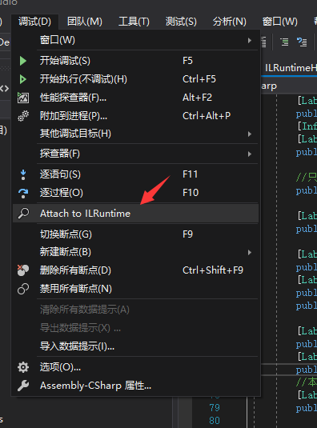
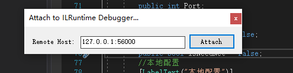
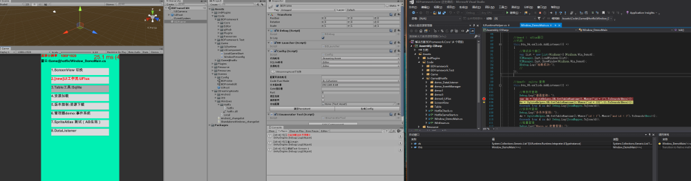

# 2.热更代码调试（ILRuntime）

## 目录

- [0.使用Debug打包，生成PDB调试文件](#0使用Debug打包生成PDB调试文件)
- [ 1.插件下载](#-1插件下载)
- [2.开启调试](#2开启调试)
- [3.VS设置](#3VS设置)
- [4.最后一顿操作猛如虎就行](#4最后一顿操作猛如虎就行)

#### 0.使用Debug打包，生成PDB调试文件

#### &#x20;1.插件下载

到q群

下载对应vs版本的调试插件

  

#### 2.开启调试

早期版本:默认只开了editor下的调试，如果需要真机调试需要修改代码

新版本：

#### 3.VS设置

**直接打开工程！**

**直接打开工程！**

这里默认为本地：127.0.0.1

如果远程调试，输入能访问的ip，如手机wifi局域网ip。

#### 4.最后一顿操作猛如虎就行

