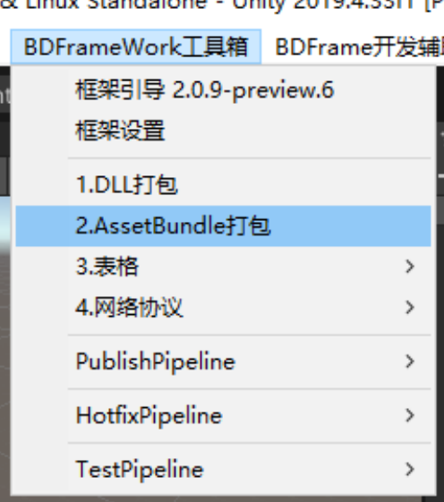
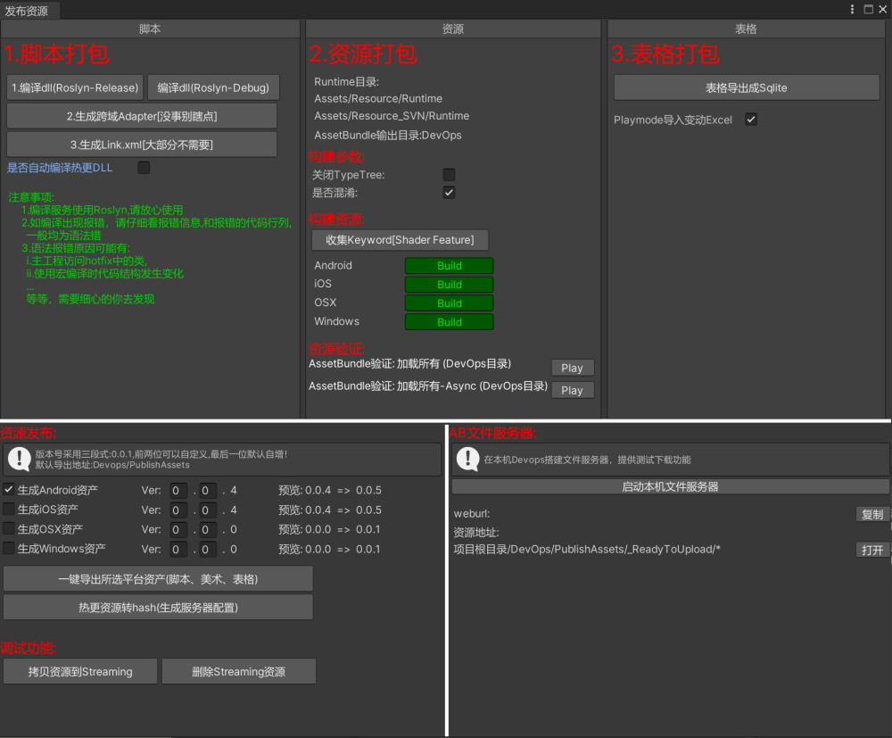

# 1.资源打包总览

## 目录

- [打包AssetBundle：](#打包AssetBundle)
- [编辑器事件监听：](#编辑器事件监听)

#### 打包AssetBundle：

打开编辑器：

1.选择平台和对应的压缩方法

2.选择导出目录进行打包。

3.BD使用**AssetGraph**作为图形化配置工具 进行打包逻辑，

&#x20;目前AssetGraph已经停止维护，BD将持续对其进行维护支持.

4.测试选项会遍历所有打包好的AssetBundle资源 进行加载.

注：window下加载Android assetbundle 需编辑器开启es2 es3

#### 编辑器事件监听：

**实现该接口 可以做打包时的监听。**

[https://www.yuque.com/naipaopao/eg6gik/foq3gg](https://www.yuque.com/naipaopao/eg6gik/foq3gg "https://www.yuque.com/naipaopao/eg6gik/foq3gg")
