# 2.打包配置,节点介绍

## 目录

- [配置概述：](#配置概述)
- [模式：](#模式)
- [节点介绍：](#节点介绍)
  - [1.框架节点](#1框架节点)
  - [2.既定逻辑节点](#2既定逻辑节点)
  - [3.路径分组](#3路径分组)
  - [4.颗粒度划分](#4颗粒度划分)
  - [5.分包逻辑](#5分包逻辑)
  - [6.颗粒度预览](#6颗粒度预览)

### 配置概述：

**1.导入AssetsPackage后，打开项目中****AssetGraph/BResourceAssetBundleConfig****进行配置：**

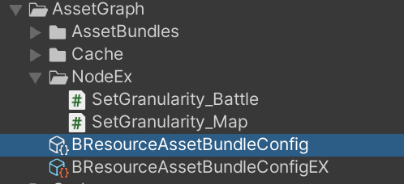

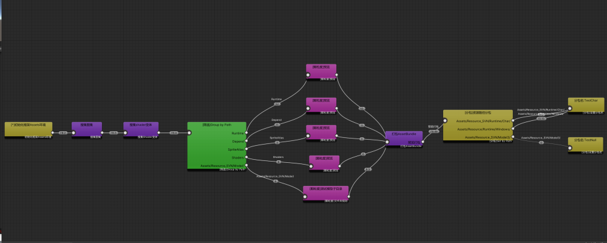

**2.不熟悉AssetGraph可以参考这一篇**

[https://zhuanlan.zhihu.com/p/409586137](https://zhuanlan.zhihu.com/p/409586137 "https://zhuanlan.zhihu.com/p/409586137")

**3.BD所有节点都是自定义节点，只是使用AssetGraph配置打包逻辑流程**

4.大部分流程无需改动，一般 只需要改动**打包颗粒度** 和\*\* 分包逻辑\*\*

### 模式：

点击**初始化框架Assets环境**节点，查看\*\*Inspector \*\*:

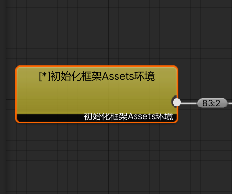

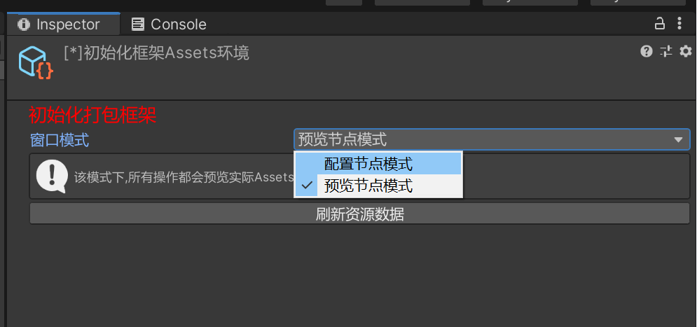

\*\*`配置节点模式`： \*\*不会加载资源数据，适合配置节点，不会很卡

\*\*`预览节点模式`： \*\*实时预览资源情况节点，数据多的时候会卡

&#x20;\*\*`刷新资源数据 按钮 `: \*\*出于效率考虑，全局会缓存1次资源，再次打开时候不会读取，修改资源需要手动点击刷新

### 节点介绍：

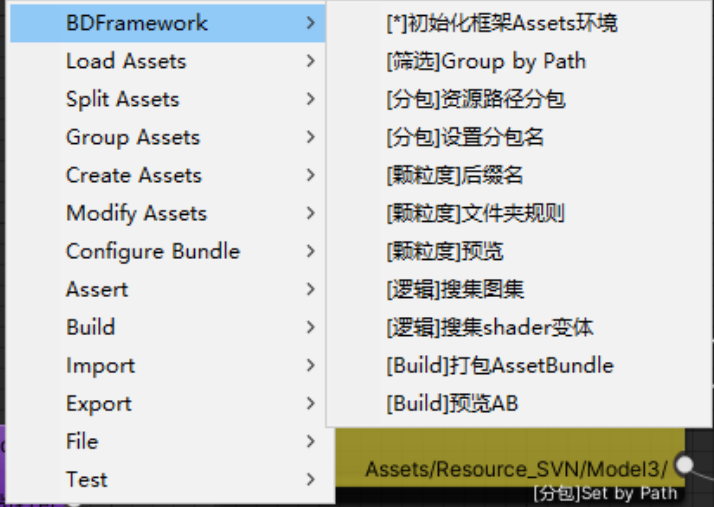

#### 1.框架节点

**`初始化框架`**：初始化打包框架

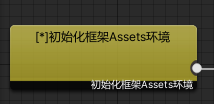

\*\*`配置节点模式`：\*\*不会加载资源数据，适合配置节点，不会很卡

\*\*`预览节点模式`：\*\*实时预览资源情况节点，数据多的时候会卡

&#x20;\*\*`刷新资源数据`: \*\*出于效率考虑，全局会缓存1次资源，再次打开时候不会读取，修改资源需要手动点击刷新

#### 2.既定逻辑节点

\*\*`逻辑，收集图集`：\*\*按BDFramework规则进行打包图集.[https://www.yuque.com/naipaopao/eg6gik/xndwai](https://www.yuque.com/naipaopao/eg6gik/xndwai "https://www.yuque.com/naipaopao/eg6gik/xndwai")

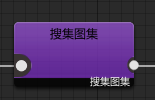

输出\*\*`SpriteAtlas`\*\*分组

[https://www.yuque.com/naipaopao/eg6gik/xndwai](https://www.yuque.com/naipaopao/eg6gik/xndwai "https://www.yuque.com/naipaopao/eg6gik/xndwai")

\*\*`逻辑，收集shader变体`：\*\*收集Runtime中的变体信息

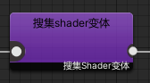

输出\*\*`Shaders`\*\*分组

\*\*`打包BuildAssetbundle`：\*\*打包逻辑

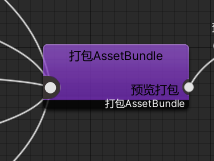

#### 3.路径分组

\*\*-****`筛选Group by path`****：\*\*按自定义规则进行资源路径的分类 用以给后续逻辑

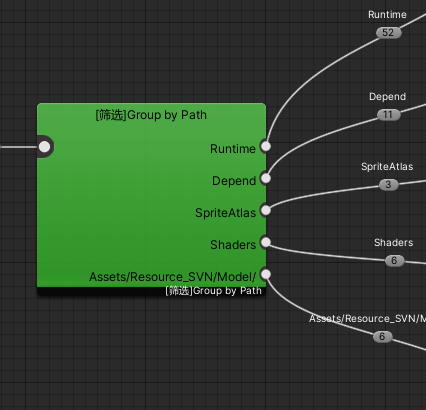

\*\*`Runtime`: \*\*所有在Runtime目录下的资源[目录结构](https://www.yuque.com/naipaopao/eg6gik/bg5if9 "目录结构")

\*\*`Depend`: \*\*所有不在Runtime中，且被Runtime中依赖的资源

\*\*`SpriteAtlas`: \*\*图集的搜集输出，生成的资源分组

\*\*`Shaders`: \*\*Shader 变体等 生成的资源分组

\*\*其他路径: \*\*所有参与打包资源的分组

\-------------------------------------------------------------------------------------------------

#### 4.颗粒度划分

\*\*`文件夹规则 `：\*\*按资源路径进行打包ab

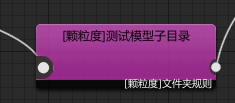

~~\*\*-后缀名: \*\*\~\~\~\~按后缀名进行打包ab~~

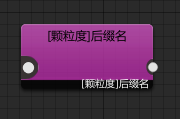

\-------------------------------------------------------------------------------------------------

#### 5.分包逻辑

支持多路径:

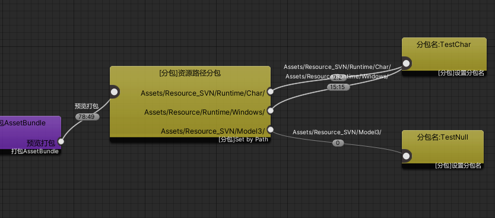

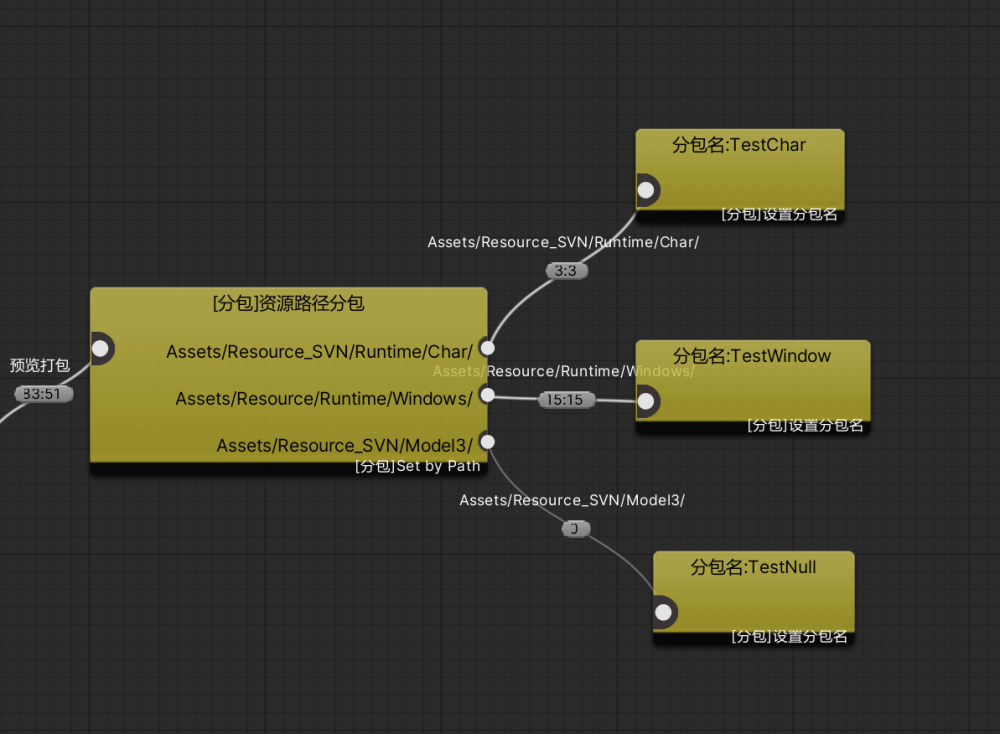

分包下载：[https://www.yuque.com/naipaopao/eg6gik/eaucy3](https://www.yuque.com/naipaopao/eg6gik/eaucy3 "https://www.yuque.com/naipaopao/eg6gik/eaucy3")

按资源路径进行分包，并设置每个分包名，

不影响ab颗粒度，只影响下载。

ps：该节点要位于打包Assetbundle以后

\-------------------------------------------------------------------------------------------------

#### 6.颗粒度预览

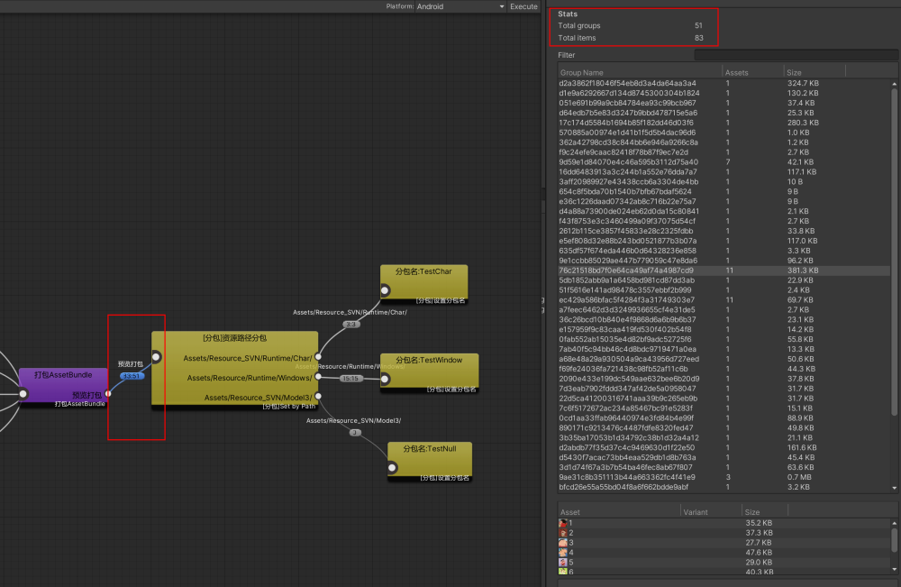

点击**预览打包**,查看**Inspector**面板：

以上图所示：

51 代表输出总AB数量，83代表参与打包的资源数

**Inspector面板：**

hash - 打包资源数量 ，**hash为具体资源的GUID**

每行代表一个AB包，

点击具体行，可以查看AB包内具体资源\~
