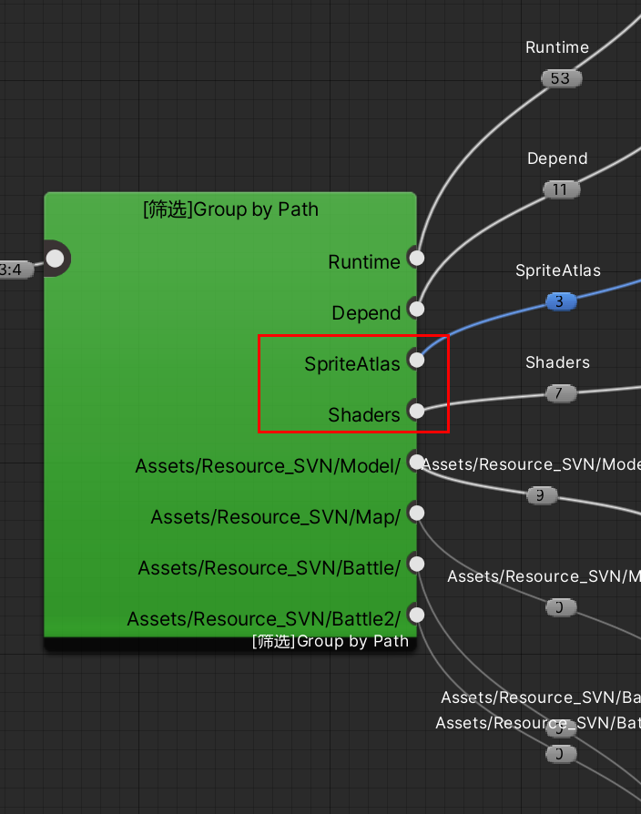
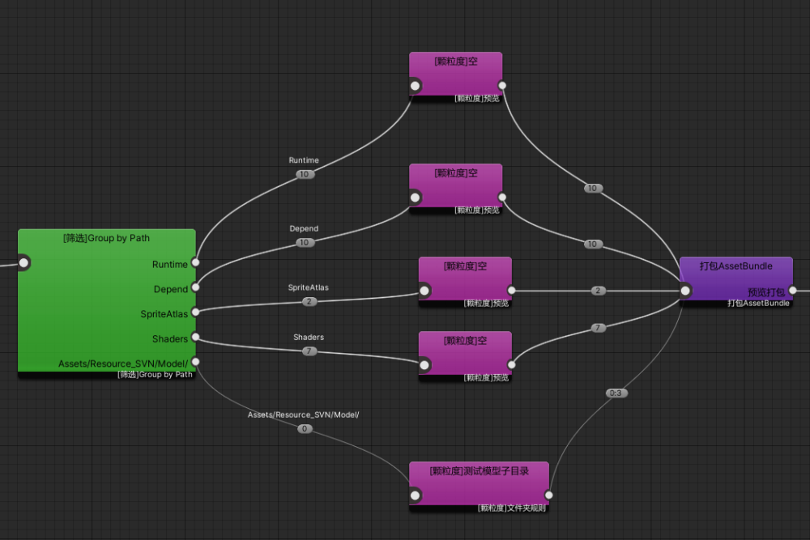
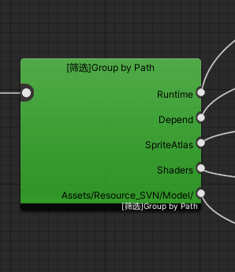
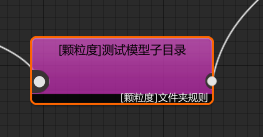
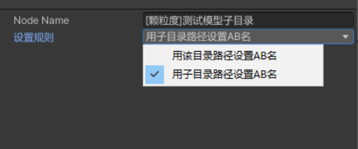

# 3.颗粒度设置

## 目录

- [默认规则：](#默认规则)
- [AssetGraph节点修改：](#AssetGraph节点修改)
  - [颗粒度设置](#颗粒度设置)
- [目前已有颗粒度节点：](#目前已有颗粒度节点)
  - [1.根据路径进行分组](#1根据路径进行分组)
  - [2.按文件夹打包：](#2按文件夹打包)
  - [自定义颗粒度逻辑教程：](#自定义颗粒度逻辑教程)

### 默认规则：

BD默认会把按**最小颗粒度**打包，

其次**收集图集**、**收集变体**等规则加入后，会按图集规则，shader变体规则打包.剩下默认情况都是最小颗粒.

**如一个a.Prefab,依赖：a.mesh 、 a.mat 、a.shder、a.png、 a2.png （如a、a2设置为一张图集）**

会生成：

> 📌1. a.prefab a.mesh a.mat 3个最小颗粒ab
> 2\. a.shader 会被打入所有shader集合中
> 3\. a.png 和a2.png 打成atals同名的ab中

如 加上用户加上**文件夹颗粒度**规则打包：

上述文件若全在一个文件夹内，则会把 \*\*a.prefab a.mesh a.mat 3个最小颗粒ab \*\*打成以文件夹同名的ab包

剩下的修改 文件夹颗粒 规则内会有其他的设置.

**在Group by path中能查看：**

\*\*`Runtime`: \*\*所有在Runtime目录下的资源[目录结构](https://www.yuque.com/naipaopao/eg6gik/bg5if9 "目录结构")

\*\*`Depend`: \*\*所有不在Runtime中，且被Runtime中依赖的资源

\*\*`SpriteAtlas`: \*\*图集的搜集输出，生成的资源分组

\*\*`Shaders`: \*\*Shader 变体等 生成的资源分组

\*\*其他路径: \*\*所有参与打包资源的分组

### AssetGraph节点修改：

#### 颗粒度设置

&#x20;基本颗粒度设置逻辑 文件夹分组=》具体颗粒度逻辑。

### 目前已有颗粒度节点：

#### **1.根据路径进行分组**

#### 2.按文件夹打包：

> 📌i.根据用传入路径直接打成一个包
> ii.根据每个子目录 分别打包

#### 自定义颗粒度逻辑教程：

[https://www.yuque.com/naipaopao/eg6gik/ir2kck](https://www.yuque.com/naipaopao/eg6gik/ir2kck "https://www.yuque.com/naipaopao/eg6gik/ir2kck")
