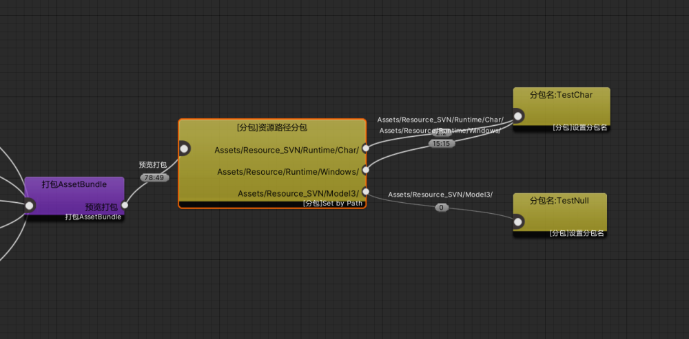
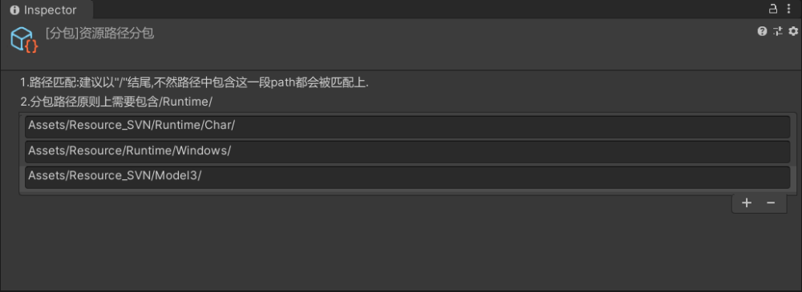

# 4.分包

## 目录

- [配置：](#配置)

#### 配置：

**分包节点为：**

> BDFramework/【分包】资源路径分包
> BDFramework/【分包】设置分包名

**分包逻辑节点 必须位于BuildAssetBundle节点后**

ps: 分包目前按照路径进行分包，默认以带上Runtime路径。

> 因为BD整套管理是基于Runtime做加载，按Runtime内部目录进行分包，会自动计算依赖并下载完全。
> 其他路径分包，属于被动依赖，可能导致无法直接加载的情况。
