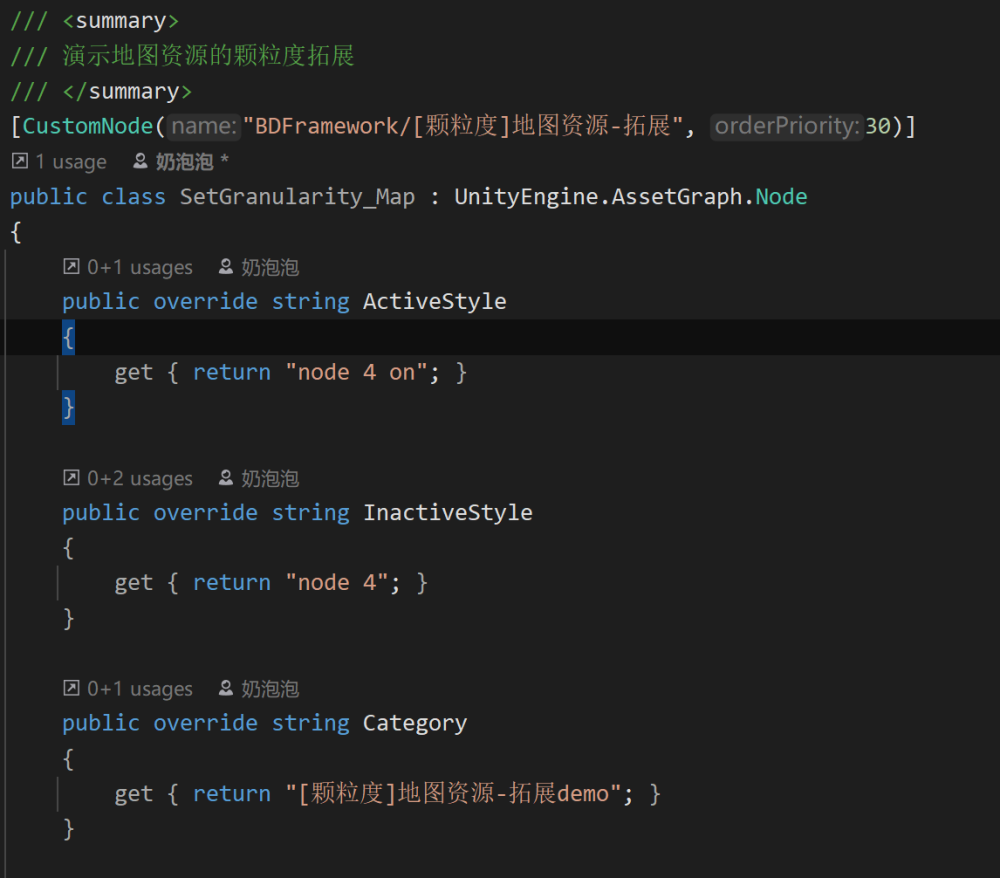
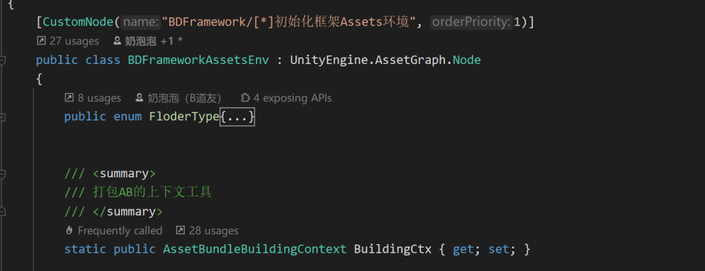
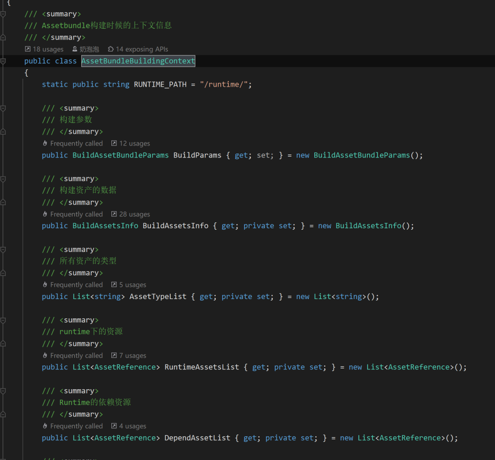
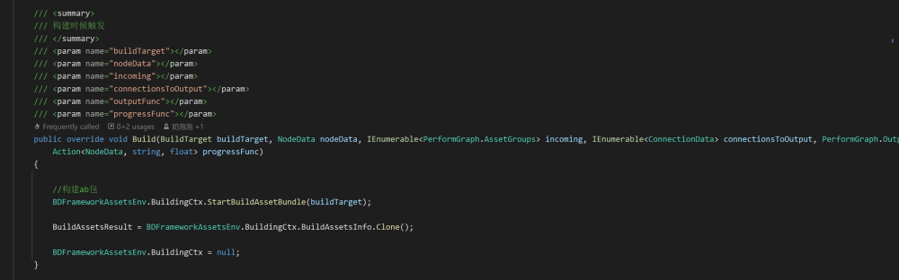

# 拓展节点简介

## 目录

- [新建自定义节点：](#新建自定义节点)
- [打包环境上下文:](#打包环境上下文)
- [Prepare：](#Prepare)
- [Build：](#Build)

### 新建自定义节点：



继承 \*\*`UnityEngine.AssetGraph.Node`\*\*后，重写以上方法，则可以得到一个新的节点.

\*\*`CustomNode`: \*\*节点按钮名，排序

\*\*`Category`：\*\*显示在节点上的文字信息

\*\*`ActiveStyle`****、****`InactiveStyle`：\*\*内置的样式信息，可选 "**node ****{1-10}**** on**";

### 打包环境上下文:

\*\* 访问静态对象：\*\* ​**`BDFrameworkAssetsEnv.BuildingCtx`**



**上下文类：**



里面常以下两个

\*\*`BuildAssetsInfo`：\*\*修改Build信息(资源、颗粒度等)，则会影响最终的打包输出\~

\*\*`BuildParams`: \*\*打包的平台，和输出路径等..

### Prepare：

这个是最关键的节点 **预览信息**，比较关键的是输入输出，目的是用来做**预览打包信息**，

> **一般用来修改BDFrameworkAssetsEnv.BuildingCtx的颗粒度，并且输出预览!!!
> Build执行时，该方法也会被执行!**

**常见流程如下：**

```c# 
   /// <summary>
  /// 预览结果 编辑器连线数据，但是build模式也会执行
  /// 这里只建议设置BuildingCtx的ab颗粒度
  /// </summary>
  /// <param name="target"></param>
  /// <param name="nodeData"></param>
  /// <param name="incoming"></param>
  /// <param name="connectionsToOutput"></param>
  /// <param name="outputFunc"></param>
  public override void Prepare(BuildTarget target, NodeData nodeData, IEnumerable<PerformGraph.AssetGroups> incoming, IEnumerable<ConnectionData> connectionsToOutput, PerformGraph.Output outputFunc)
  {
      //没有输入连线时候判断
      if (incoming == null)
      {
          return;
      }
      var outMap = new Dictionary<string, List<AssetReference>>();
      //1.遍历传入的节点连线，每个item则为一根传入的线
      foreach (var ags in incoming)
      {
          //2.遍历每根线的输入内容
          foreach (var assetGroup in ags.assetGroups)
          {
              //这里注意为了防止 下个节点逻辑对传出数据影响，所以这里tolist进行copy一次
              outMap[assetGroup.Key] = assetGroup.Value.ToList();
          }
      }


      //只对第一个节点输出
      var output = connectionsToOutput?.FirstOrDefault();
      if (output != null)
      {
          //3.输出的一根线内容（其实也是下个节点遍历内容）
          outputFunc(output, outMap);
      }
  }
}

```


### Build：



**构建时候才会调用的函数，一般不会继承实现，目前只在BuildAssetbundle节点中才会实现\~**
