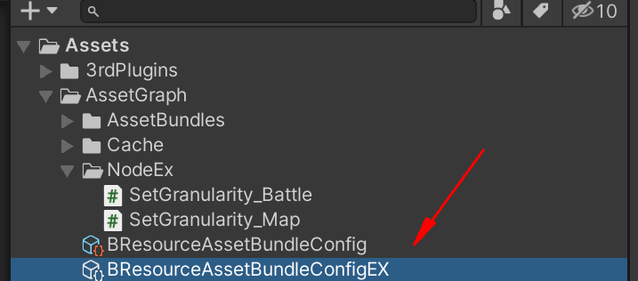
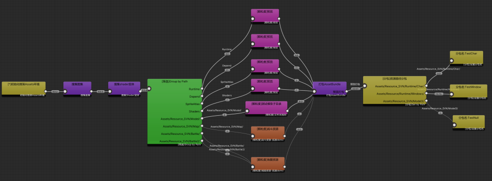
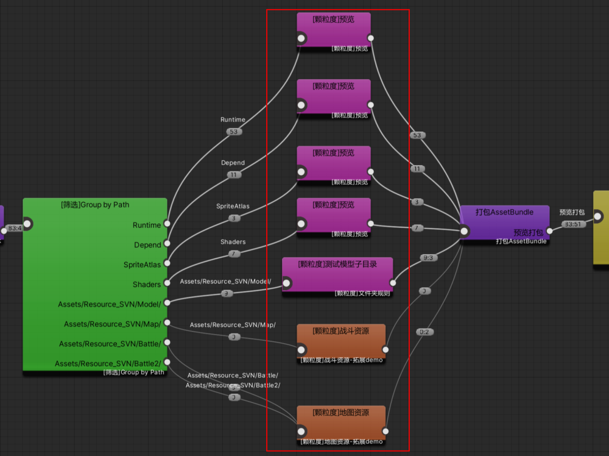
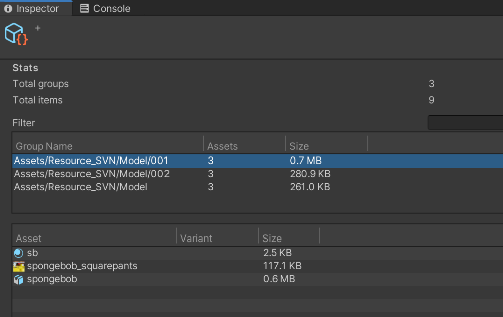

# 自定义颗粒度

## 目录

- [自定义预览](#自定义预览)
- [流程限制](#流程限制)
- [拓展代码编写：](#拓展代码编写)

### 自定义预览



在导入对应版本Assets.package（>2.1.0）后，会有以上资源.

\*\*`NodeEx`：\*\*演示2个自定义设置ab颗粒度的拓展.

\*\*`BResourceAssetBundleConfigEX`：\*\*会有拓展节点的演示（橙色）



### 流程限制

设置颗粒度节点，一般位于 ：**路径分组之后**，**BuildAssetBundle节点之前**。

不建议修改大的流程，涉嫌代码较多.



### 拓展代码编写：

一般情况下只需要拓展Prepare即可.

```c# 
/// <summary>
/// 预览结果 编辑器连线数据，但是build模式也会执行
/// 这里只建议设置BuildingCtx的ab颗粒度
/// </summary>
/// <param name="target"></param>
/// <param name="nodeData"></param>
/// <param name="incoming"></param>
/// <param name="connectionsToOutput"></param>
/// <param name="outputFunc"></param>
public override void Prepare(BuildTarget target, NodeData nodeData, IEnumerable<PerformGraph.AssetGroups> incoming, IEnumerable<ConnectionData> connectionsToOutput, PerformGraph.Output outputFunc)
{
    //没有输入连线时候判断
    if (incoming == null)
    {
        return;
    }
    var outMap = new Dictionary<string, List<AssetReference>>();
    //1.遍历传入的节点连线，每个item则为一根传入的线
    foreach (var ags in incoming)
    {
        //2.遍历每根线的输入内容
        foreach (var assetGroup in ags.assetGroups)
        {
            //这里注意为了防止 下个节点逻辑对传出数据影响，所以这里tolist进行copy一次
            outMap[assetGroup.Key] = assetGroup.Value.ToList();
        }
    }


    //只对第一个节点输出
    var output = connectionsToOutput?.FirstOrDefault();
    if (output != null)
    {
        //3.输出的一根线内容（其实也是下个节点遍历内容）
        outputFunc(output, outMap);
    }
}
}

```


**设置颗粒度：**

**Prepare处理的是设置****ab包颗粒度****和****预览输出****！**

**设置颗粒度：**

**`BDFrameworkAssetsEnv.BuildingCtx.BuildingCtx.BuildAssetsInfo.SetABName(ar.importFrom, sf);`**

根据自己需求，将需要打包一起的资源，设置为相同ab名。

设置ab名有几种模式:

**预览输出：**

既上述代码返回的outmap，key是ab名，value是包含哪些资源.

输出结构的只是为了预览，不会对打包产生实际结果，

主要还是修改**BuildAssetsInfo.SetABName 设置颗粒度生效!**

设置ab名有几种模式:

**注：ab名最好为存在的某个资源**，如 把 a.png、 a.mesh、 a.mat 都打包成assets/xxx/a.prefab 作为ab名、文件夹名也可.

**上面的outmap结果：**


