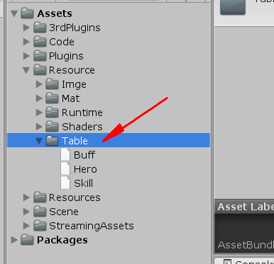
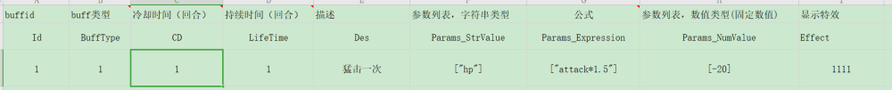
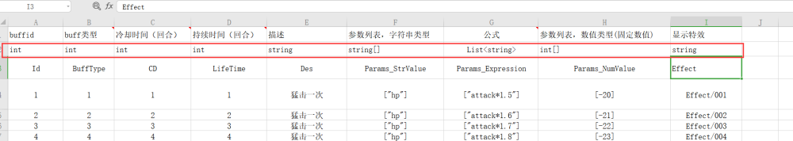
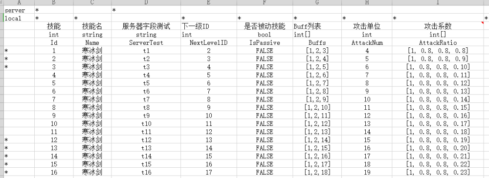

# Excel内容格式

## 目录

- [内容格式](#内容格式)
  - [I.自动推断字段名模式，无需填字段类型（不建议使用）](#I自动推断字段名模式无需填字段类型不建议使用)
  - [II.自定义字段名格式，第二行填上字段类型](#II自定义字段名格式第二行填上字段类型)
  - [III. \* 保留导出字段 和 记录，本地服务器双db导出](#III--保留导出字段-和-记录本地服务器双db导出)
  - [IV.单元格为空时，值填充规则：](#IV单元格为空时值填充规则)
  - [V:多张Sheet时](#V多张Sheet时)

# 内容格式

1.默认放置Excel目录位于：Resource/Table下

2.注意Excel 后缀为.xlsx

3.Excel内容

#### ~~I.自动推断字段名模式，无需填字段类型（不建议使用）~~

#### II.自定义字段名格式，第二行填上字段类型

#### III. \* 保留导出字段 和 记录，本地服务器双db导出

i.第一行为预留字段，如不需要 也要空着

ii.字段名首列必须是“Id”

iii.支持格式：

&#x20;  **`数字类型`** 和 \*\*`字符串`\*\*直接输入即可，会自动识别。如果出错，请检查 **单元格格式**

&#x20;  **`字符串数组`**：  \[abc,def]， 可以不加引号

&#x20;  **` 数字数组`**：\[1,2,3]

#### IV.单元格为空时，值填充规则：

**float**、**int**、\*\*double \*\*：**0**

\*\*bool \*\*: **false**

\*\*string \*\*: **"" (空字符串)**

### V:多张Sheet时

i.当sheet结构和第一张一致会自动合并，用以管理单张sheet太大的问题

 
