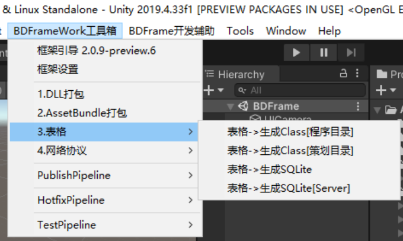
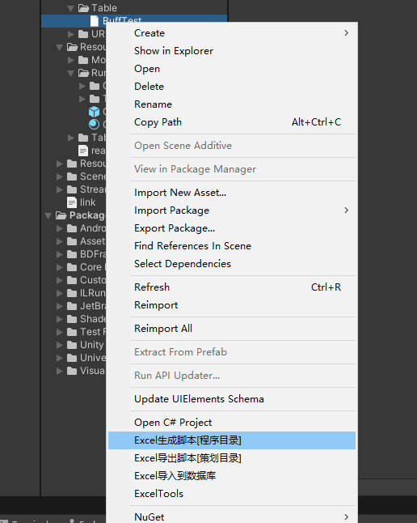

# Sqlite表格打包

## 目录

- [1.批量生成和导入:](#1批量生成和导入)
- [2.单个文件导入](#2单个文件导入)
- [3.自动导表:](#3自动导表)
- [4.事件监听：](#4事件监听)

## 1.批量生成和导入:

**`表格->生成Class[程序目录]`**

将项目中excel生成class到程序目录:Code/Game/Table
生成规则: [Excel生成Class规则](https://www.yuque.com/naipaopao/eg6gik/gg1do6 "Excel生成Class规则")
Excel class 热更配置：[链接](https://www.yuque.com/naipaopao/eg6gik/zplll0/edit?toc_node_uuid=0qfp_Bze_lKayqbt "链接")

**`表格->生成Class[程序目录]`**

将项目中excel生成class到程序  录:Resource\_SVN/Table/Code
生成规则: [Excel生成Class规则](https://www.yuque.com/naipaopao/eg6gik/gg1do6 "Excel生成Class规则")
Excel class 热更配置：[链接](https://www.yuque.com/naipaopao/eg6gik/zplll0/edit?toc_node_uuid=0qfp_Bze_lKayqbt "链接")

**`表格->生成SQLite`**

将所有表格导出生成Local.db文件、会生成iOS、Android 2份
默认路径在StremingAssets下

**`表格->生成SQLite[Server]`**

将所有表格导出生成Server.db文件 默认给服务器使用.
默认路径在StremingAssets下

## 2.单个文件导入

对单个excel文件右击时，会显示选项，功能与上述相同，但是只会单张表生效。

## 3.自动导表:

当excel发生修改时，会触发自动导表功能.

## 4.事件监听：

**实现该接口 可以做打包时的监听。**

[https://www.yuque.com/naipaopao/eg6gik/foq3gg](https://www.yuque.com/naipaopao/eg6gik/foq3gg "https://www.yuque.com/naipaopao/eg6gik/foq3gg")
