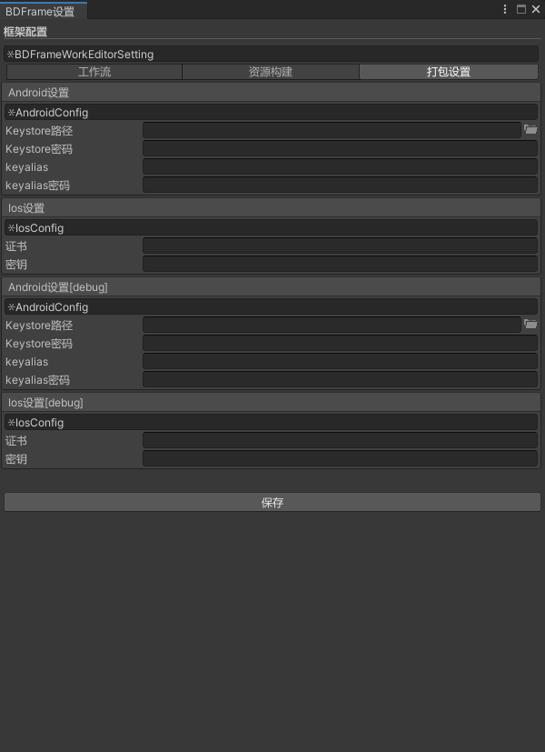
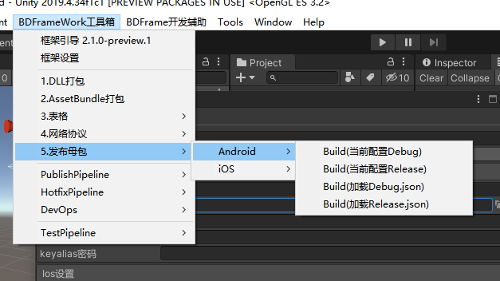
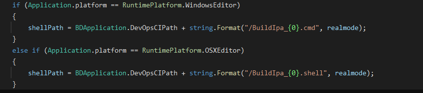
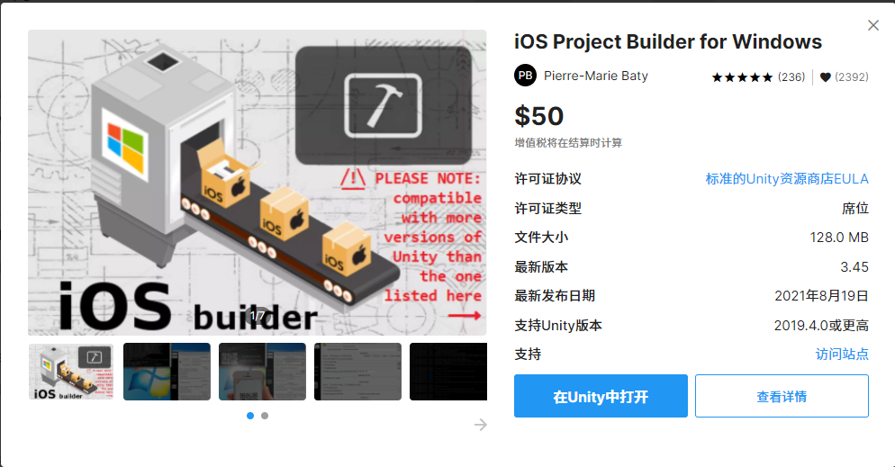

# 4.包体构建

## 目录

- [包体构建](#包体构建)
  - [1.设置好打包参数](#1设置好打包参数)
  - [2.常用打包选项](#2常用打包选项)
  - [3.Android、iOS打包注意事项](#3AndroidiOS打包注意事项)
  - [4.CI、CD相关接口](#4CICD相关接口)

# 包体构建

#### 1.设置好打包参数

打开"**`BDFramework工具箱/框架设置/打包设置`**"

#### 2.常用打包选项

#### 3.Android、iOS打包注意事项

Android打包：

&#x20;会直接构建apk，建议在Unity3d直接集成好sdk等操作

&#x20;**输出路径为****:DevOps\PublishPackages\Android\包名 \_(Release or Debug).apk**​

iOS打包：

&#x20;1.先会打包出Xocode工程,

&#x20;**输出路径为**\*\*:DevOps\PublishPackages\iOS\包名 \_(Release or Debug)\*\*​

&#x20;2\. 然后会调用"**DevOps/CI**"目录下的:

&#x20;\*\*BuildIpa\_Debug.cmd **，或者**BuildIpa\_Release.cmd \*\*脚本!

**输出Ipd路径为****:DevOps\PublishPackages\iOS\包名 \_(Release or Debug).Ipa**​

建议使用

在windows环境下打包，或者做ci

#### 4.CI、CD相关接口

此处为语雀内容卡片，点击链接查看：[https://www.yuque.com/naipaopao/eg6gik/cvr8eh](https://www.yuque.com/naipaopao/eg6gik/cvr8eh "https://www.yuque.com/naipaopao/eg6gik/cvr8eh")
&#x20; &#x20;
