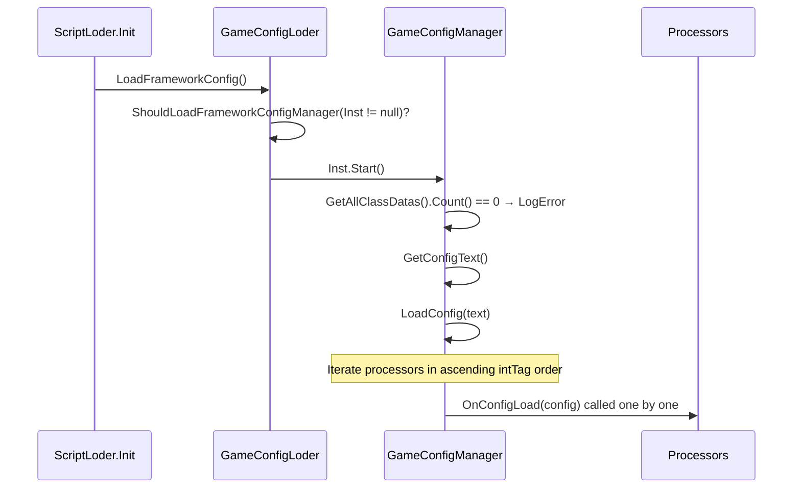

# Configuration (GameConfig)

The configuration centre is built on **an `IConfigProcessor` handler plus a `.bytes` JSON file**, replacing the ScriptableObject approach.

!!! warning "The namespace is `BDFramework.Configure`"
    `GameConfigLoder`, `GameConfigManager`, `GameConfigAttribute`, `GameBaseConfigProcessor` and `GameCipherConfigProcessor` all live in **`BDFramework.Configure`**, not `BDFramework`. This is a high-frequency trap.

## Type hierarchy

```csharp
namespace BDFramework.Configure

// ① 属性：标记一个配置处理器，intTag 决定执行顺序
public class GameConfigAttribute : ManagerAttribute
{
    public string Title = "";
    public GameConfigAttribute(int intTag, string tile) : base(intTag);
    public GameConfigAttribute(string tag) : base(tag);
}

// ② 配置数据基类
abstract public class ConfigDataBase
{
    [HideInInspector] public string ClassType;      // = 嵌套 Config 类的 FullName，用于匹配
}

// ③ 处理器接口
public interface IConfigProcessor
{
    void OnConfigLoad(ConfigDataBase config);
}

// ④ 配置中心
public class GameConfigManager : ManagerBase<GameConfigManager, GameConfigAttribute>
{
    public override void Start();
    public (List<ConfigDataBase>, List<IConfigProcessor>) LoadConfig(string configText);
    public T GetConfig<T>() where T : ConfigDataBase;
    public T GetConfigProcessor<T>() where T : IConfigProcessor;
    public List<ConfigDataBase> CreateNewConfig();
    public Dictionary<Type, ConfigDataBase> ReadConfig(string configText);

    private static readonly string DefaultEditorConfigPath = "Assets/Scenes/Config/editor.bytes";
}

// ⑤ 静态入口
public class GameConfigLoder
{
    public static void LoadFrameworkConfig();
}
```

## The processor contract

Every processor class needs:

1. A `[GameConfig(intTag, "标题")]` attribute
2. A **nested `Config` class** deriving from `ConfigDataBase`
3. An implementation of `IConfigProcessor.OnConfigLoad(ConfigDataBase config)`

```csharp
[GameConfig(100, "我的模块")]
public class MyConfigProcessor : IConfigProcessor
{
    // ★ 嵌套类名必须叫 Config
    [Serializable]
    public class Config : ConfigDataBase
    {
        public int    MaxLevel  = 100;
        public string ServerUrl = "http://127.0.0.1:8080";
    }

    public void OnConfigLoad(ConfigDataBase config)
    {
        var con = config as Config;
        // 消费配置
    }
}
```

!!! danger "The nested class must be called `Config`"
    `GameConfigManager.LoadConfig` uses `cd.Type.GetNestedType("Config")` to fetch the nested type and then compares its `FullName` against the `ClassType` field in the JSON. If the class is not called `Config`, the match fails.

## Reading configuration

```csharp
var config = GameConfigManager.Inst.GetConfig<GameBaseConfigProcessor.Config>();
var version = config.ClientVersionNum;
```

When the manager has not been initialised yet, `GetConfig<T>()` **parses the configuration once on its own and writes it into `configList`**, so it is safe to call early.

## Load sequence



### Priority of configuration text sources

The resolution order in `GameConfigStartupPureLogic.ResolveFrameworkConfigTextSource`:

| # | Condition | Source |
|---|-----------|--------|
| 1 | `Application.isPlaying` and the runtime launcher has a `TextAsset` | The runtime `BDLauncher` |
| 2 | The scene has a `BDLauncher` and `ConfigText` is assigned | The scene `BDLauncher` |
| 3 | Editor, and `Assets/Scenes/Config/editor.bytes` exists | The default Editor configuration |
| 4 | — | `None` (returns immediately, nothing is loaded) |

`GameConfigStartupPureLogic` is `internal static` and supports a **MonoBehaviour-free** startup path (BatchMode / EditorTest).

## Built-in processors

### `GameBaseConfigProcessor` (`[GameConfig(-9999, "框架基础")]`)

```csharp
[Serializable]
public class Config : ConfigDataBase
{
    public AssetLoadPathType CodeRoot    = AssetLoadPathType.Editor;    // LabelTextAttribute("代码路径")
    public AssetLoadPathType SQLRoot     = AssetLoadPathType.Editor;    // LabelTextAttribute("SQLite路径")
    public AssetLoadPathType ArtRoot     = AssetLoadPathType.Editor;    // LabelTextAttribute("资源路径")
    public HotfixCodeRunMode CodeRunMode = HotfixCodeRunMode.HyCLR;     // LabelTextAttribute("热更代码执行模式")
    public bool   IsDebugLog          = true;                           // LabelTextAttribute("是否打印日志")
    public string ClientVersionNum    = "0.0.0";                        // LabelTextAttribute("客户端版本")
    public L2Type L2Type              = L2Type.zh_CN;                   // LabelTextAttribute("语言包")

    public string GetClientVersionNumForIOS();
#if UNITY_EDITOR
    public void UpdateClientToAllConfig();     // [ButtonAttribute]
#endif
}

public void OnConfigLoad(ConfigDataBase config);      // 把 IsDebugLog 同步到 BDebug.IsLog
public static BDebug EnsureDebugComponent(GameObject owner);
static public string GetLoadPath(AssetLoadPathType assetLoadPathType);
```

UI grouping (Odin attributes): `a/a1` code path, `a/a2` SQLite, `a/a3` assets, `a/a4` execution mode, `a/a6` logging, `a/a12` client version, `a/a13` language pack.

!!! note "`-9999` guarantees it runs first"
    The execution order of configuration processors is decided by `GetAllClassDatas()` sorting in ascending intTag. `GameBaseConfigProcessor` uses `-9999` to guarantee it runs **before `GameCipherConfigProcessor` (2)**, so that `SqliteLoder.Password` is always injected before `SqliteLoder.Init`.

### `GameCipherConfigProcessor` (`[GameConfig(2, "加密")]`)

```csharp
public class Config : ConfigDataBase
{
    public string SqlitePassword  = "password123!!!";   // LabelTextAttribute("Sqlite密码")
    public string ScriptPubKey    = "";                 // LabelTextAttribute("DLL公钥")
    public string ScriptPrivateKey = "";                // LabelTextAttribute("DLL私钥")
}

public void OnConfigLoad(ConfigDataBase config)
{
    var con = config as Config;
    SqliteLoder.PasswordFallback = () => con.SqlitePassword;   // 解耦 Config → Sql 依赖
    SqliteLoder.Password = con.SqlitePassword;
}
```

!!! warning "`ScriptPubKey` / `ScriptPrivateKey` are never consumed"
    These two fields are storage only; **nothing in the repository ever reads them**.

## `AssetLoadPathType` and `HotfixCodeRunMode`

```csharp
namespace BDFramework

public enum AssetLoadPathType { Editor = 0, Hotfix = 1 }
public enum HotfixCodeRunMode { HyCLR = 1, Mono64 }

public class Config : MonoBehaviour { }     // ★ 字段为空，只剩枚举宿主价值
```

!!! note "`Config : MonoBehaviour` is an empty shell"
    In the source, the `Config` class **has no fields at all** — every configuration item lives in the nested `Config` class of its processor. Its only remaining value is hosting the definitions of those two enums (see [Refactor Backlog](../architecture/refactor-backlog.md#ref-11-empty-types)).

For how `AssetLoadPathType` is resolved see [Asset Load Paths](../guide/asset-load-path.md).

## Configuration file format

| Item | Value |
|------|-------|
| Default path | `Assets/Scenes/Config/editor.bytes` |
| Format | **A LitJson-serialized JSON array** |
| Per entry | The serialized form of one `ConfigDataBase`-derived object, carrying the `ClassType` field |
| Device source | The contents of `BDLauncher.ConfigText` (the `TextAsset` attached in the scene), which is the same JSON |
| Extension | `.bytes` (`ConfigEditorUtil.FILE_SUFFIX`) |

`ConfigEditorUtil` (`namespace BDFramework.Editor.Inspector.Config`, but **it lives in the Runtime assembly**):

```csharp
CONFIG_PATH   = "Assets/Scenes/Config"
FILE_SUFFIX   = ".bytes"
DefaultEditorConfig = "Assets/Scenes/Config/editor.bytes"

GenConfigPaths()   // Directory.GetFiles(CONFIG_PATH, "*.bytes", AllDirectories)，排除 .meta
```

!!! warning "`ConfigEditorUtil` sits in the Runtime assembly yet depends on UnityEditor"
    Its contents are wrapped in `#if UNITY_EDITOR`. The consequence is that `GameConfigManager` cannot reuse it directly and ends up duplicating the `DefaultEditorConfigPath` constant. See [Refactor Backlog](../architecture/refactor-backlog.md#ref-8-configeditorutil).

## Full steps for adding a configuration module

```csharp
// ① 定义处理器
[GameConfig(100, "战斗配置")]
public class BattleConfigProcessor : IConfigProcessor
{
    [Serializable]
    public class Config : ConfigDataBase
    {
        public int    MaxCombo    = 10;
        public float  DamageScale = 1.0f;
        public string[] BannedSkills = new string[0];
    }

    public void OnConfigLoad(ConfigDataBase config)
    {
        var con = config as Config;
        BDebug.Log($"[BattleConfig] MaxCombo={con.MaxCombo}");
    }
}

// ② 读取
var cfg = GameConfigManager.Inst.GetConfig<BattleConfigProcessor.Config>();
```

The configuration panel shows the fields of `BattleConfigProcessor.Config` **automatically** (via the `GetAllClassDatas()` scan plus Odin rendering); there is no manual registration step.

!!! note "The configuration file has to be saved once from the Editor panel"
    Once a new processor is added, `Assets/Scenes/Config/*.bytes` does not yet contain the matching `ClassType` entry. Saving once from the `BDFrameWork工具箱 → 框架设置` panel writes it.

## Common failures

| Symptom | Root cause |
|---------|------------|
| `[GameconfigManger]启动失败，class data 数量为0.` | The processor class was not collected (missing attribute / not in an allow-listed assembly) |
| `GetConfig<T>()` returns `null` | The nested class is not called `Config`; or the configuration file has no such `ClassType` |
| The configuration panel does not show new fields | The configuration file was not saved; or the field is missing an Odin attribute |
| `GameConfig配置为null,请检查!` | The scene's `BDLauncher.ConfigText` is not assigned |
| Editor has configuration, the device does not | The client package's `StreamingAssets` did not include the configuration, or `ConfigText` was not packed |
| Namespace errors | `using BDFramework.Configure;` was forgotten |

## Related pages

- [Asset Load Paths](../guide/asset-load-path.md) — how `AssetLoadPathType` is resolved
- [Startup Sequence](../architecture/bootstrap.md) — where configuration sits in startup
- [Tables (SQLite)](sqlite.md) — how the encryption configuration is injected
- [Runtime Module Map](../architecture/runtime-modules.md)
