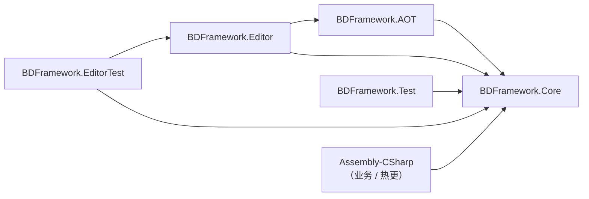

# Assemblies & Dependencies

## First-party assembly inventory

| Assembly | asmdef path | Platform | Responsibility |
|----------|-------------|----------|----------------|
| `BDFramework.Core` | `Packages/com.popo.bdframework/Runtime/BDFramework.Core.asmdef` | Any | Framework runtime |
| `BDFramework.AOT` | `Packages/com.popo.bdframework/Runtime.AOT/BDFramework.AOT.asmdef` | Any | AOT supplement registration, preserved for IL2CPP pre-stripping |
| `BDFramework.Editor` | `Packages/com.popo.bdframework/Editor/BDFramework.Editor.asmdef` | Editor | Build pipeline, editor windows, CI bridge |
| `BDFramework.Test` | `Packages/com.popo.bdframework/Runtime.Test/Runtime/` | Any | Runtime API tests (Debug builds only) |
| `BDFramework.EditorTest` | `Packages/com.popo.bdframework/Runtime.Test/Editor/` | Editor | Editor-only tests, BatchMode bridge |

`Runtime/AssemblyInfo.cs` exposes internal types to the test assemblies:

```csharp
[assembly: InternalsVisibleTo("BDFramework.EditorTest")]
[assembly: InternalsVisibleTo("BDFramework.Test")]
```

There is also a first-party package `com.talosai.e2e` (`Packages/com.talosai.e2e/`) that hosts E2E test orchestration; it is not part of the framework itself.

## Dependency direction



Rules:

- **`Runtime` must not reference `Editor`.** The single exception is `Runtime/GameConfig/ConfigEditorUtil.cs` — it sits in the Runtime assembly but its contents are wrapped in `#if UNITY_EDITOR`. This is historical baggage (see the [Refactor Backlog](refactor-backlog.md)).
- **`BDFramework.AOT` must not reference `BDFramework.Core`.** That is why `BDLauncher` takes a fully reflective route to reach Core.
- **Business code (`Assembly-CSharp`) may reference Core; Core knows nothing about business code.**

## Third-party and bundled dependencies

### Pulled in as Unity packages

| Package | Purpose |
|---------|---------|
| `com.code-philosophy.hybridclr` | Hotfix runtime |
| `com.code-philosophy.obfuz` / `com.code-philosophy.obfuz4hybridclr` | Code obfuscation |
| `com.unity.assetgraph` (BDFramework fork) | AssetBundle packing graph |
| `Unity-Logs-Viewer` | On-device log viewer |
| `com.popo.bdframework/3rdPlugins/AssetGraph-1.8-release-BD` | AssetGraph source mirror |

### Bundled inside the package (`Packages/com.popo.bdframework/`)

| Directory | Contents |
|-----------|----------|
| `3rdPlugins/BetterStreamingAssets` | Reading assets inside an Android APK |
| `3rdPlugins/LitJson` | JSON serialization (config files, `AssetsVersionInfo`) |
| `3rdPlugins/MessagePack` | Binary serialization |
| `3rdPlugins/Protobuf` | Network protocol |
| `3rdPlugins/UniTask` | async/await support |
| `3rdPlugins/ZString` | Zero-allocation string formatting |
| `3rdPlugins/NuGet` | NuGet package host |
| `Nuget/ServiceStack.Text.5.12.0` | CSV serialization (`art_assets.info` and `assets.info` are both CSV) |
| `Plugins/Sqlite` | Native `sqlite3` / SQLCipher |
| `Plugins/Debug` | Editor dependencies such as Odin |

!!! warning "Do not modify third-party or vendored plugins"
    `Packages/com.code-philosophy.*`, `3rdPlugins/**` and `Nuget/**` are third-party code. First-party changes are only allowed under `Packages/com.popo.bdframework/**` and `Packages/com.talosai.e2e/**`.

    When you need to override third-party behaviour, use an **extension point** (inherit + register) rather than forking the source. The AssetGraph fork `AssetGraph-1.8-release-BD` is the one exception — its very existence is the customisation.

## Business assemblies

There is **no `.asmdef` anywhere** under `Assets/Code/**`, so everything lands in Unity's default assemblies:

| Directory | Assembly | Participates in hotfix |
|-----------|----------|------------------------|
| `Assets/Code/**` (excluding `Editor`) | `Assembly-CSharp` | ✓ |
| `Assets/Code/**/Editor/**` | `Assembly-CSharp-Editor` | ✗ |
| `Assets/Plugins/**` | `Assembly-CSharp-firstpass` | ✓ |
| `Assets/3rdPlugins/**` | Their own asmdefs | ✗ |

The hotfix collection whitelist (`ScriptLoder.GetAppDomainHostingTypes()`, matched by `Assembly.FullName` prefix, taking only `IsClass && !IsNested`):

```text
"BDFramework"
"Assembly-CSharp,"
"Assembly-CSharp-firstpass,"
"UnityEngine.UI"
"Game."
含 "@main"
```

The result is **cached after the first scan** in `hostingTypeList`. In the Editor it is sorted by `FullName` and printed line by line as `框架托管DLL:...`.

### HybridCLR hotfix assembly configuration

The conventions written by `HyCLREditorTools.SetBDFramework2HCLRConfig()`:

| Setting | Value |
|---------|-------|
| `preserveHotUpdateAssemblies` (appended) | `Assembly-CSharp`, `Assembly-CSharp-firstpass`, `BDFramework.Core` |
| `hotUpdateAssemblies` (removed) | the original list |
| `patchAOTAssemblies` (appended) | `mscorlib`, `System`, `System.Core` |

`preserveHotUpdateAssemblies` means "these assemblies **already exist as DLLs** inside the client package; hotfix replaces rather than adds them". `ScriptLoderAOT.ShouldSkipAlreadyLoadedHotfixAssembly` skips assemblies already preloaded by the Player, avoiding duplicate same-named types in the `AppDomain`.

## Related pages

- [Startup Sequence](bootstrap.md)
- [Runtime Module Map](runtime-modules.md)
- [Hotfix Code (HybridCLR)](../pipeline/build-hotfix-dll.md#hotfix-assembly-set)
