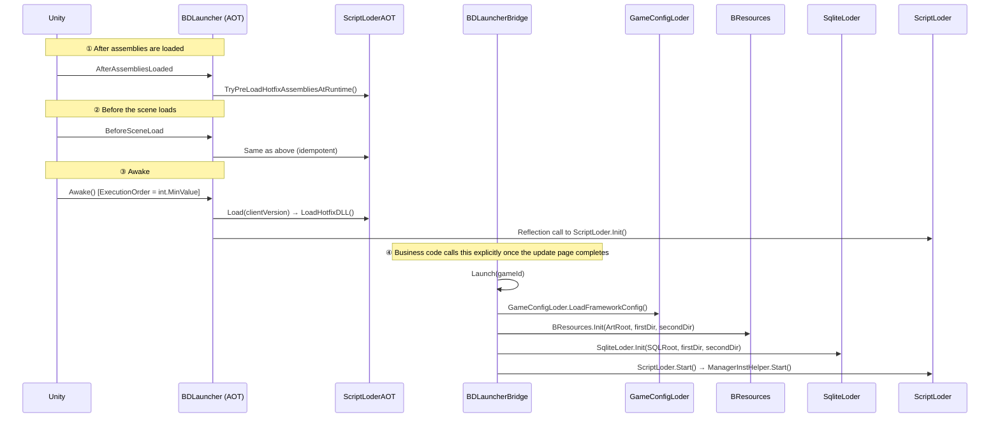

# Startup Sequence

Framework startup has **three phases**; between the first and the second, business code decides when to proceed.



## ① AOT phase (`Runtime.AOT/BDLauncher.cs`)

```csharp
[RuntimeInitializeOnLoadMethod(RuntimeInitializeLoadType.AfterAssembliesLoaded)]
static void PreLoadHotfixAssembliesAfterAssembliesLoadedFromLauncher()
    => ScriptLoderAOT.TryPreLoadHotfixAssembliesAtRuntime("AfterAssembliesLoaded");

[RuntimeInitializeOnLoadMethod(RuntimeInitializeLoadType.BeforeSceneLoad)]
static void PreLoadHotfixAssembliesBeforeSceneLoadFromLauncher()
    => ScriptLoderAOT.TryPreLoadHotfixAssembliesAtRuntime("BeforeSceneLoad");   // 幂等
```

`Awake()` (`[DefaultExecutionOrder(int.MinValue)]`, the first thing to run in the whole project) does the following in order:

1. `Inst = this`; validate `ConfigText != null`, otherwise `Debug.LogError("GameConfig配置为null,请检查!")`.
2. When `Application.isPlaying`, call `DontDestroyOnLoad(this)`.
3. If `!ScriptLoderAOT.HasLoadedHotfixAssembliesBeforeSceneLoad` → `ScriptLoderAOT.Load(ClientVersion)`.
4. `InitHotfixScriptLoder()` — iterate `AppDomain.CurrentDomain.GetAssemblies()` to find `"BDFramework.ScriptLoder"` and invoke `ScriptLoder.Init()` via `method.Invoke(null, null)`.
5. On non-Editor platforms, set `BDFramework.Core.Tools.BApplication.IsPlaying = true` by reflection.

!!! danger "Why everything here is reflection"
    `BDFramework.AOT` cannot reference `BDFramework.Core` (circular dependency). And **`System.Type.GetType("..., BDFramework.Core")` returns `null` under IL2CPP** — you must enumerate `AppDomain.CurrentDomain.GetAssemblies()` instead. The source comments record this trap explicitly.

### Hotfix DLL loading (`ScriptLoderAOT.LoadHotfixDLL`) { #hotfix-dll-loading }

| Step | Path | Notes |
|------|------|-------|
| 1. Compute dual-addressing roots | `firstLoadDir` = `persistentDataPath/<clientVersion>/<platform>` | `clientVersion` comes from `StreamingAssets/<platform>/package_build.info` |
| 2. **AOT metadata supplement** | **Always** from the client at `StreamingAssets/<platform>/script/aot_patch/*.zlua.bytes` | **Does not follow the version directory**, because the AOT patch must match the client's IL2CPP output |
| 3. Hotfix DLLs | Prefer `firstLoadDir/script/hotfix/*.zlua.bytes` | On hit: `File.ReadAllBytes` + `Assembly.Load` |
| 4. Fall back to the client | Android uses `BetterStreamingAssets.ReadAllBytes`; others use `File.ReadAllBytes` | If neither exists, throw `【AOT.Load】HyCLR热更DLL不存在! 路径:...` |

AOT metadata loading: `RuntimeApi.LoadMetadataForAOTAssembly(bytes, HomologousImageMode.SuperSet)`.

**Assembly load order is hardcoded** (`GetHotfixDllLoadRank`):

| Rank | Match | Notes |
|------|-------|-------|
| 0 | `bdframework.core*` | The framework must come first |
| 1 | `assembly-csharp-firstpass*` | |
| 2 | `assembly-csharp*` | |
| 10 | everything else | Within a rank, sorted by file name with `OrdinalIgnoreCase` |

A `FileNotFoundException` / `DirectoryNotFoundException` for a single file is downgraded to `Debug.LogWarning` and processing continues.

## ② Bridge phase (`Runtime/BDLauncherHotfix.cs`)

```csharp
BDLauncherBridge.Launch(string gameId = "default")
```

**Business code calls this explicitly after the hotfix/update screen completes.** Steps:

1. `BApplication.IsPlaying = true`
2. `BDLauncher.Inst.gameObject.AddComponent<IEnumeratorTool>()` ← **the coroutine driver must be attached first**
3. `GameConfigLoder.LoadFrameworkConfig()`
4. `Config = GameConfigManager.Inst.GetConfig<GameBaseConfigProcessor.Config>()`
5. `(firstLoadDir, secondLoadDir) = ClientAssetsUtils.GetMultiAssetsLoadPath(BApplication.RuntimePlatform, Config.ClientVersionNum)`
    - `firstLoadDir = secondLoadDir` when `Application.isEditor`
6. `ClientAssetsUtils.CheckBaseClientAssets(firstLoadDir, secondLoadDir)`
7. `BResources.Init(Config.ArtRoot, firstLoadDir, secondLoadDir)`
8. `SqliteLoder.Init(Config.SQLRoot, firstLoadDir, secondLoadDir)`
9. `ScriptLoder.Start()` → `ManagerInstHelper.Start()`

`BDLauncherHotfix.Launch(gameId)` is only a forwarding alias. `OnApplicationQuit()` performs `SqliteLoder.Close()` + `ScriptLoder.Dispose()` in the Editor only.

## ③ Order inside `ScriptLoder`

```csharp
ScriptLoder.Init()
  1. GetAppDomainHostingTypes()                    // 带缓存，Editor 下打印清单
  2. ManagerInstHelper.LoadManager(types)          // 只注册，不启动
  3. GameConfigLoder.LoadFrameworkConfig()         // 配置中心提前可用
  4. _ = BApplication.persistentDataPath;          // 主线程预热路径，防后台线程污染静态构造
  5. IsRunning = true

ScriptLoder.Start()
  → ManagerInstHelper.Start()
      ① 全部 Mgr.Init()
      ② 所有 !IsStarted 的 Mgr.Start()      // 按 [ManagerOrder] 升序
```

## Manager startup order

`ManagerInstHelper.LoadManager` sorts by `[ManagerOrder(Order = n)]` (default `0`; lower starts earlier).

| Manager | Order | Notes |
|---------|-------|-------|
| `GameConfigManager` | 0 | Config centre |
| `UIManager` | 0 | UI |
| `ComponentBindAdaptorManager` | 0 | Binding adapters |
| `ScreenViewManager` | **99999** | The only `ManagerOrder` in the whole repo; guarantees navigation starts last (its `Start()` immediately calls `BeginNavTo` for the default page) |

Business managers (such as `DemoEventManager`) need no registration — the `"Game."` / `"Assembly-CSharp,"` prefixes collect them.

!!! warning "`base.Start()` is not optional"
    `ManagerBase.Start()` sets `IsStarted = true`. If you override it and forget `base.Start()`, `ManagerInstHelper.Start()` will call your `Start()` **repeatedly**.

## Pure-logic startup without a MonoBehaviour

`GameConfigStartupPureLogic` lets the framework reuse the production path under BatchMode / EditorTest.

```csharp
GameConfigLoder.LoadFrameworkConfig()
  → if (!GameConfigStartupPureLogic.ShouldLoadFrameworkConfigManager(GameConfigManager.Inst != null))
        return;      // 直接返回，不做场景查找、不读文件
  → GameConfigManager.Inst.Start()
```

Config text resolution priority (`ResolveFrameworkConfigTextSource`):

1. `Application.isPlaying` and a runtime launcher has a `TextAsset` → use the runtime launcher
2. A `BDLauncher` exists in the scene with `ConfigText` assigned → use the scene launcher
3. Editor and `Assets/Scenes/Config/editor.bytes` exists → use the editor default config
4. Otherwise `None`

This design lets E2E / BatchMode construct the framework runtime **without a `BDLauncher` component** (see `TalosE2EBatchBridge.PrepareEditorOnlyRuntime`).

## Troubleshooting order for startup failures

| Symptom | Check |
|---------|-------|
| `GameConfig配置为null,请检查!` | `BDLauncher.ConfigText` in the scene |
| `【AOT.Load】HyCLR热更DLL不存在!` | `StreamingAssets/<platform>/script/hotfix/` |
| `[GameconfigManger]启动失败，class data 数量为0.` | Is the business assembly being collected (prefix whitelist)? |
| A manager's `Init()` is never called | Does its attribute derive from `ManagerAttribute`? |
| AB async load never calls back | Is `IEnumeratorTool` attached? |
| Everything fine in the Editor, black screen on device | Was `AssetLoadPathType` misconfigured as `Editor`? |

## Related pages

- [Asset Load Paths](../guide/asset-load-path.md)
- [Managers (ManagerBase)](../api/manager-base.md)
- [Hotfix Code (HybridCLR)](../pipeline/build-hotfix-dll.md)
- [E2E (Talos)](../testing/e2e.md)
