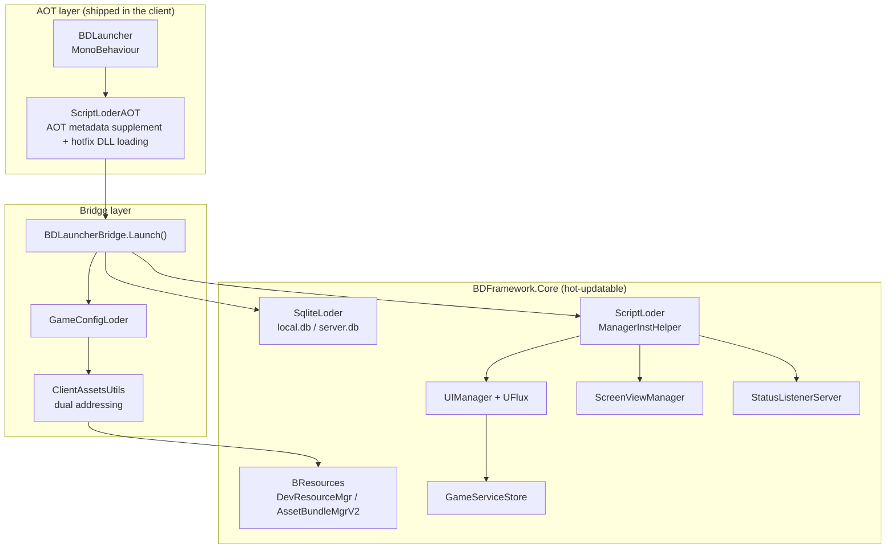

# BDFramework Documentation

BDFramework is an engineering framework built for **long-term live operation of Unity mobile games**. It covers three main tracks:

| Track | Problem it solves | Main entry points |
|-------|-------------------|-------------------|
| **Hotfix & assets** | Ship code, tables and art updates without a store release | `ScriptLoder`, `SqliteLoder`, `BResources` |
| **UI architecture (UFlux)** | Rendering, state and decoupling for complex screens | `UIManager`, `AWindow<T>`, `Reducer/Store` |
| **Build & release pipeline** | Repeatable asset packing, client builds and CI artifacts | `BuildTools_*`, `PublishPipeLineCI` |

This documentation targets branch `v4/v-4.0.0` (Unity 2021, package version `com.popo.bdframework@4.0.0`, hotfix solution: **HybridCLR**).

!!! info "Documentation layers"
    This site is the **human-facing published documentation**. Agent-facing rules (coding workflow, quality gates, per-file constraints) live under `.github/`. See [Documentation Governance](agent/doc-governance.md) for how the two relate.

!!! note "About this translation"
    This is the English translation of the Chinese documentation, which is the source of truth.
    Pages that have not been translated yet automatically **fall back to the Chinese original** —
    you will never hit a missing page, but you may land on Chinese text. Code samples are kept
    verbatim from the codebase, so comments inside code blocks remain Chinese-first (the repo
    convention for source comments).

## Where to start

- :material-rocket-launch: **New to the framework**

    ---

    Start with installation, project layout and asset path rules to build a correct mental model of the project structure.

    [:octicons-arrow-right-24: Getting Started](guide/installation.md)

- :material-sitemap: **How the code is organised**

    ---

    Assembly split, startup sequence, Runtime and Editor module maps, plus the refactor backlog.

    [:octicons-arrow-right-24: Architecture](architecture/index.md)

- :material-window-restore: **Writing UI**

    ---

    The three UFlux layers — Window / Component / State — plus binding, messages and dependency injection.

    [:octicons-arrow-right-24: UI (UFlux)](uflux/index.md)

- :material-package-variant-closed: **Building / wiring up CI**

    ---

    The four build tracks — hotfix DLL, AssetBundle, tables, client package — and the publish/upload protocol.

    [:octicons-arrow-right-24: Build & Release](pipeline/index.md)

- :material-robot: **Letting AI edit framework code**

    ---

    A per-module Skill set that gives the agent direct knowledge of each module's API and pitfalls.

    [:octicons-arrow-right-24: Skill Index](agent/skills.md)

## Framework at a glance

## The three rules that are easiest to get wrong

1. **The hotfix boundary**: AOT code outside the main assembly (`Assembly-CSharp-firstpass`) **must not reference hotfix types directly**. Communicate only through decoupling channels such as `StatusListenerServer` or manager properties. See [Asset Load Paths](guide/asset-load-path.md) and [Hotfix Code Build](pipeline/build-hotfix-dll.md).
2. **Anything explicitly loadable must live under a `Runtime` directory**: `Assets/*/Runtime/**` is the framework's single convention for collecting assets. Placed elsewhere, an asset is silently ignored at pack time. See [Project Layout](guide/project-structure.md).
3. **Editor and device paths differ**: In the Editor, `streamingAssetsPath` is rewritten to `DevOps/PublishAssets` and `persistentDataPath` to `<ProjectRoot>/.AppData`. Read [Asset Load Paths](guide/asset-load-path.md) before writing any path-related code.

## Documentation map

| Section | Contents |
|---------|----------|
| [Getting Started](guide/installation.md) | Installation, project layout, asset paths, coding guidelines |
| [Architecture](architecture/index.md) | Assemblies, startup sequence, module maps, refactor backlog |
| [UI (UFlux)](uflux/index.md) | Window / Component / RenderData / State / Store / DI |
| [Runtime API](api/index.md) | Managers, assets, tables, events, config, navigation, utilities |
| [Build & Release](pipeline/index.md) | Hotfix DLL, AssetBundle, tables, client package, publishing, CI |
| [Editor](editor/index.md) | Editor core classes, Http server, pipeline hooks, menu index |
| [Testing](testing/index.md) | Unit tests, BatchMode tests, E2E |
| [Tutorials & Demos](tutorials/index.md) | Business demo walkthroughs and external video resources |
| [Agent](agent/index.md) | Skill system and documentation governance |
| [Archive](archive/index.md) | Raw pre-migration Wolai export and migration mapping |
