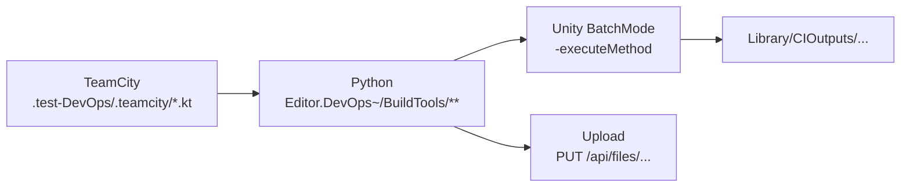

# DevOps & CI

In CI, **TeamCity schedules Python scripts**, and the Python side assembles the Unity BatchMode command line and uploads artifacts.



## BatchMode `-executeMethod` entry points

All of them live in `BDFramework.Editor.DevOps.PublishPipeLineCI`
(`Packages/com.popo.bdframework/Editor/EditorPipeline/DevOpsPipeline/CI/PublishPipeLineCI.cs`).

| `-executeMethod` | `[CI]` description | Forwards to |
|------------------|------------|--------|
| `…PublishPipeLineCI.CheckEditorCode` | Code check | `BuildTools_HotfixScript.CheckEditorCode()` |
| `…PublishPipeLineCI.BuildDLL` | — | **Empty implementation** |
| `…PublishPipeLineCI.BuildTable` | BatchMode unified table build | `BuildTools_Excel2SQLite.BuildTableForBatchMode()` |
| `…PublishPipeLineCI.BuildCode{Android,IOS,Windows}` | BatchMode hotfix code build * | `BuildTools_Assets.BuildClientResForBatchMode(bt, BuildPackageOption.BuildHotfixCode)` |
| `…PublishPipeLineCI.BuildAssetbundle{Android,IOS,Windows}` | BatchMode hotfix AssetBundle build * | `BuildClientResForBatchMode(bt, BuildPackageOption.BuildArtAssets)` |
| `…PublishPipeLineCI.VerifyClientRes{Android,IOS,Windows}` | BatchMode hotfix asset verification * | `AssetsVersionController.VerifyFileServerAssetsForBatchModeWithRequest` |
| `…PublishPipeLineCI.BuildClientPackage{Android,IOS,Windows}` | BatchMode client package build *-Release | Private `BuildClientPackageForBatchMode(BuildTarget)` (**the full injection version**) |
| `…PublishPipeLineCI.PublishPackage_{Android,iOS,Windows}{Debug,Release,DebugForProfiler,ReleaseForTest}` | Publish client package * | Calls `BuildTools_ClientPackage.BuildClientPackageForBatchMode` directly (**does not inject test assemblies**) |

!!! danger "The two groups of client package entry points behave differently"
    - `PublishPackage_*` (12 of them): call `BuildClientPackageForBatchMode` directly, **bypassing** test assembly injection and `TalosDebugDefineScope`
    - `BuildClientPackage{Android,IOS,Windows}` (3 of them): take the full injection path

    Picking the wrong one leaves a Debug build without test assemblies, or mixes test assemblies into a Release build.

!!! note "The Android verification entry point prepares the environment first"
    `VerifyClientResAndroid` first calls `AndroidExternalToolsBatchResolver.EnsureAndroidExternalToolsForBatchMode()`.

Helper public APIs:

```csharp
static public bool IsDebugBuildRequested();
static public bool IsDebugBuildRequested(IReadOnlyList<string> args);
static public BuildTools_ClientPackage.BuildMode ResolveClientPackageBuildModeForBatchMode([args]);
static public bool ShouldIncludeDebugSymbolForTalosClientPackageBuild(BuildMode mode);
public static AssetsVersionController.FileServerBatchVerificationRequest
    CreateVerifyClientResRequestForBatchMode(BuildTarget, IReadOnlyList<string> args, bool resetLocalStateBeforeVerify = true);
```

Static constructor: `if (Application.isBatchMode) BDFrameworkEditorEnvironment.InitEditorEnvironment();`

## CI command line arguments (parsed on the C# side)

| Argument | Parsing point |
|------|--------|
| `-clientVersion` | `BuildTools_ClientPackage.ClientVersionBatchArgName` |
| `-buildDebug true\|false` | `BuildTools_ClientPackage` / `PublishPipeLineCI` |
| `-buildMode Debug\|DebugForProfiler\|Release\|ReleaseForTest` | `ResolveClientPackageBuildModeForBatchMode` |
| `-ciOutputRoot <path>` | `BuildTools_Assets.CIOutputRootBatchArgName` |
| `-fileServerUrl` | `AssetsVersionController.FileServerUrlBatchArgName` |
| `-expectedCodeVersion` / `-expectedAssetbundleVersion` / `-expectedTableVersion` | Const of the same name |
| `-buildTarget` | **Read on the Python side to assemble the command; not parsed on the C# side** |
| `-talosForceE2E` | `TalosE2EBatchBridge` |

## Standard Unity command line

```bash
<Unity> -batchmode \
        -projectPath <project_dir> \
        -executeMethod <cls.method> \
        -clientVersion <ver> \
        -logFile <log> \
        [-buildDebug <bool>] \
        [-buildTarget Android|iOS|Win64] \
        [-ciOutputRoot <dir>] \
        -quit
```

Rules:

| Rule | Description |
|------|------|
| Extra arguments are inserted **before `-quit`** | Python `insert_command_argument`; appended at the end when `-quit` is missing |
| `-buildTarget` mapping | `android→Android`, `ios→iOS`, `windows→Win64` |
| **ClientRes tasks must pass `-buildTarget` explicitly** | Otherwise the current Editor platform is used |
| Table tasks only pass `-ciOutputRoot` | The upload platform is mapped from the host by `TABLE_OUTPUT_PLATFORM_BY_HOST = {mac: osx, windows: windows, linux: linux}` |
| Verify tasks pass `-buildTarget` + `-fileServerUrl` (including `/files`) + all three `-expected*Version` | |
| **`-nographics` is not used** | |
| **Switching the ClientRes target platform inside the Editor is forbidden** | Specify it through `-buildTarget` |

!!! danger "`-quit` is required"
    On this machine Unity 2021.3.58f1 crashes in the batchmode main loop on the license signature check (`CheckLicenseActivated()` segfault). `-quit` makes Unity exit before it enters the main loop.

    `-force-open` Bus Errors on this machine and is **disabled**.

## Python scripts and CLI

Located in `Packages/com.popo.bdframework/Editor.DevOps~/BuildTools/` (the `~` suffix = Unity ignores this directory).

| Script | `-executeMethod` | Required arguments | Optional arguments |
|------|-----------------|---------|---------|
| `BuildClientResAssetbundle/build_{android,ios,windows}.py` | `BuildAssetbundle*` | `--client-version` | `--build-name` `--build-number` `--unity-version` `--project-dir` `--debug-build` `--phase all\|build\|upload` `--dry-run` |
| `BuildClientResCode/build_{android,ios,windows}.py` | `BuildCode*` | `--client-version` | Same as above |
| `BuildClientResTable/build_table.py` | `BuildTable` | (`--client-version` optional) | Same as above (no `--debug-build`) |
| `BuildClientPackage/build_{android,ios,windows}.py` | `BuildClientPackage*` | `--client-version` | `--build-name` `--build-number` `--unity-version` `--project-dir` `--debug-build` `--build-mode` `--file-server-url` `--dry-run` |
| `VerifyClientRes/verify_{android,ios,windows}.py` | `VerifyClientRes*` | `--client-version` `--expected-*` `--server-url` `--config` | … |
| `VerifyClientRes/test_client_res.py` | (pure TeamCity scheduling) | — | Subcommands `resolve-builds` / `wait-builds` / `queue-verify-build` |

### Shared helpers

| File | Key APIs |
|------|---------|
| `Common/artifact_uploader.py` | `resolve_file_server_settings`, `upload_single_file`, `upload_to_remote_root`, `upload_client_package`, `build_artifact_remote_root`, `ArtifactType`, `compute_file_sha256` |
| `Common/client_resource_artifacts.py` | `get_ci_output_root`, `prepare_clean_ci_output_root`, `prepare_{code,assetbundle,table}_upload_source`, `upload_client_res_*`, `validate_uploaded_artifacts` |
| `Common/client_resource_flow.py` | `run_platform_resource_build`, `run_table_resource_build`, `run_platform_resource_verify`, `parse_*_args`, `prepare_platform_ci_project_dir` |
| `Common/client_resource_version_manifest.py` | `clientRes_{platform}/version.info` = `code.assetbundle.table` |
| `Common/buildtools_config.py` | Typed dataclass configuration entry point (**the only place TOML is read**) |
| `Common/buildtools_config_guard.py` | Intercepts ad hoc TOML parsing |

## Local isolated output

```text
<projectDir>/Library/CIOutputs/<build_kind>/<build_name>/<build_number>[/<platform>]
```

`build_kind` ∈ `clientres_code` / `clientres_assetbundle` / `clientres_table`; logs live in `Library/CIOutputs/logs`.

| Phase | Behaviour |
|------|------|
| `build` | Cleared first (`prepare_clean_ci_output_root`) |
| `upload` | **Not** cleared |

## TeamCity Kotlin DSL

!!! note "The DSL is not under `DevOps/`"
    It lives in **`.test-DevOps/.teamcity/`**.

| File | BuildType / Project |
|------|-------------------|
| `Project.kt` | `BDFrameworkCoreProject` = `BDFramework.Core`; subProjects: ClientPackage / ClientResCode / ClientResAssetbundle / ClientResTable / TalosAI / TestPipeline |
| `projects/ClientPackage.kt` | `ClientPackage` |
| `projects/ClientResCode.kt` / `ClientResAssetbundle.kt` / `ClientResTable.kt` | `ClientRes_Code` / `ClientRes_Assetbundle` / `ClientRes_Table` |
| `projects/TestPipeline.kt` + `ClientResVerify.kt` | `TestPipeline/TestBuildPipeline_ClientRes` |
| `projects/TalosAI.kt` + `TalosAIE2E.kt` | `TalosAI/TalosAI.E2E` |
| `buildTypes/BuildClientPackage.kt` + `_android/_ios/_windows.kt` | Aggregate + the three per-platform package builds |
| `buildTypes/BuildCode_{android,ios,windows}.kt` | `BDFrameworkCore_BuildCode*` |
| `buildTypes/BuildAssetbundle_{android,ios,windows}.kt` | `BDFrameworkCore_BuildAssetbundle*` |
| `buildTypes/BuildTable.kt` | `BDFrameworkCore_BuildTable` |
| `buildTypes/TestClientRes.kt` | `BDFrameworkCore_TestClientRes` (3 steps: resolve-builds / wait-builds / queue-verify-build) |
| `buildTypes/TalosAI*.kt` | E2E tasks |
| `vcsRoots/Github.kt` | `【Github】BDFramework.core` |

Common parameters: `build.client.version` (defaults to `0.1`), `build.extra.args`, `ci.python.command` (defaults to `python`), `build.debugBuild`.

A typical step:

```kotlin
scriptContent = """
    %ci.python.command% "Packages/com.popo.bdframework/Editor.DevOps~/BuildTools/BuildClientResAssetbundle/build_android.py" \
      --client-version "%build.client.version%" \
      --build-name "BuildAssetbundle_android" \
      --build-number "%build.number%" \
      --project-dir "%teamcity.build.checkoutDir%" \
      --phase build %build.extra.args%
""".trimIndent()
```

`artifactRules = "Library/CIOutputs/logs => build-logs"`.

## External configuration

| File | Content |
|------|------|
| `Packages/com.popo.bdframework/Editor.DevOps~/BuildTools/buildtools.toml` | `[artifact_file_server]`, `[ci_server]`, `[ios_xcode]`, `[tests.remote_artifact]` |
| `DevOps/CI/buildtools.toml` | **A duplicated copy** (see [Refactor Backlog](../architecture/refactor-backlog.md#ref-20-duplicated-config)) |
| `DevOps/CI/talos_e2e_config.toml` | `[talos.e2e]` client_version / build_debug / build_mode / timeout / unity_host / unity_port |
| `DevOps/Config/BDFrameworkSetting.conf` | Editor settings (keystore path and so on) |
| `DevOps/Config/HotfixFile.conf` | Hotfix file filter rules |

**Configuration priority** (`resolve_file_server_settings`):

```text
显式参数 > 环境变量 ARTIFACT_FILE_SERVER_URL
        > buildtools.toml[artifact_file_server].base_url
        > ARTIFACT_FILE_SERVER_IP / ip
        > 127.0.0.1:20001
```

**Config path priority**:

```text
config_path / --config > BUILDTOOLS_CONFIG > 旧模块级环境变量 > buildtools.toml > buildtools.toml.example
```

## pytest coverage

```bash
python -m pytest Packages/com.popo.bdframework/Editor.DevOps~/BuildTools/tests/ [-q] [--run-remote-artifact-tests]
```

| Test file | Coverage |
|---------|------|
| `conftest.py` | The `--run-remote-artifact-tests` switch + the `remote_artifact` marker |
| `test_buildclientpackage_helpers.py` | Build artifact generation / ZIP entries |
| `test_buildclientpackage_batchmode.py` | Naming paths, project dir validation, Unity executable resolution |
| `test_buildclientpackage_main_flow.py` | Main flow (fake flow) |
| `test_buildtools_config.py` | Reading the external integration config |
| `test_artifact_uploader.py` | Local upload HTTP server (success / error / recovery) |
| `test_artifact_uploader_remote.py` | Remote smoke (requires the marker) |
| `test_client_resource_artifacts.py` | Output root cleanup, staging, manifest validation |
| `test_client_resource_flow.py` | Three-platform wrapper delegation, flow steps, dry-run |
| `test_client_resource_verify.py` | Verification wrapper |
| `test_client_resource_version_manifest.py` | `version.info` parsing / validation |
| `test_test_client_res.py` | TeamCity build reuse / wait logic |

## Unity-side pure-logic verification entry points

```bash
"$UNITY_PATH" -batchmode -quit \
  -projectPath "/Users/naipaopao/Documents/GitHub/BDFramework.Core" \
  -executeMethod BDFramework.EditorTest.DevOps.PublishPipeLineCITest.RunBatchVerification \
  -logFile /tmp/PublishPipeLineCITest.log

"$UNITY_PATH" -batchmode -quit \
  -projectPath "/Users/naipaopao/Documents/GitHub/BDFramework.Core" \
  -executeMethod BDFramework.EditorTest.AssetsManager.AssetsVersionControllerDevOpsBatchVerification.RunBatchVerification \
  -logFile /tmp/AssetsVersionControllerDevOpsBatchVerification.log
```

## Platform isolation and caches

!!! warning "Only Assetbundle forces a platform-isolated checkout"
    - TeamCity `checkoutDir = ClientRes/{platform}`
    - `prepare_platform_ci_project_dir` prefers to reproduce `already_isolated` (parent directory name == platform), otherwise it does `git worktree add --force --detach` into `../<platform>/<repo-name>`
    - **Code / Table / Verify are not isolated** (`ciProjectIsolation=skipped`)

Reason: AssetBundle packing depends on a platform-specific `Library/` cache, and reusing it across platforms pollutes the SBP cache.

Other cache constraints:

| Item | Description |
|----|------|
| iOS BatchMode SBP first-failure retry | Reimport textures + clear `Temp/ContentBuildData`; an extra `BuildCache.PurgeCache(false)` **only when the project is not a platform-isolated directory** |
| SBP local BuildCache | `PruneCache_Background(200GB)` |
| Blacklist removal | `buildlogtep.json` / `build_result.info` / `EditorBuild.Info` / `package_build.info` are never pushed to the cloud |

## Advice for CI (from the framework author)

1. Build the DLLs and run tests on every commit —— surface compilation problems in hotfix code as early as possible
2. Build both platforms (Android + iOS) on asset commits —— differences between the two packing paths are the most common source of live issues
3. Build ipa/apk regularly —— verify the whole package build chain
4. Set up a virtual machine for automation —— on-device verification is indispensable
5. Sample performance with UWA regularly —— performance decay in long-lived projects is gradual

## Known drift

| Item | Fact |
|----|------|
| `DevOps/CI/githook/` | **Not found**; `DevOpsEditorTasks.UpdateGitHookToLocalStore` still references that path |
| `DevOps/PublishPackages/` | Empty directory |
| `DevOps/CI/buildtools.toml` | Duplicated by the copy inside the package |
| `PublishPipeLineCI.BuildDLL()` | Empty implementation |
| The `PublishPipelineTools` comment | Its path order is the reverse of the implementation |

## Related pages

- [Pipeline Hooks](../editor/publish-hooks.md)
- [Asset Publishing](publish-assets.md) —— upload protocol and verification
- [BatchMode & CI Tests](../testing/batchmode-tests.md)
- [E2E (Talos)](../testing/e2e.md)
