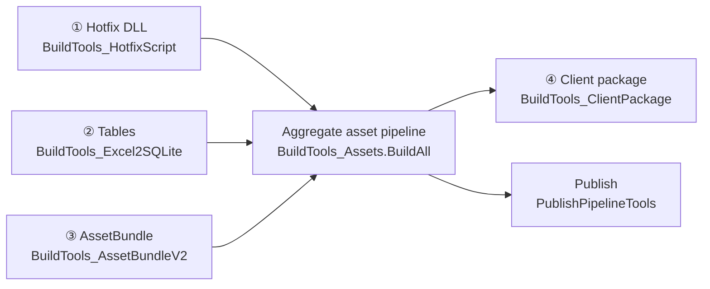

# Build & Release

BDFramework has **four independent build tracks** + **one aggregate asset pipeline** that strings them together.



## The four tracks

| # | Track | Entry class | Entry method | Artifacts |
|---|------|--------|---------|------|
| ① | [Hotfix code](build-hotfix-dll.md) | `BDFramework.Editor.HotfixScript.BuildTools_HotfixScript` | `BuildDLL(string outpath, RuntimePlatform platform)` | `<out>/<platform>/script/hotfix/*.zlua.bytes`<br/>`<out>/<platform>/script/aot_patch/*.zlua.bytes` |
| ② | [Tables](build-table.md) | `BDFramework.Editor.Table.BuildTools_Excel2SQLite` | `BuildSqlite(string ouptputPath, RuntimePlatform platform, DBType dbType, bool isUseCache)` | `<out>/<platform>/local.db`<br/>`<out>/server_data/server.db` |
| ③ | [AssetBundle](build-assetbundle.md) | `BDFramework.Editor.BuildPipeline.AssetBundle.BuildTools_AssetBundleV2` | `BuildAssetBundles(RuntimePlatform platform, string outputPath)` | `<out>/<platform>/art_assets/` |
| ④ | [Client package](build-package.md) | `BDFramework.Editor.BuildPipeline.BuildTools_ClientPackage` | `Build(BuildMode, string buildScene, string buildConfig, bool isGenAssets, string outdir, BuildTarget, …)` | `DevOps/PublishPackages/<platform>/…` |

## Aggregate asset pipeline

```csharp
BuildTools_Assets.BuildAll(platform, outputPath, clientVersion, buildOption)
```

| Step | Content |
|------|------|
| 0 | `OnBeginBuildAllAssets` → resolve the version number |
| 1 | Hotfix DLL |
| 2 | SQLite |
| 3 | AssetBundle |
| 4 | `GenBasePackageBuildInfo(bundleVersion)` |
| 5 | **`assets.info` generation** ← source comments require this to come last |
| 6 | `OnEndBuildAllAssets` |

`BuildPackageOption` can restrict a run to a subset (`BuildHotfixCode` / `BuildArtAssets` / `BuildAll`); that is exactly what CI relies on to split the work.

## Artifact directory layout

```text
DevOps/PublishAssets/                     ← 构建根（Editor 下 streamingAssetsPath 被重写到这里）
├── <platform>/
│   ├── art_assets/
│   │   ├── <ABName 或 GUID>              AB 本体（无扩展名）
│   │   ├── art_assets.info               加载索引（CSV: List<AssetBundleItem>）
│   │   ├── art_asset_type.info           资源类型表（CSV）
│   │   └── EditorBuild.Info              构建信息（仅 Editor，发布时剔除）
│   ├── script/
│   │   ├── hotfix/<asm>.zlua.bytes       热更 DLL
│   │   └── aot_patch/<asm>.zlua.bytes    AOT 补充元数据
│   ├── local.db                          客户端表（SqlCipher 加密）
│   ├── assets.info                       资源清单（CSV: List<AssetItem>）
│   ├── assets_subpack.info               分包配置
│   ├── package_build.info                母包构建信息（含三段 SVC 版本号）
│   ├── server_assets_version.info        版本信息（JSON）
│   └── build_result.info / buildlogtep.json   SBP 构建日志（发布时剔除）
├── server_data/server.db                 服务器表（不加密）
└── _ReadyToUpload/<version>/<platform>/  待上传目录（发布管线产出）
```

Platform directory names (`BApplication.GetPlatformLoadPath`): `windows` / `android` / `osx` / `ios`.

## Build menu entry points

| Menu path | Order | Purpose |
|---------|------|------|
| `BDFrameWork工具箱/Odin BuildPipeline` | — | Main build window (`EditorWindow_BuildPipeline`) |
| `BDFrameWork工具箱/1.DLL打包` | 52 | Script packing panel |
| `BDFrameWork工具箱/2.AssetBundle打包` | 53 | Asset packing panel |
| `BDFrameWork工具箱/3.表格/表格->生成SQLite` | 55 | Excel → local.db |
| `BDFrameWork工具箱/3.表格/表格->生成SQLite[Server]` | 56 | Excel → server.db |
| `BDFrameWork工具箱/3.表格/表格->生成Class[程序目录]` | 54 | Excel → C# table classes |
| `BDFrameWork工具箱/3.表格/表格预览` | 54 | Table preview window |
| `BDFrameWork工具箱/4.网络协议/Protobuf->生成Class` | 57 | Protobuf generation |
| `BDFrameWork工具箱/5.构建包体` | 58 | Client package build panel |
| `BDFrameWork工具箱/PublishPipeline/1.发布资源` | 101 | Asset publishing window |
| `BDFrameWork工具箱/HotfixPipeline/1.配置热更文件` | 111 | Hotfix file configuration |
| `BDFrameWork工具箱/DevOps/CI - API预览` | 121 | CI API list |

For the complete menu index see [Menus & Tools Index](../editor/menus.md).

## Pipeline lifecycle hooks

Business code hooks into the pipeline by extending `ABDFrameworkPublishPipelineBehaviour`:

```csharp
public class MyPublishBehaviour : ABDFrameworkPublishPipelineBehaviour
{
    public override void OnBeginBuildAllAssets(...) { }
    public override void OnEndBuildAllAssets(...) { }
    public override void OnBeginBuildAssetBundle(AssetBundleBuildingContext ctx) { }
    public override void OnBeginBuildPackage(BuildTarget target, string outputpath, string clientVersion) { }
    public override void OnEndBuildPackage(...) { }
    public override void OnBeginPublishAssets(...) { }
    public override void OnEndPublishAssets(...) { }
}
```

Example in this repository: `Assets/Code/BDFramework.Game/Editor/BDFrameworkPublishPipelineBehaviourTest.cs`.

→ See [Pipeline Hooks](../editor/publish-hooks.md) for details.

## Related pages

| Page | Content |
|------|------|
| [Hotfix Code (HybridCLR)](build-hotfix-dll.md) | DLL compilation, AOT metadata supplement, assembly configuration |
| [AssetBundle Building](build-assetbundle.md) | AssetGraph graphs, granularity, split packages |
| [AssetGraph Node Extension](build-assetbundle-extension.md) | Writing custom build nodes |
| [Table Building](build-table.md) | Excel format conventions, incremental builds, dual database output |
| [Client Package Build](build-package.md) | Three-platform packaging, BuildMode, version injection |
| [Asset Publishing](publish-assets.md) | Hash layout, upload protocol, version manifests |
| [DevOps & CI](devops-ci.md) | BatchMode entry points, Python tooling, TeamCity |
