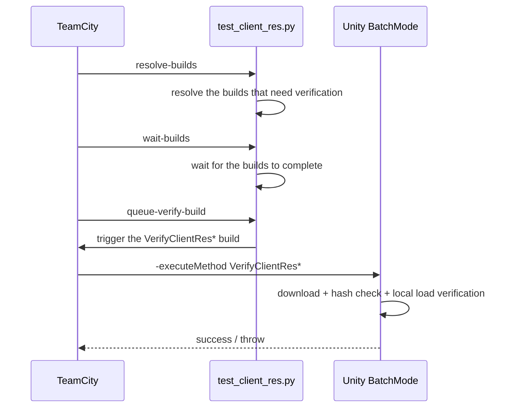

# BatchMode & CI Tests

## Three kinds of BatchMode verification

| Type | Entry | Purpose |
|------|------|------|
| Build pipeline pure-logic verification | `BDFramework.EditorTest.DevOps.PublishPipeLineCITest.RunBatchVerification` | Verifies CI argument parsing and platform mapping |
| File server protocol verification | `BDFramework.EditorTest.AssetsManager.AssetsVersionControllerDevOpsBatchVerification.RunBatchVerification` | Verifies download / check / version comparison |
| Artifact end-to-end verification | `PublishPipeLineCI.VerifyClientRes{Android,IOS,Windows}` | Really downloads from the file server and verifies |

## Command line template

```bash
"$UNITY_PATH" -batchmode -quit \
  -projectPath "<repo>" \
  -executeMethod <类.方法> \
  -logFile <日志路径> \
  [额外参数]
```

!!! danger "`-quit` and `-force-open`"
    | Argument | Notes |
    |------|------|
    | `-quit` | **Required.** On this machine Unity 2021.3.58f1 crashes in the batchmode main loop because of the licence signature check (`CheckLicenseActivated()` → `Licensing::Module::ActivatedWithErrorReason()` segfault). `-quit` makes Unity exit after finishing `-executeMethod` and before entering the main loop. |
    | `-force-open` | **Forbidden.** It causes a Bus Error on this machine. |
    | `-nographics` | Optional. Using it or not does not affect the crash above (the crash is in the main loop, not in graphics). |

### Pure-logic verification entry points

```bash
"$UNITY_PATH" -batchmode -quit \
  -projectPath "/Users/naipaopao/Documents/GitHub/BDFramework.Core" \
  -executeMethod BDFramework.EditorTest.DevOps.PublishPipeLineCITest.RunBatchVerification \
  -logFile /tmp/PublishPipeLineCITest.log

"$UNITY_PATH" -batchmode -quit \
  -projectPath "/Users/naipaopao/Documents/GitHub/BDFramework.Core" \
  -executeMethod BDFramework.EditorTest.AssetsManager.AssetsVersionControllerDevOpsBatchVerification.RunBatchVerification \
  -logFile /tmp/AssetsVersionControllerDevOpsBatchVerification.log
```

### CI asset verification entry points

```bash
<Unity> -batchmode -quit \
  -projectPath <dir> \
  -executeMethod BDFramework.Editor.DevOps.PublishPipeLineCI.VerifyClientResAndroid \
  -buildTarget Android \
  -fileServerUrl http://<host>:<port>/files \
  -expectedCodeVersion <code> \
  -expectedAssetbundleVersion <ab> \
  -expectedTableVersion <table> \
  -logFile <log>
```

!!! warning "`-fileServerUrl` must include `/files`"
    The Python-side base_url does not contain `/files`; it is appended when the value is passed to Unity.

## Framework initialisation under BatchMode

!!! note "`GameConfigStartupPureLogic` makes MonoBehaviour-free startup possible"
    ```csharp
    GameConfigLoder.LoadFrameworkConfig()
      → if (!GameConfigStartupPureLogic.ShouldLoadFrameworkConfigManager(GameConfigManager.Inst != null))
            return;      // 直接返回，不查场景、不读文件
      → GameConfigManager.Inst.Start()
    ```

    Config text source precedence: runtime launcher → scene launcher → Editor default file → `None`.

### Automatic initialisation of the CI entry point

```csharp
static PublishPipeLineCI()
{
    if (Application.isBatchMode) BDFrameworkEditorEnvironment.InitEditorEnvironment();
}
```

`InitEditorEnvironment()` initialises `BDEditorApplication`, `ScriptLoder`, `BResources` (Editor backend), `ManagerInstHelper`, `GameConfigLoder` and so on, in that order.

## Known limitations under BatchMode

| Limitation | Notes |
|------|------|
| `TestContext.WriteLine` throws an NRE | NUnit's `TestContext` depends on runner infrastructure that BatchMode does not provide. **Use `UnityEngine.Debug.Log` instead** |
| Async AB loading makes no progress | Requires the `IEnumeratorTool` component (only present in PlayMode) |
| `BDLauncherBridge.Launch()` needs `BDLauncher.Inst` | For pure-logic paths use the init chain in `TalosE2EBatchBridge.PrepareEditorOnlyRuntime` |
| `streamingAssetsPath` is rewritten in the Editor | It points at `DevOps/PublishAssets` |
| Licence crash | `-quit` is mandatory |

## Python-side tests

```bash
python -m pytest Packages/com.popo.bdframework/Editor.DevOps~/BuildTools/tests/ -q

# 包含远端制品测试（需要真实文件服务器）
python -m pytest Packages/com.popo.bdframework/Editor.DevOps~/BuildTools/tests/ \
    --run-remote-artifact-tests
```

| Test file | Coverage |
|---------|------|
| `conftest.py` | The `--run-remote-artifact-tests` switch + the `remote_artifact` marker |
| `test_buildclientpackage_helpers.py` | Package artifact generation / ZIP entries |
| `test_buildclientpackage_batchmode.py` | Naming paths, project dir validation, Unity executable resolution |
| `test_buildclientpackage_main_flow.py` | Main flow (fake flow) |
| `test_buildtools_config.py` | Reading the external integration config |
| `test_artifact_uploader.py` | Local upload HTTP server (success / error / recovery) |
| `test_artifact_uploader_remote.py` | Remote smoke test (needs the marker) |
| `test_client_resource_artifacts.py` | Output root cleanup, Code/AB/Table staging, manifest validation |
| `test_client_resource_flow.py` | Three-platform wrapper delegation, flow steps, dry-run |
| `test_client_resource_verify.py` | Verification wrapper |
| `test_client_resource_version_manifest.py` | `version.info` parsing / validation |
| `test_test_client_res.py` | TeamCity build reuse / wait logic |

## Asset verification flow



Inside `VerifyFileServerAssetsForBatchModeWithDevOps` on the Unity side:

1. `Task.Run(...).GetAwaiter().GetResult()` background download
2. Return to the main thread and run `ValidateFileServerRepresentativeLocalLoads`
3. Final check via `ValidateFileServerPackageBuildInfo`
4. On failure, uniformly `throw new Exception("[CI][VerifyClientRes] 文件服务器 BatchMode 验证失败! ...")`

The log prefix is `[CI][VerifyClientRes]`, and it includes the Chinese `测试目的=` / `实现手段=` fields.

## Platform isolation

!!! warning "Only Assetbundle forces a platform-isolated checkout"
    | Task | Isolation |
    |------|------|
    | Assetbundle | ✓ `ClientRes/{platform}` (`git worktree add --force --detach`) |
    | Code | ✗ `ciProjectIsolation=skipped` |
    | Table | ✗ |
    | Verify | ✗ |

Reason: AB packing depends on platform-specific `Library/` and SBP caches, and reusing them across platforms pollutes the build.

**iOS BatchMode SBP first-failure retry**: re-import textures + clear `Temp/ContentBuildData`; only **when the project is not a platform-isolated directory** is `BuildCache.PurgeCache(false)` additionally called.

## Related pages

- [Testing Overview](overview.md)
- [Runtime Unit Tests](runtime-tests.md)
- [DevOps & CI](../pipeline/devops-ci.md)
- [E2E (Talos)](e2e.md)
