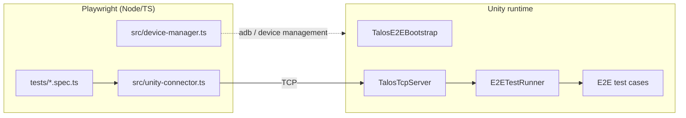

# E2E (Talos)

`Packages/com.talosai.e2e/` provides cross-process E2E test orchestration: **Playwright drives → TCP transports → Unity executes the tests**.

!!! note "Not part of the framework itself"
    Talos E2E is a separate first-party package serving "verifying the framework's own quality", not a runtime capability for business teams.

## Architecture



## Unity side (`Runtime/`)

### TestRunner

| File | Responsibility |
|------|------|
| `E2ETestRunner.cs` | Test executor |
| `E2ETestAttribute.cs` | Test marker attribute |
| `TalosE2EBootstrap.cs` | Bootstrap entry point (`LaunchE2EStatic()` supports MonoBehaviour-free startup) |
| `E2EAutoInit.cs` | Automatic discovery and initialisation |
| `E2ESceneAutoStarter.cs` | Scene auto-start |
| `RuntimeLaunchArguments.cs` | Runtime argument parsing |
| `DebugBuildMarker.cs` | Debug build marker |

### Transport

| File | Responsibility |
|------|------|
| `TalosTcpServer.cs` / `TalosTcpClient.cs` | TCP communication |
| `Protocol.cs` | Protocol definitions |
| `TalosPortPolicy.cs` | Port policy |

### Editor

| File | Responsibility |
|------|------|
| `E2EEditorTools.cs` | Editor-side entry points such as `LaunchE2EBatchMode()` |
| `EditorCommandDispatcher.cs` | Editor command dispatch |

`Runtime/link.xml` ensures E2E-related types are not stripped under IL2CPP.

## Playwright side (`Playwright~/`)

The `~` suffix makes Unity ignore this directory (a pure Node/TS project).

### Test suites

| File | Coverage |
|------|------|
| `testBaseFlow-e2e.spec.ts` | Base flow |
| `testBaseFlow-EditorPlayer-e2e.spec.ts` | Base flow in Editor Player mode |
| `testFrameworkCore-e2e.spec.ts` | Framework core |
| `testFrameworkBusiness-e2e.spec.ts` | Framework business |
| `testModuleIntegration-e2e.spec.ts` | Module integration |

### fixtures

| File | Responsibility |
|------|------|
| `fixtures.ts` | Base fixtures |
| `fixtures-unityplayer.ts` | Unity Player fixture (port allocation, process management, screenshots) |

### `src/`

| File | Responsibility |
|------|------|
| `unity-connector.ts` | Connect to Unity, send commands, receive results |
| `device-manager.ts` | Device management (PC / Android) |
| `unity-editor-ops.ts` | Editor operations |
| `index.ts` | Export entry point |

### `tools/` — run scripts and configuration

| File | Purpose |
|------|------|
| `test-pc.sh` | PC platform E2E |
| `test-editorplayer.sh` | Editor Player E2E |
| `test-android.sh` | Android device/emulator E2E |
| `test-batchmode.sh` | BatchMode E2E |
| `connect_androidVirtualDevice.sh` | Connect an Android virtual device |
| `node-tools.sh` | Node toolchain preparation |
| `talos_e2e_config.py` / `.toml` | Config reading |
| `teamcity_e2e_runner.py` | TeamCity integration |
| `debug_build_helper.py` | Debug build helper |

### pytest coverage (`tools/tests/`)

| File | Coverage |
|------|------|
| `test_talos_e2e_config.py` | Config parsing |
| `test_teamcity_e2e_runner.py` | TeamCity runner |
| `test_pc_tool.py` / `test_android_tool.py` / `test_batchmode_tool.py` / `test_editorplayer_tool.py` | Per-platform scripts |
| `test_node_tools.py` | Node toolchain |
| `test_il2cpp_preserve.py` | IL2CPP preservation verification |
| `test_host_launch_suite_source.py` / `test_host_baseflow_suite_source.py` / `test_host_dependency_boundary.py` | Suite source contracts |
| `test_framework_business_source.py` / `test_window_preconfig_source.py` | Business source contracts |
| `test_playwright_fixture_ports_source.py` / `test_playwright_step_screenshot_source.py` | Fixture contracts |

```bash
python -m pytest Packages/com.talosai.e2e/Playwright~/tools/tests/ -q
```

## Configuration

`DevOps/CI/talos_e2e_config.toml`:

```toml
[talos.e2e]
client_version = "0.1"
build_debug = true
build_mode = "Debug"
timeout = 5400
unity_host = "127.0.0.1"
unity_port = 10002
```

## TeamCity integration

| BuildType | Purpose |
|-----------|------|
| `TalosAI/TalosAI.E2E` | Main E2E task |

Menu entry points (Editor):

| Menu | Purpose |
|------|------|
| `Talos/E2E Test/创建 DEBUG 标记` | Creates the `DebugBuildMarker` |
| `Talos/E2E Test/移除 DEBUG 标记` | Removes the marker |
| `Talos/E2E Test/检查 DEBUG 状态` | Checks the current state |

!!! note "What the Debug marker is for"
    E2E has to run in a Debug build. `DebugBuildMarker` is a marker readable at runtime that **quickly tells whether the current package is a Debug build**, avoiding accidentally running E2E against a Release package.

## BatchMode launch

```csharp
// Editor 侧入口
TalosE2EBatchBridge.LaunchTalosE2EBatchMode();   // 打开 BDFrame.unity → E2EEditorTools.LaunchE2EBatchMode()
TalosE2EBatchBridge.LaunchTalosE2EEditorOnly();
TalosE2EBatchBridge.RunTalosE2EAndExport();
```

Command line argument: `-talosForceE2E`.

**The Editor-only path does not depend on the `BDLauncher` MonoBehaviour**:

```text
GameConfigLoder.LoadFrameworkConfig()
ClientAssetsUtils.GetMultiAssetsLoadPath(...)
CheckBaseClientAssets(...)
BResources.Init(config.ArtRoot, first, second)
SqliteLoder.Init(config.SQLRoot, first, second)
```

`TalosE2EBatchBridge.AssignEditorOnlyLauncherInstance` **reflectively writes back** `BDLauncher.Inst`'s private setter, so the runtime logic believes the launcher is ready.

## MonoBehaviour-free startup

`TalosE2EBootstrap.LaunchE2EStatic()` supports starting E2E without any `MonoBehaviour` (TCP mode).

`IEnumeratorTool` **is only required when coroutines are needed** (async AB loading and so on); a pure-logic E2E run can omit it.

## Related pages

- [Testing Overview](overview.md)
- [BatchMode & CI Tests](batchmode-tests.md)
- [Startup Sequence](../architecture/bootstrap.md) — the MonoBehaviour-free path
- [DevOps & CI](../pipeline/devops-ci.md)
