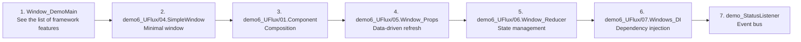

# Tutorials & Demos

| Page | Contents |
|------|----------|
| [Demo Walkthrough](demos.md) | A directory-by-directory explanation of every sample under `Assets/Code/Game@hotfix/` |
| [Videos & External Resources](videos.md) | External material such as the Zhihu column and Bilibili videos |

## Demo entry points

The project ships two demo entry windows:

| Window | Class | Contents |
|--------|-------|----------|
| `Win_Main` | `Window_DemoMain` | Framework overview: unit tests, ScreenView, SQLite queries, asset loading |
| `Win_UFlux` | `Window_FluxDemoMain` | Full UFlux feature demo (Component / Binding / Props / Reducer / DI) |

How to launch it: run `Assets/Scenes/BDFrame.unity`; the first screen, `ScreenView_Main`, loads `Win_Main`.

## Suggested learning path

## Related pages

- [UI (UFlux)](../uflux/index.md)
- [Window](../uflux/window.md)
- [State Management (Reducer/Store)](../uflux/state-management.md)
- [Event Bus](../api/event-bus.md)
