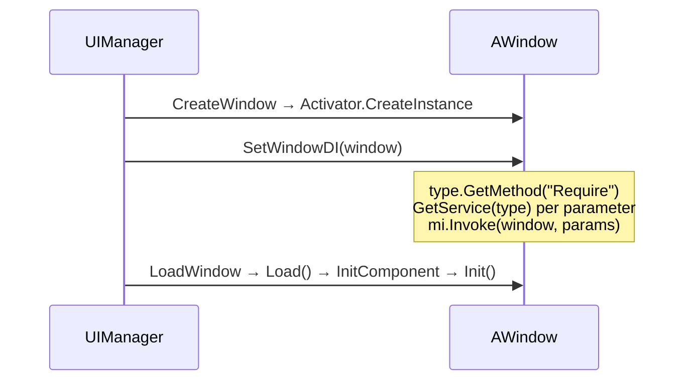

# Dependency Injection

UFlux provides a **convention-based** lightweight DI: a window implements a method named `Require`, and the framework injects the services it needs after the window is created.

!!! info "There is no `[Dependency]` attribute"
    Injection relies on a **method-name convention** (`Require`), not an attribute. The framework looks it up via reflection with `type.GetMethod("Require")`.

## When injection happens



**Injection happens after construction and before `Load()`.** The services injected in `Require` are therefore ready to use inside `Init()`.

## Defining `Require`

```csharp
[UI((int)WinEnum.Player, "Windows/Window_Player")]
public class Window_Player : AWindow
{
    private IPlayerModel _model;
    private IItemModel   _itemModel;

    // 方法名必须是 Require；形参即需要注入的服务
    public void Require(IPlayerModel model, IItemModel itemModel)
    {
        _model = model;
        _itemModel = itemModel;
    }

    public override void Init()
    {
        base.Init();
        _model.Load();          // 已注入，可直接用
    }
}
```

Framework implementation (`UIManager.SetWindowDI`):

```csharp
public void SetWindowDI(IWindow window)
{
    var mi = window.GetType().GetMethod("Require");
    if (mi == null) return;

    var @params = mi.GetParameters();
    if (@params.Length == 0) return;

    object[] paramsObjs = new object[@params.Length];
    for (int j = 0; j < @params.Length; j++)
        paramsObjs[j] = this.GetService(@params[j].ParameterType);

    mi.Invoke(window, paramsObjs);
}
```

!!! warning "`Require` must be `public`"
    `GetMethod("Require")` uses the default binding flags (`Public | Instance | Static`), so **a private method is not found**.

!!! warning "It is not called when there are 0 parameters"
    The guard `if (@params.Length > 0)` comes first. Writing a parameterless `Require()` means it is never executed.

## Registering services

```csharp
public void AddSingleton<T>() where T : class;                  // 反射 new T()
public void AddSingleton(object inst);                          // 用现有实例
public void AddTransient<T>(T obj) where T : class;             // ★ 只用 obj 取类型
public T GetService<T>(T t) where T : class;
public object GetService(Type type);
```

| Method | What each `GetService` returns | Requirement |
|------|---------------------|------|
| `AddSingleton<T>()` | The same instance | `T` has a parameterless constructor |
| `AddSingleton(object)` | The same instance | — |
| `AddTransient<T>(T obj)` | **A new instance** | `T` has a parameterless constructor |

!!! danger "`AddTransient<T>(T obj)` throws away the instance you pass in"
    ```csharp
    public void AddTransient<T>(T obj) where T : class
    {
        var type = obj.GetType();
        // 只把 type 存进 transientList —— obj 本身被丢弃
        this.transientList.Add(type);
    }
    ```
    Every `GetService` does `Activator.CreateInstance(type)`. **To inject a stateful instance, use `AddSingleton(inst)`, not `AddTransient`.**

### Where to register

Register everything after `UIManager.Init()` and before loading any window:

```csharp
// 业务启动代码
UIManager.Inst.AddSingleton<PlayerModel>();
UIManager.Inst.AddSingleton(new ConfigService("..."));
UIManager.Inst.AddTransient<ItemModel>(null);      // 注意：null 会 NRE，需传实例
```

!!! warning "Registering the same type twice reports an error"
    A second call to `AddSingleton` / `AddTransient` for the same type logs `BDebug.LogError("已存在同类型的Singleton")` but **does not overwrite** — subsequent `GetService` calls still return the first one.

## Resolution order

```text
GetService(type)
 ① singletonList.FindLast(o => o.GetType() == type)      ← 单例优先
 ② transientList.FindLast(t => t == type) → Activator.CreateInstance
 ③ 都未命中 → 返回 null
```

**An unregistered service does not throw; `null` is injected instead.** Always null-check inside `Require`.

```csharp
public void Require(IPlayerModel model)
{
    _model = model ?? throw new InvalidOperationException("IPlayerModel 未注册");
}
```

## Relationship with `ServiceContainer`

A window also has its own independent DI container:

```csharp
public interface IWindow
{
    ServiceContainer ServiceContainer { get; }      // 每个窗口独立
}
```

The implementation inside `AWindow<TP>`:

```csharp
public ServiceContainer ServiceContainer { get; } = new ServiceContainer();
```

How the two divide the work:

| Container | Scope | How to register |
|------|--------|---------|
| `UIManager`'s singleton/transient lists | **Global** (shared by all windows) | `UIManager.Inst.AddSingleton/AddTransient` |
| `IWindow.ServiceContainer` | **Per window** | Registered inside the window itself |
| `GameServiceStore` | **Isolated per module name** | `GameServiceStore.GetService("Module")` |

`GameServiceStore` and UFlux's DI **do not see each other** — `SetWindowDI` only queries `UIManager`'s own two lists.

```csharp
// GameServiceStore 是另一套（见「服务容器」页）
var container = GameServiceStore.GetService("Battle");
container.AddSingleton<BattleContext>();
```

## Full example

```csharp
// ── 服务接口与实现 ──
public interface IPlayerModel { void Load(); int Gold { get; } }

public class PlayerModel : IPlayerModel
{
    public int Gold { get; private set; }
    public void Load() => Gold = 100;
}

// ── 注册（业务启动时） ──
UIManager.Inst.AddSingleton<PlayerModel>();
// 注意：Require 里要的是 IPlayerModel，而注册的是 PlayerModel
// → 类型必须精确匹配，所以这里要按接口注册
UIManager.Inst.AddSingleton(new PlayerModel() as IPlayerModel);
```

!!! danger "The registered type must exactly match the `Require` parameter type"
    `GetService` compares with `o.GetType() == type`, an **exact type comparison** that does no interface or base-class matching. `Require(IPlayerModel m)` requires the object passed to `AddSingleton` to have a `GetType()` of exactly `IPlayerModel` (an interface instance) — which is hard to satisfy in practice.

    **Recommended**: have `Require` take concrete types directly.

    ```csharp
    // ✓ 推荐：用具体类型
    UIManager.Inst.AddSingleton<PlayerModel>();

    public void Require(PlayerModel model) { _model = model; }

    // ✗ 不推荐：接口类型需要注册时显式转型，容易出错
    public void Require(IPlayerModel model) { … }
    ```

## Common failures

| Symptom | Root cause |
|------|------|
| `Require` is never called | The method is not `public`; or it has 0 parameters |
| The injected field is `null` | The service was not registered; or the registered type is not exactly equal to the parameter type |
| An exception is thrown inside `Require` | `GetService` returned `null` and was used without a check |
| A different instance every time | You used `AddTransient` (by design) |
| The instance passed to `AddTransient` has no effect | It stores only the type; the instance is discarded |
| Registering the same type twice reports an error | The type was already registered; the second call is ignored |

## Related pages

- [Window](window.md)
- [Service Container & Logging](../api/utils.md) — `ServiceContainer` / `GameServiceStore`
- [Demo Walkthrough](../tutorials/demos.md) — `demo6_UFlux/07.Windows_DI`
