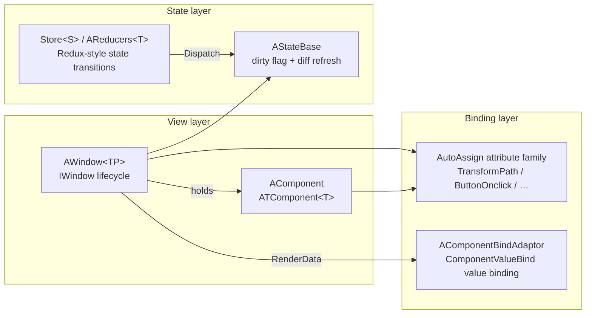

# UI (UFlux)

UFlux is BDFramework's UI logic orchestration architecture. It uses a roughly **MVI (Model-View-Intent)** layering: separate "render data" from "business state", and handle state transitions with Reducers.

## The three layers



## Reading order

| Page | Contents | When to read |
|------|----------|--------------|
| [UFlux Overview](uflux-overview.md) | Why it is layered this way, and how it maps to Redux/MVC | Your first contact with UFlux |
| [Window](window.md) | The full `UIManager` API, `IWindow` lifecycle, load/show/close | Writing your first window |
| [SubWindow](sub-window.md) | Splitting windows, parent/child message forwarding | When a screen needs reuse |
| [Messages (UIMessage)](ui-message.md) | `UIMsgData` and `[UIMessageListener]` | Window-to-window communication |
| [Component](component.md) | `ATComponent<T>` / `AComponent` | Writing reusable UI units |
| [RenderData](render-data.md) | `ARenderDataBase`, `ComponentValueBind`, `PropsList` | When you need data-driven refresh |
| [Auto-Assign Attributes](auto-assign-attributes.md) | The 5 built-in attributes + custom extensions | Grabbing nodes / binding events |
| [State Management (Reducer/Store)](state-management.md) | `AReducers<T>` / `Store<S>` / `Subscribe` | Complex state transitions |
| [Dependency Injection](dependency-injection.md) | `Require(...)` + `AddSingleton`/`AddTransient` | When a window needs external services |

## Minimal working example

```csharp
// 1) 定义窗口
[UI((int)WinEnum.Demo, "Windows/Window_Demo")]
public class Window_Demo : AWindow
{
    // 2) 节点自动赋值
    [TransformPath("btnClose")]
    private Button _btnClose;

    // 3) 事件自动绑定
    [ButtonOnclick("btnClose")]
    private void OnClickClose()
        => UIManager.Inst.CloseWindow(WinEnum.Demo);
}

// 4) 加载并显示
UIManager.Inst.LoadWindow(WinEnum.Demo);
UIManager.Inst.ShowWindow(WinEnum.Demo);
```

## The three easiest mistakes

!!! danger "1. A window is not a `MonoBehaviour`"
    `AWindow<TP>` inherits `ATComponent<TP>` and is **not a `MonoBehaviour`**. Do not write `Awake()` / `Update()`; use `Init()` / `Open()` / `Close()` for lifecycle. Get nodes via `[TransformPath]`, not `transform.Find()`.

!!! danger "2. After `LoadWindow` a window stays cached"
    Windows in `windowMap` are only really `Destroy()`-ed by `UnLoadWindow` / `UnLoadALLWindows`. `ShowWindow` / `CloseWindow` merely toggle `SetActive`. Calling `LoadWindow` twice only logs; it does not rebuild.

!!! danger "3. `ShowWindow` has preconditions"
    It requires `IsLoad == true` and `IsOpen == false`, otherwise it errors with `UI处于[unload,lock,open]状态之一`.

## Mapping to the bundled demos

The complete demos shipped with the framework live in `Assets/Code/Game@hotfix/demo6_UFlux/`:

| Demo directory | What it demonstrates |
|----------------|----------------------|
| `00.State` | State definition and change notification |
| `01.Component` | Splitting into components |
| `02.CustomComponentBindAdator` | Custom binding adapters |
| `04.SimpleWindow` | The smallest possible window |
| `05.Window_Props` | RenderData-driven refresh |
| `06.Window_Reducer` | Reducer / Store state transitions |
| `07.Windows_DI` | `Require(...)` dependency injection |

→ See [Demo Walkthrough](../tutorials/demos.md).
